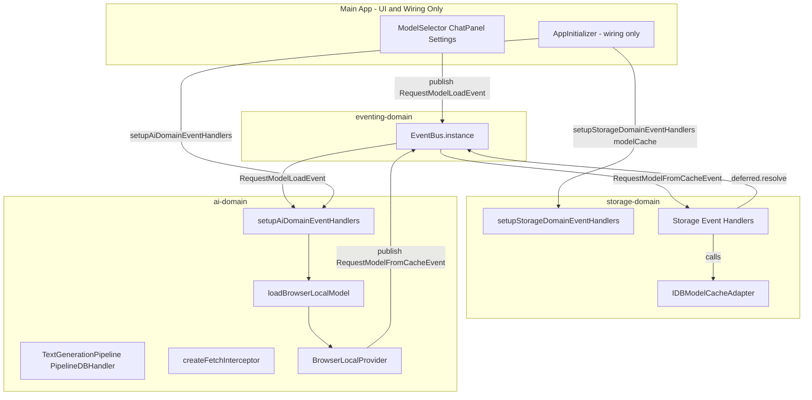

# Main App UI-Only Migration Plan (Complete, Non-Lazy)

## Scope: Do Everything

**In scope (everything):**

- storage-domain: full interface + browser impl + desktop/mobile impls + EventBus (consistent decoupling—no ugly duckling)
- ai-domain: pipelines, orchestration, fetch interceptor, EventBus handlers, ProviderManager, Worker AI, LocalServer AI
- Main app: pure UI/UX only—no AI logic, no storage logic, no provider logic
- Worker AI flow: full migration into ai-domain
- ProviderManager: full refactor into ai-domain
- Desktop/mobile: all interfaces, abstractions, FileSystemModelCacheAdapter, NativeModelCacheAdapter—DONE NOW

**Only opt-out:** Pure UI/UX of desktop and mobile apps (React Native screens, Electron/Tauri windows). When you do desktop/mobile UI plan next, you write ZERO non-UI code.

**Final main app:** Pure UI/UX only. Game engine etc. move in a separate plan. This plan: main app holds only UI for AI/storage/provider flows.

---

## Core Principles


| Code Type                                | Lives In               | NOT In                       |
| ---------------------------------------- | ---------------------- | ---------------------------- |
| Storage (IndexedDB, filesystem, native)  | storage-domain         | main app, ai-domain          |
| Decoupling mechanism                     | EventBus (all domains) | No direct cross-domain calls |
| AI (inference, pipelines, orchestration) | ai-domain              | main app                     |
| Provider selection, switching, lifecycle | ai-domain              | main app                     |
| Worker AI, LocalServer AI logic          | ai-domain              | main app                     |
| UI/UX + minimal bootstrap wiring         | main app               | —                            |


---

## Dependency Graph

```
eventing-domain        (leaf – EventBus)
       ↑
storage-domain         (depends on: eventing-domain)
       ↑
ai-domain              (depends on: storage-domain, logging-domain, eventing-domain)
       ↑
main app (web)         (depends on: ai-domain, logging-domain, eventing-domain)
                       (does NOT depend on storage-domain directly)
```

**All domains use EventBus**—consistent decoupling. No direct cross-domain calls. ai-domain publishes storage request events; storage-domain subscribes and fulfils.

---

## Target Architecture




**Storage EventBus flow (request + deferred):**

- ai-domain publishes `RequestModelFromCacheEvent`, `RequestManifestEntryEvent`, etc. (each carries `deferred: { resolve, reject }`)
- storage-domain subscribes via `setupStorageDomainEventHandlers`, calls ModelCacheAdapter impl, `deferred.resolve(result)`
- ai-domain awaits `deferred.promise`, continues. No direct storage calls.

---

## Phase 0: Baseline

1. Run full test suite and record pass/fail
2. Manual AIPlayground: load model, chat, game rules test
3. Capture baseline in migration report

---

## Phase 1: storage-domain – Complete Platform Abstraction + EventBus

**Goal:** storage-domain owns ALL storage code. Full interface + browser/desktop/mobile impls. **EventBus for decoupling**—same pattern as rest of app. ai-domain publishes storage request events; storage-domain subscribes and fulfils. No direct cross-domain calls.

**1.1 Add eventing-domain dependency to storage-domain**

- In `packages/storage-domain/package.json`: add `@ocentra/eventing-domain` as dependency.

**1.2 Add storage event types (eventing-domain or storage-domain)**

- Events (request + deferred pattern): `RequestModelFromCacheEvent`, `RequestManifestEntryEvent`, `RequestAddManifestEntryEvent`, `RequestAddQuantToManifestEvent`, `RequestSaveChunkEvent`, `RequestGetChunkInfoEvent`, `RequestTryServeFromCacheEvent`
- Each event: `{ requestId, ...params, deferred: { resolve, reject } }`
- Define in eventing-domain (central registry) or storage-domain. ai-domain imports types to publish.

**1.3 Add setupStorageDomainEventHandlers**

- **New file:** `packages/storage-domain/src/setupStorageDomainEventHandlers.ts`
- **API:** `setupStorageDomainEventHandlers(options: { modelCache: ModelCacheAdapter }): () => void`
- **Returns:** Unsubscribe function (for tests)
- **Responsibilities:** Subscribe to all storage request events. For each event, call the corresponding method on `modelCache`, then `deferred.resolve(result)` or `deferred.reject(err)`.
- Main app (or platform bootstrap) creates ModelCacheAdapter impl (IDB/FileSystem/Native) and passes it.

**1.4 Add ModelCacheAdapter interface and implementations**

- **Interface:** `packages/storage-domain/src/model-cache/ModelCacheAdapter.ts`
- **Implementations:** IDBModelCacheAdapter, FileSystemModelCacheAdapter, NativeModelCacheAdapter (same as before—full impls)
- Used internally by setupStorageDomainEventHandlers; ai-domain never calls them directly.

**1.5 ai-domain publishes storage events (no direct ModelCacheAdapter calls)**

- ai-domain needs cache → creates deferred, publishes RequestXEvent, awaits deferred.promise
- All cache access goes through EventBus. No injection of ModelCacheAdapter into ai-domain.

---

## Phase 2: ai-domain – Pipelines and AI Logic (via EventBus)

**Goal:** All AI logic moves to ai-domain. Pipelines, fetch intercept, orchestration. **Storage access via EventBus**—ai-domain publishes RequestXEvent, awaits deferred. No direct storage calls.

**2.1 Move pipelines to ai-domain**

- **From main app → ai-domain:**
  - [TextGenerationPipeline](src/lib/pipelines/TextGenerationPipeline.ts)
  - [PipelineDBHandler](src/lib/pipelines/PipelineDBHandler.ts) – refactor to publish storage events (RequestModelFromCacheEvent, etc.) instead of calling IndexedDB
  - [PipelineConfigs](src/lib/pipelines/PipelineConfigs.ts)
  - [BasePipeline](src/lib/pipelines/BasePipeline.ts)
  - [PipelineFactory](src/lib/factories/pipelines/PipelineFactory.ts)

**2.2 Move TransformersJSRuntimeAdapter to ai-domain**

- Implements InferenceRuntimeAdapter, wraps TextGenerationPipeline. AI logic → ai-domain.

**2.3 Refactor model-storage-api / cache access**

- ai-domain's cache access: publish RequestManifestEntryEvent, RequestAddQuantToManifestEvent, etc. (with deferred). Await deferred.promise. Remove direct IndexedDBService / ModelCacheAdapter calls. initModelStorage removed—storage-domain setup handles wiring.

---

## Phase 3: Fetch Interceptor and Load Orchestration in ai-domain

**3.1 Add createFetchInterceptor to ai-domain**

- Publishes `RequestTryServeFromCacheEvent` (url, modelId, deferred). Awaits deferred.promise. storage-domain subscribes, calls modelCache.tryServeFromCache, resolves deferred with Response | null.
- Main app wires `env.fetch` at bootstrap

**3.2 Add loadBrowserLocalModel and setupAiDomainEventHandlers**

- ai-domain subscribes to EventBus (RequestModelLoadEvent)
- Publishes ModelLoadProgressEvent, ModelLoadedEvent
- All storage calls inside loadBrowserLocalModel / pipelines go through storage request events (deferred pattern)

---

## Phase 4: ProviderManager and Provider Flow – Full ai-domain Migration

**Goal:** ProviderManager, WorkerAIService, LocalServerAIService, BrowserLocalService—ALL provider logic in ai-domain. Main app holds zero provider logic.

**4.1 Move ProviderManager to ai-domain (full refactor)**

- Main app `src/lib/managers/ai/ProviderManager.ts` is REMOVED. ai-domain owns provider selection, switching, lifecycle.
- Consolidate ai-domain's existing `provider-manager.ts` with main app's ProviderManager semantics. ai-domain ProviderManager:
  - Receives adapters: `{ fetch, secrets, modelCache, workerBaseUrl?, authToken? }`
  - `switchProvider(providerType, modelId?, quantPath?)` – creates BrowserLocalService, WorkerAIService, or LocalServerAIService internally
  - `getCurrentProvider()`, `getCurrentProviderType()`, `isProviderReady()`
  - No singleton in main app. ai-domain exposes `createProviderManager(adapters)` or similar; main app wires at bootstrap.

**4.2 Move WorkerAIService, LocalServerAIService, BrowserLocalService to ai-domain**

- **WorkerAIService:** Move from `src/adapters/ai/worker-ai-service.ts` to ai-domain. Uses injected fetch (with auth), worker base URL adapter. All `generateAIResponse`, `getLocalProviderConfig` logic moves to ai-domain. Main app provides fetch + auth adapter only.
- **LocalServerAIService:** Move from `src/adapters/ai/local-server-ai-service.ts` to ai-domain. Uses injected fetch, config adapter. Main app provides adapters only.
- **BrowserLocalService:** Already wraps ai-domain BrowserLocalProvider. Move from main app to ai-domain. Main app provides ModelCacheAdapter, InferenceRuntimeAdapter (which ai-domain also owns via TransformersJSRuntimeAdapter).

**4.3 Move ai-service logic to ai-domain**

- `src/services/ai/ai-service.ts`: getWorkerBaseUrl, getAuthToken, generateAIResponse, getLocalProviderConfig, storeProviderKey, listConfiguredProviders, testProviderConnection—ALL move to ai-domain. Main app provides: storage config adapter, auth adapter (Firebase getIdToken), fetch. ai-domain owns the orchestration.

**4.4 Main app provider wiring**

- Main app: calls `setupStorageDomainEventHandlers({ modelCache: IDBModelCacheAdapter })`, then `setupAiDomainEventHandlers(adapters)`. Adapters: `{ fetch, getAuthToken, getWorkerBaseUrl, getStorageConfig }`. No modelCache passed to ai-domain—storage goes via EventBus.

---

## Phase 5: Main App – Pure UI/UX Only

**5.1 Remove all non-UI from main app**

- Remove: ModelManager (or slim to pure UI state holder that delegates to ai-domain)
- Remove: ProviderManager, WorkerAIService, LocalServerAIService, ai-service, pipelines, IDBModelCacheAdapter, PipelineDBHandler, TextGenerationPipeline
- Keep: React UI (AIPlayground, ModelSelector, ChatPanel, Settings, tabs). EventBus publish/subscribe for UI events. Bootstrap wiring.

**5.2 Platform bootstrap pattern – COMPLETE**

- `bootstrapWeb()`: create IDBModelCacheAdapter, call `setupStorageDomainEventHandlers({ modelCache })`, call `setupAiDomainEventHandlers(adapters)`, wire env.fetch.
- `bootstrapDesktop()`: create FileSystemModelCacheAdapter, same setup. Ready for desktop UI.
- `bootstrapMobile()`: create NativeModelCacheAdapter, same setup. Ready for mobile UI.

---

## Phase 6: Verification

1. Lint, type-check, tests, manual AIPlayground
2. No storage code in main app or ai-domain. ai-domain publishes storage events; storage-domain subscribes. No direct ModelCacheAdapter calls from ai-domain.
3. All domains use EventBus for cross-domain communication—no ugly duckling.
4. No AI code, no provider logic in main app
5. packages/ai-domain has no imports from src/
6. packages/storage-domain owns all storage implementations + EventBus handlers
7. Worker AI, LocalServer AI flows work through ai-domain

---

## Phase 7: Documentation – Clear Flows and Ownership

**Goal:** Update README and .md files in each domain and main app so other devs know exactly who does what and how. Mermaid diagrams, clear data flow, explicit boundaries.

**7.1 storage-domain README / docs**

- **File:** `packages/storage-domain/README.md` (or `docs/ARCHITECTURE.md`)
- **Contents:**
  - Mermaid: dependency graph (storage-domain → eventing-domain)
  - Mermaid: EventBus flow (ai-domain publishes RequestXEvent with deferred; storage-domain subscribes, calls ModelCacheAdapter, deferred.resolve)
  - Mermaid: ModelCacheAdapter interface and platform impls (IDB, FileSystem, Native)
  - Table: who owns what (storage-domain owns all storage; decoupling via EventBus)
  - Quick reference: storage events, setupStorageDomainEventHandlers, when to use each impl

**7.2 ai-domain README / docs**

- **File:** `packages/ai-domain/README.md` and `packages/ai-domain/docs/ARCHITECTURE.md`
- **Contents:**
  - Mermaid: ai-domain as central AI logic (pipelines, providers, EventBus handlers)
  - Mermaid: request flow (UI → EventBus → setupAiDomainEventHandlers → loadBrowserLocalModel / ProviderManager)
  - Mermaid: provider flow (BrowserLocal vs Worker vs LocalServer)
  - Table: who owns what (ai-domain owns AI, orchestration, providers)
  - Quick reference: setupAiDomain, createProviderManager, EventBus events

**7.3 main app README / docs**

- **File:** `README.md` or `docs/ocentra/ARCHITECTURE.md`
- **Contents:**
  - Mermaid: main app = pure UI/UX only; domains do the rest
  - Mermaid: bootstrap flow (main app calls setupStorageDomainEventHandlers, setupAiDomainEventHandlers)
  - Mermaid: UI → EventBus → domains (no direct AI/storage calls from main app)
  - Table: main app owns only UI + bootstrap wiring

**7.4 Migration report and plan docs**

- **File:** `packages/ai-domain/docs/plans/reports/migration-main-app-ui-only.md`
- Update with final architecture, mermaid diagrams, verification checklist

**7.5 Cross-cutting: AGENTS.md / .cursor/rules**

- Update AGENTS.md and relevant .cursor rules with domain boundaries, "who owns what" summary

---

## Multi-Platform Readiness (All Done in This Plan)


| Platform | Storage Impl                               | AI        | Main App                    |
| -------- | ------------------------------------------ | --------- | --------------------------- |
| Web      | storage-domain IDBModelCacheAdapter        | ai-domain | React UI + bootstrap        |
| Desktop  | storage-domain FileSystemModelCacheAdapter | ai-domain | Desktop UI only (next plan) |
| Mobile   | storage-domain NativeModelCacheAdapter     | ai-domain | Mobile UI only (next plan)  |


**Next plan (desktop/mobile UI):** Create Electron/Tauri or React Native app. Call `bootstrapDesktop()` or `bootstrapMobile()`. Build UI only. Zero domain/adapter/storage code.

---

## Files Summary


| Action | Location                                                                                                             |
| ------ | -------------------------------------------------------------------------------------------------------------------- |
| Create | storage-domain: ModelCacheAdapter interface                                                                          |
| Create | storage-domain: IDBModelCacheAdapter, FileSystemModelCacheAdapter, NativeModelCacheAdapter                           |
| Create | storage-domain: setupStorageDomainEventHandlers (subscribes to storage events)                                       |
| Create | eventing-domain or storage-domain: storage event types ( RequestXEvent with deferred )                               |
| Modify | storage-domain: add eventing-domain dependency                                                                       |
| Move   | TextGenerationPipeline, PipelineDBHandler, PipelineConfigs, BasePipeline → ai-domain                                 |
| Move   | ai-domain: publish storage events ( RequestModelFromCacheEvent etc ) instead of direct calls                         |
| Create | ai-domain: createFetchInterceptor, loadBrowserLocalModel, setupAiDomainEventHandlers                                 |
| Move   | WorkerAIService, LocalServerAIService, BrowserLocalService → ai-domain                                               |
| Move   | ai-service (generateAIResponse, getLocalProviderConfig, etc.) → ai-domain                                            |
| Move   | ProviderManager full logic → ai-domain (remove from main app)                                                        |
| Create | ai-domain: ProviderManager with adapters (fetch, secrets, workerBaseUrl, auth) – no modelCache; storage via EventBus |
| Modify | ai-domain: publish storage events; add eventing-domain dep                                                           |
| Modify | main app: remove ALL AI/storage/provider logic; pure UI + bootstrap only                                             |
| Update | storage-domain: README / docs with mermaid (interface, impls, flow)                                                  |
| Update | ai-domain: README / ARCHITECTURE.md with mermaid (providers, EventBus, flow)                                         |
| Update | main app: README / docs with mermaid (UI-only, bootstrap)                                                            |
| Update | migration report, AGENTS.md, .cursor rules with domain boundaries                                                    |


---

## Only Opt-Out: Desktop/Mobile Pure UI

**Explicitly out of scope (only):**

- Building the actual desktop app UI shell (Electron/Tauri windows, menus)
- Building the actual mobile app UI shell (React Native screens, navigation)

**Everything else is IN SCOPE and DONE in this plan.** All interfaces, abstractions, base implementations, storage adapters, provider logic, worker AI, local server AI—complete. When you do desktop/mobile UI plan next, you write ONLY UI/UX code.