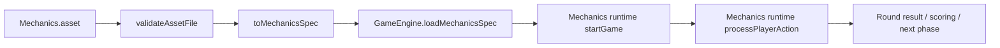

# Mechanics Runtime Execution Plan

## Goal

Turn authored `CardGameMechanics` assets into executable round flow inside `packages/game-domain`, with a real smoke path from:

1. `.asset` file
2. Zod validation
3. `MechanicsSpec` translation
4. `GameEngine` execution
5. repeatable tests

## Current State

- `CardGameMechanics.asset` exists and validates.
- `MechanicsTranslator` converts mechanics asset data into `MechanicsSpec`.
- `GameEngine` can load a mechanics spec and expose the current mechanics phase.
- `GameEngine` does not yet execute mechanics-driven setup, turn flow, or scoring.
- The old engine path is still hardcoded around legacy Claim-like actions and generic phases.

## Target State

`GameEngine` should behave like this when a mechanics spec is loaded:

## Design

### 1. Layering

Keep the split:

- `game-asset-domain`
  - asset schema
  - asset validation
  - asset-to-spec translation
- `game-domain`
  - execution runtime
  - deterministic transitions
  - action processing
  - scoring hooks

### 2. Runtime Shape

Add a mechanics runner under `packages/game-domain/src/engine/mechanics`.

Responsibilities:

- initialize mechanics-driven game state
- auto-run system phases like setup
- validate mechanics actions
- process supported actions
- evaluate mechanics phase transitions
- trigger scoring / round completion

### 3. First Executable Slice

Phase 1 execution will support one full round for authored mechanics like Claim.

Supported behaviors:

- system setup phase
- dealing initial hands from `initialHandSize`
- floor card reveal from `drawConfig`
- current-player turn loop
- action legality from current mechanics phase
- `declare`
- `pass`
- `pick_up`
- `call_showdown`
- showdown response tracking
- scoring trigger

### 4. State Additions

Extend `GameState` with lightweight mechanics runtime context so execution stays deterministic without inventing ad hoc globals.

Initial context fields:

- `dealerIndex`
- `showdownCallerId`
- `revealedPlayerIds`
- `lastMechanicsAction`

### 5. Transition Model

Use mechanics phase IDs as the real source of truth.

Legacy `GamePhase` remains as a compatibility shell for current consumers:

- `setup_round` -> `DEALING`
- `turn_loop` -> `PLAYER_ACTION`
- `showdown` -> `SHOWDOWN`
- `score_round` -> `SCORING`
- terminal -> `GAME_END`

### 6. Supported Condition Evaluation

Phase 1 condition evaluation should support a small built-in vocabulary:

- `showdown_called`
- `all_players_revealed`
- `game_end_reached`
- `start_next_round`

Unknown conditions should not silently pass.

## Implementation Phases

### Phase A: Runtime Foundation

- add mechanics runtime context to `GameState`
- add mechanics runner class
- route `GameEngine.startGame()` through the mechanics runner when a spec is loaded
- route `GameEngine.processPlayerAction()` through the mechanics runner when a spec is loaded

Success:

- engine starts from mechanics setup
- current mechanics phase advances correctly

### Phase B: Claim Round Flow

- support Claim-authored mechanics actions
- auto-deal 3 cards
- reveal floor card
- allow declare and showdown flow
- trigger scoring at showdown completion

Success:

- one full Claim round can be simulated in tests

### Phase C: Real Asset Smoke Tests

- load real Claim mechanics asset from `packages/asset-editor/Resources/...`
- validate asset file
- translate to `MechanicsSpec`
- run the engine against it

Success:

- real authored asset passes smoke execution

### Phase D: Extension Hooks

After the first round-flow slice is green:

- next-round reset
- family-specific runners
- richer action effects
- multiplayer session wrappers

## Test Strategy

### Unit Tests

In `game-domain`:

- mechanics start game deals correct number of cards
- mechanics start game reveals floor card when configured
- mechanics action validation respects current phase
- showdown transitions to scoring

### Asset Smoke Tests

In `game-asset-domain`:

- parse real `claimMechanics.asset`
- validate with `validateAssetFile`
- translate with `toMechanicsSpec`
- execute a deterministic round in `GameEngine`

### Validation Gates

Run after implementation:

- `packages/game-domain`: `npm run test`, `npm run lint`
- `packages/game-asset-domain`: `npm run test`, `npm run lint`
- if asset files change: `packages/asset-editor`: `npm run validate:assets`

## Done Criteria

This story is done when:

- `Claim` mechanics asset is not only inspectable but executable
- the engine can run a mechanics-authored setup and showdown flow
- real authored assets are part of the test loop
- the runtime path is deterministic enough to become the base for multiplayer-safe sessions later
