# Scriptable Gameplay Engine Plan

## Purpose

Design the next step of the Ocentra scriptable game system from the code that already exists, not from a greenfield idea.

This plan is for:

- turning processed `packages/card-games` JSON into full game asset sets
- keeping the existing Unity-like asset composition model
- adding a real execution asset for gameplay flow
- preserving typed validation and factory-driven asset generation
- keeping games multiplayer-safe from day 1 without forcing network/runtime cost onto true solo games

This document is intended to be detailed enough that a Cursor agent can implement any phase with minimal extra explanation.

---

## Executive Summary

The TypeScript asset system is already a decomposed version of the older Unity `GameMode` ScriptableObject.

In the Unity reference, one `GameMode` asset owned:

- rules text
- description text
- strategy text
- move-validity conditions
- example hands
- bonus rules
- ranking data
- core configuration

In Ocentra, that monolith has already been split into:

- `CardGameMode`
- `CardGameRules`
- `Strategy`
- `CardGameScoring`
- `GameInfo`
- `CardGameLayout`
- `Deck`
- `CardRanking`
- `Card`
- `ImageCarousel`

That means the right move is **not** to delete or flatten assets.

The right move is:

- keep the existing asset graph
- keep `Rules.asset`
- keep `GameInfo.asset` as the synthesized UI/content destination
- add `Mechanics.asset` as a new execution asset
- update the factories so processed-game JSON can generate the whole set

Short version:

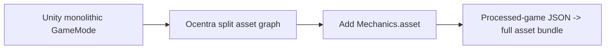

---

## What Exists Today

## Actual Existing Asset Model

The current game bundle is built around `CardGameMode`.

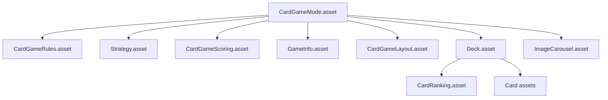

Key files:

- [GameModeAssetFactory.ts](/E:/ocentra-games/packages/game-asset-domain/src/factories/GameModeAssetFactory.ts)
- [createGameModeBundle.ts](/E:/ocentra-games/packages/asset-editor/src/adapters/assets/createGameModeBundle.ts)
- [CardGameMode.ts](/E:/ocentra-games/packages/game-asset-domain/src/gameMode/cardGameMode/CardGameMode.ts)

Important observation:

- there are already **two** asset-bundle creation paths
- both assume the same current asset contract
- any redesign must update both, not just one

---

## Current Content / UI Synthesis Model

`GameInfo.asset` is not the only owner of game text.

It is the **destination** for pre-baked synthesized UI content.

Current synthesis flow:

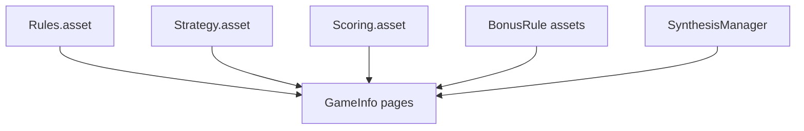

Key file:

- [SynthesisManager.ts](/E:/ocentra-games/packages/asset-editor/src/adapters/assets/SynthesisManager.ts)

What it does:

- loads a `GameInfo` asset
- looks at linked asset GUIDs on pages
- asks linked assets for `synthesizeUIContent(...)`
- writes the resulting content blocks back into `GameInfo`

This means:

- `Rules`, `Strategy`, and `Scoring` are already typed **content contributors**
- `GameInfo` is the assembled UI/content product

This is very important for `Mechanics`:

- `Mechanics.asset` should primarily be an execution asset
- but it may optionally become another synthesis contributor for flow/setup/action explanation pages

---

## Current Role of `Rules.asset`

My earlier assumption that rules could simply disappear was wrong.

From the current code, `Rules.asset` owns more than prose:

- human-readable rules
- AI-readable rules
- objective / gameplay / key rules
- move-validity conditions
- example hands
- bonus-rule GUID linkage
- trump usage / trump bonus values on `CardGameRules`

Key files:

- [GameRules.ts](/E:/ocentra-games/packages/game-asset-domain/src/game/gameRules/GameRules.ts)
- [CardGameRules.ts](/E:/ocentra-games/packages/game-asset-domain/src/game/gameRules/CardGameRules.ts)
- [AIHelper.ts](/E:/ocentra-games/packages/ai-domain/src/orchestration/AIHelper.ts)

So the correct question is not:

- "does Rules go away?"

The correct question is:

- "which parts of current Rules stay in Rules, and which parts move to Mechanics or Scoring?"

Current best answer:

| Asset | Owns |
|---|---|
| `Rules.asset` | human/AI rules text, objective, gameplay, key rules, example hands, move-validity guidance |
| `Mechanics.asset` | executable phases, actions, zones, transitions, actor flow |
| `Scoring.asset` | ranking, multipliers, scoring direction, win resolution, bonus-score config |
| `GameInfo.asset` | pre-baked UI content destination assembled from other assets |

---

## Unity Reference Mapping

Reference folder:

- [LLMGames](/E:/ocentra-games/References/Scripts/OcentraAI/LLMGames)

Most relevant files:

- [GameMode.cs](/E:/ocentra-games/References/Scripts/OcentraAI/LLMGames/GameMode/CardGames/GameMode.cs)
- [ThreeCardGameMode.cs](/E:/ocentra-games/References/Scripts/OcentraAI/LLMGames/GameMode/CardGames/ThreeCardGameMode.cs)
- [GameRulesContainer.cs](/E:/ocentra-games/References/Scripts/OcentraAI/LLMGames/GameMode/CardGames/Rules/GameRulesContainer.cs)
- [BaseBonusRule.cs](/E:/ocentra-games/References/Scripts/OcentraAI/LLMGames/GameMode/CardGames/Rules/BaseBonusRule.cs)

Unity intent:

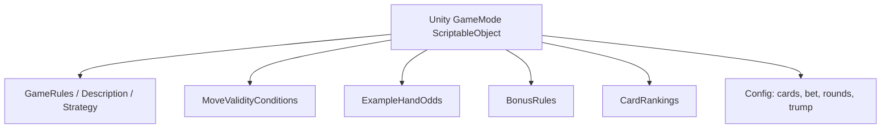

Ocentra TypeScript is already the split version of that:

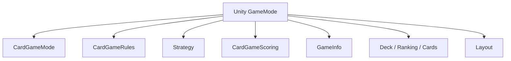

So the design principle should be:

- do not collapse back into one mega-asset
- continue the decomposition
- add `Mechanics.asset` as the missing execution split

---

## Current Factory System

There is already a real factory/orchestration layer. That is where processed-game conversion should land.

Current top-level bundle creation:

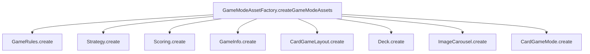

Editor-side equivalent:

- [createGameModeBundle.ts](/E:/ocentra-games/packages/asset-editor/src/adapters/assets/createGameModeBundle.ts)

This tells us the next architecture step very clearly:

- do **not** invent a parallel processed-game import system
- extend the current factory system so it can create a full asset set from processed JSON

Target factory shape:

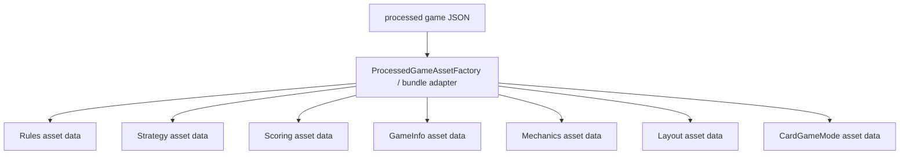

---

## Current Deck / Card / Ranking Pipeline

Decks, cards, and rankings are already more mature than game execution assets.

Important facts:

- extracted deck/card/ranking work already exists
- decks have `supportedTriples`
- rankings describe the concrete family payload
- validation scripts already exist

Examples:

- [500 deck 63.asset](/E:/ocentra-games/packages/asset-editor/Resources/GameMode/CardGames/Decks/500%20deck%2063.asset)
- [StandardCardRanking.asset](/E:/ocentra-games/packages/asset-editor/Resources/GameMode/CardGames/CardRanking/StandardCardRanking.asset)
- [report-deck-triple-coverage.ts](/E:/ocentra-games/packages/game-asset-domain/scripts/report-deck-triple-coverage.ts)

This means the processed-game import path should **reuse** existing deck/ranking assets, not create fake placeholder decks.

Target behavior:

- processed game says `deckType + suitSet + rankSet`
- factory resolves an existing validated deck asset for that triple
- `CardGameMode` links that deck asset

---

## Current Engine Situation

The runtime engine exists, but it is not yet the interpreter for the extracted engine blueprint.

Relevant files:

- [GameEngine.ts](/E:/ocentra-games/packages/game-domain/src/engine/GameEngine.ts)
- [RuleEngine.ts](/E:/ocentra-games/packages/game-domain/src/engine/logic/RuleEngine.ts)
- [TurnManager.ts](/E:/ocentra-games/packages/game-domain/src/engine/logic/TurnManager.ts)

The current gap:

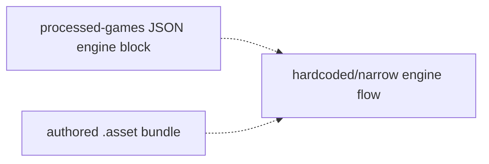

We already started a provisional `CardGameMechanics` asset and some shallow engine plumbing, but the real architectural work still needs to be aligned with the actual asset system before more interpreter work happens.

---

## Corrected Target Model

## Asset Responsibilities

### `CardGameMode.asset`

Remains the root wiring asset.

Owns:

- game identity
- release status
- player count envelope
- links to other assets
- high-level runtime availability flags

Should reference:

- `gameRulesAsset`
- `strategyAsset`
- `scoringAsset`
- `gameInfoAsset`
- `layoutAsset`
- `deckAsset`
- `carouselImagesAsset`
- `mechanicsAsset` new

### `CardGameRules.asset`

Should stay.

Owns:

- LLM/player rules text
- objective
- gameplay
- key rules
- move-validity guidance for UI/AI
- example hands
- rule-linked bonus rule references
- rule explanation content

May gradually lose execution-config fields that really belong elsewhere, but should not be deleted as a concept.

### `Strategy.asset`

Stays as strategy + AI personality guidance + synthesis contributor.

### `CardGameScoring.asset`

Owns:

- card ranking ref
- scoring type
- pattern multipliers
- win condition
- card values
- penalties
- target score
- scoring direction

Bonus-rule evaluation and trump-bonus scoring logic should be treated as scoring-side or scoring-linked, not pure info.

### `GameInfo.asset`

Stays as the pre-baked UI/content package.

Owns:

- hero/marketing content
- explorer metadata
- structured sections/pages
- synthesized content blocks from linked assets

### `CardGameLayout.asset`

Stays UI-side.

Owns:

- table / seat preset data
- zone placement hints
- future animation mapping from engine events to visuals

### `CardGameMechanics.asset`

This is the missing execution asset.

Owns:

- phases
- actions
- zones
- setup flow
- turn order
- visibility transitions
- end conditions
- deterministic execution metadata

This asset is additive to the system, not a replacement for Rules or GameInfo.

---

## Revised Target System

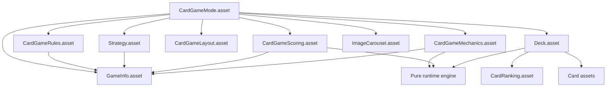

Meaning:

- `Rules`, `Strategy`, `Scoring`, and possibly `Mechanics` all contribute UI/explainer content
- `GameInfo` remains the assembled content destination
- `Mechanics` additionally drives the executable flow

---

## Where `Mechanics` Fits

`Mechanics.asset` should fit between authored/extracted content and the runtime engine.

It should not replace:

- `Rules.asset`
- `GameInfo.asset`
- `Scoring.asset`

It should answer a different question:

- not "how do we explain the game?"
- but "how does the state progress?"

### Minimal Mechanics Ownership

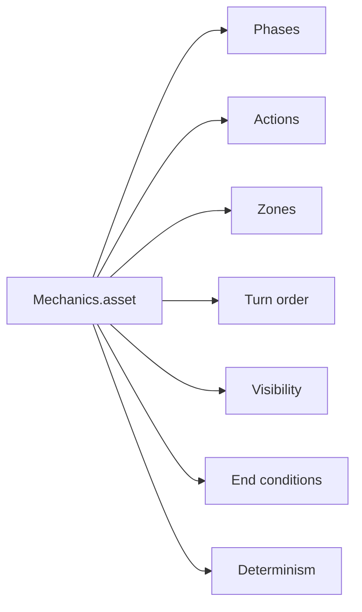

### Optional Mechanics Synthesis

Mechanics may later synthesize pages such as:

- setup flow
- turn flow
- legal action reference
- phase breakdown

That would make it another synthesis contributor without mixing UI prose into runtime execution.

---

## Processed Game JSON Mapping

The processed JSON already has enough information to drive this.

Example:

- [three-card-brag.json](/E:/ocentra-games/packages/card-games/src/processed-games/three-card-brag.json)

It contains:

- overview
- setup
- rules
- strategy
- scoring
- engine phases/actions/zones/etc.

That means processed-game import should be an asset-bundle mapping problem, not a data-discovery problem.

Target mapping:

| Processed JSON | Asset output |
|---|---|
| `overview`, `history`, `setup`, `rules`, `variations`, `ai`, `sources` | `GameInfo.asset` and `CardGameRules.asset` |
| `strategy` | `Strategy.asset` |
| `scoring` | `CardGameScoring.asset` |
| `engine.*` flow fields | `CardGameMechanics.asset` |
| `deckType/suitSet/rankSet` | existing `Deck.asset` lookup |
| metadata + links | `CardGameMode.asset` |

---

## Target Factory Direction

We need a typed conversion layer that plugs into the existing factory system.

### Proposed Flow

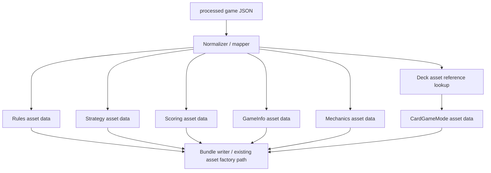

### Important Rule

The mapper should be:

- strongly typed
- enum-backed where possible
- no ad-hoc string soup

It should borrow from:

- `packages/card-games` schema types
- `packages/game-domain` game enums/types
- `packages/game-asset-domain` asset schemas

---

## Validation Strategy

Validation remains the center of the system.

The point is not just to prevent malformed JSON.

The point is to guarantee that:

- assets are coherent
- assets are importable
- assets are executable
- AI/humans do not write garbage

### Validation Layers

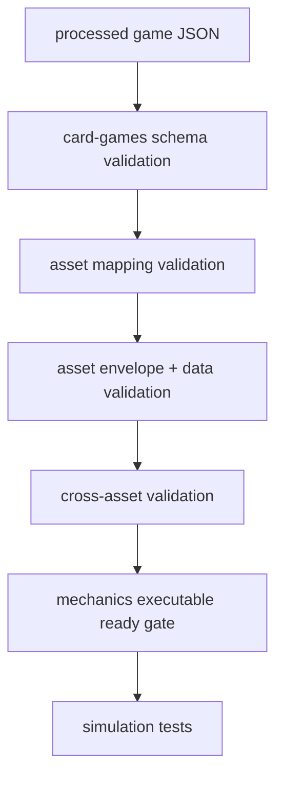

### Concrete Validation Responsibilities

#### `card-games`

Already owns:

- extracted source validation
- strong engine blueprint validation

#### `game-asset-domain`

Must own:

- asset-envelope validation
- per-asset Effect Schema schema validation
- cross-asset validation
- readiness checks for imported asset bundles

#### `Mechanics.asset`

Must guarantee:

- valid phase graph
- legal action references resolve
- zones resolve
- start path exists
- terminal path exists
- deterministic/random points are declared

---

## Important Current Gap: Schema Drift

Some of the live asset schemas appear older or looser than the current real asset classes and actual authored assets.

Examples:

- [rules-data.schema.ts](/E:/ocentra-games/packages/game-asset-domain/src/schemas/asset/rules-data.schema.ts)
- [game-info-data.schema.ts](/E:/ocentra-games/packages/game-asset-domain/src/schemas/asset/game-info-data.schema.ts)
- [card-game-mode-data.schema.ts](/E:/ocentra-games/packages/game-asset-domain/src/schemas/asset/card-game-mode-data.schema.ts)

This matters because we cannot build a reliable processed-game import path on top of stale schema contracts.

So before large-scale import work, we need a schema-alignment pass:

1. actual serialized asset shape
2. class fields
3. Effect Schema validation schema
4. bundle/factory output
5. editor inspector expectations

All five need to agree.

---

## Multiplayer-Safe Rule

Keep this as a hard rule:

- build gameplay state/actions to be multiplayer-safe from day 1
- do not force transport/network/Cloudflare/Solana into every game

Target layering:

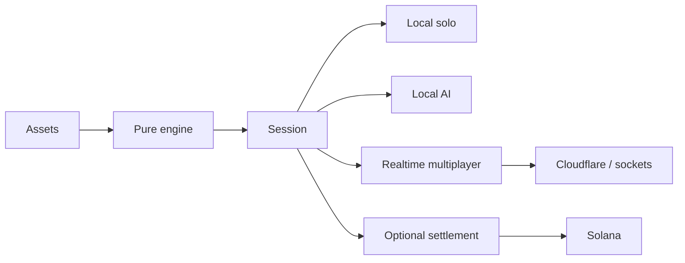

This avoids the singleplayer-to-multiplayer rewrite nightmare while still keeping true solo games lightweight.

---

## Pilot Games

### Pilot 1: Claim

Why:

- authored prototype already exists
- exercises current scriptable composition
- good for deciding exact `Rules` vs `Mechanics` boundary

Target:

- preserve current asset graph
- add `claimMechanics.asset`
- update `claim.asset` to link mechanics
- keep rules/info/scoring layout roles intact

### Pilot 2: Three Card Brag

Why:

- strong fit for processed JSON import
- also exists as Unity reference concept
- compact betting/vying family pilot

Target:

- generate full asset set from processed JSON
- prove `Rules + Strategy + Scoring + GameInfo + Mechanics + existing Deck` pipeline

### Pilot 3: Briscola

Why:

- extracted trick-taking game
- tests a different family
- proves family-kernel path after 3 Card Brag

---

## Phase Plan

## Phase 0: Architecture Correction and Audit Lock

Deliverables:

- update the plan to reflect the actual scriptable system
- document current asset ownership correctly
- confirm `Rules.asset` stays
- confirm `Mechanics.asset` is additive
- identify schema drift and factory touchpoints

Exit criteria:

- no more ambiguity about current system roles
- no assumption that `GameInfo` is the only rules owner
- no assumption that `Rules` can simply be deleted

## Phase 1: Schema and Contract Alignment

Deliverables:

- audit actual serialized asset shapes vs classes vs schemas
- update:
  - `rules-data.schema.ts`
  - `game-info-data.schema.ts`
  - `card-game-mode-data.schema.ts`
  - related schemas as needed
- add `mechanicsAsset` to the `CardGameMode` schema and class contract
- make the runtime validator reflect the real asset model

Exit criteria:

- current authored assets validate against their real contracts
- `CardGameMode` can legally reference `CardGameMechanics`

## Phase 2: Factory Refactor Foundation

Deliverables:

- refactor/create a typed processed-game mapping layer
- extend:
  - `GameModeAssetFactory`
  - `createGameModeBundle`
- support reusing validated deck/ranking assets instead of generating placeholders

Exit criteria:

- one function can accept processed-game JSON and emit typed data for the full asset set

## Phase 3: Mechanics Asset Contract

Deliverables:

- finalize `CardGameMechanics` asset class
- finalize Effect Schema schema
- add cross-asset validation rules
- define import mapping from `engine.*` processed JSON into mechanics asset data

Exit criteria:

- mechanics asset contract is stable enough to import a real game

## Phase 4: Claim Pilot

Deliverables:

- align Claim to the corrected asset model
- preserve `Rules`, `Scoring`, `Info`, `Layout`
- add `Mechanics`
- verify synthesis still works cleanly

Exit criteria:

- Claim becomes the first authored game with the corrected asset graph

## Phase 5: Three Card Brag Processed Import Pilot

Deliverables:

- import `three-card-brag.json`
- resolve existing deck/ranking asset refs
- generate:
  - `CardGameMode`
  - `Rules`
  - `Strategy`
  - `Scoring`
  - `GameInfo`
  - `Layout`
  - `Mechanics`

Exit criteria:

- one processed game can become a full validated asset set

## Phase 6: Engine Interpretation

Deliverables:

- wire `Mechanics.asset` into `game-domain` properly
- keep engine deterministic and replay-safe
- start with a narrow interpreter for pilot mechanics

Exit criteria:

- imported or authored mechanics can drive the engine through a full seedable flow

## Phase 7: Family Expansion

Deliverables:

- generalize from pilots into family kernels
- add poker/vying and trick-taking base interpreters

Exit criteria:

- at least two families are supported by the same system

## Phase 8: Session / Transport / Settlement Wrappers

Deliverables:

- local solo session
- local AI session
- realtime wrapper
- optional settlement hooks

Exit criteria:

- network and settlement remain wrappers, not engine rewrites

---

## Test Plan

### Contract Tests

- asset class vs schema alignment
- authored asset samples still validate
- new `mechanicsAsset` linkage validates

### Factory Tests

- processed JSON -> typed asset data mapping
- deck/ranking triple resolution
- full bundle generation for a pilot game

### Cross-Asset Tests

- `CardGameMode` references valid linked asset types
- `GameInfo` synthesis from linked assets still works
- `Rules`, `Strategy`, `Scoring`, `Mechanics` can coexist cleanly

### Runtime Tests

- mechanics phase graph is coherent
- legal actions resolve
- seeded progression works
- no invalid phase transitions

---

## Execution Slices Cursor Can Take

### Slice A: Audit and Align Schemas

Implement:

- reconcile classes, schemas, and real asset files
- add/update tests for schema drift

### Slice B: Extend CardGameMode Contract

Implement:

- `mechanicsAsset` in class + schema + bundle path
- keep existing rules/info/scoring/strategy/layout contract intact

### Slice C: Processed Game Mapper

Implement:

- typed mapper from processed JSON to asset payloads
- reuse enums and types from existing domains

### Slice D: Factory Integration

Implement:

- processed JSON to full bundle through existing creation paths

### Slice E: Claim Alignment

Implement:

- add mechanics cleanly without breaking synthesis/content

### Slice F: Three Card Brag Full Import

Implement:

- generate the first real processed-game full asset set

---

## Final Target State

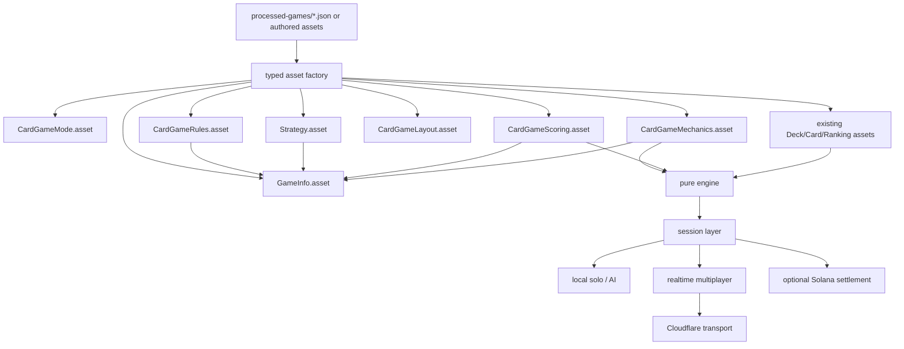

### Success Definition

We are done when:

- the system reflects the real scriptable architecture already in the repo
- `Rules.asset` remains a first-class asset with a clarified role
- `Mechanics.asset` becomes the execution asset without replacing content assets
- processed-game JSON can generate a full validated asset set
- Claim and Three Card Brag both fit the same corrected asset graph
- engine/runtime work can proceed on top of a stable asset contract instead of guesswork
