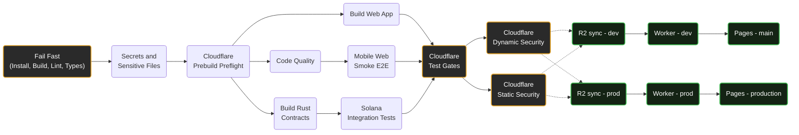

# Ocentra Games CI/CD Architecture

This directory contains the GitHub Actions workflows that power the Ocentra Games monorepo. 

To keep the pipeline incredibly fast, easily maintainable, and completely DRY (Don't Repeat Yourself), we use a **Modular Orchestrator Architecture**.

## Architecture Overview

Instead of putting all steps into one massive file, the pipeline is split into three layers:
1. **The Orchestrator:** `ci-gate.yml` is the traffic controller. It listens for `push` events and dictates *what* runs and in *what order*.
2. **The Modules (Reusable Workflows):** Files like `pull-request-checks.yml`, `cloudflare-preflight.yml`, and `sync-r2.yml` are modules. They contain the actual test/deploy logic.
3. **The Machine Builder (Composite Action):** EVERY workflow calls `.github/actions/setup-ci`. Instead of manually installing Node/Python/k6 over and over, workflows just pass feature flags to this single function to configure their isolated Ubuntu runners.

---

## The Pipeline Execution Flow

When you push code, `ci-gate.yml` executes the following visual sequence.

*Note: Parallel tracks merge and wait for each other before proceeding to the next security/deployment gate.*



### Why we "Fail Fast"
The very first job (`Fail Fast`) is the bottleneck. It runs `npm ci`, builds your domains, lints the code, and runs the strict TypeScript compiler (`tsc --noEmit`). 
If you missed a comma or broke an interface, the pipeline instantly dies here to save CI minutes, preventing execution of the expensive parallel testing machines.

### How `setup-ci` works
Since GitHub Actions spins up a strictly blank machine for **every single node** in the graph above, we must install Node.js numerous times. 

To prevent copy-pasting install scripts, every job uses:
```yaml
- uses: ./.github/actions/setup-ci
  with:
    install-mode: ci-only          # Valid options: full, ci-only, skip
    build-domains: 'true'          # Runs turbo build on internal packages
    install-python: 'true'         # Dynamically installs python if needed
    install-cloudflared: 'true'    # Dynamically installs tunnels
    install-k6: 'true'             # Dynamically installs load-testing tools
```
