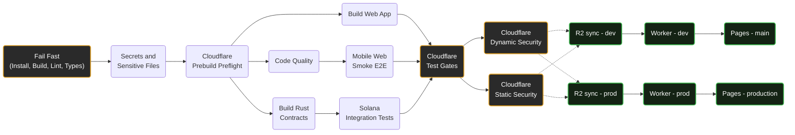

# Ocentra Games CI/CD Architecture

This directory contains the GitHub Actions workflows that power the Ocentra Games monorepo. 

To keep the pipeline incredibly fast, easily maintainable, and completely DRY (Don't Repeat Yourself), we use a **Modular Orchestrator Architecture**.

## Architecture Overview

Instead of putting all steps into one massive file, the pipeline is split into three layers:
1. **The Orchestrator:** `ci-gate.yml` is the traffic controller. It listens for `push` events and dictates *what* runs and in *what order*.
2. **The Modules (Reusable Workflows):** Files like `pull-request-checks.yml`, `cloudflare-preflight.yml`, and `sync-r2.yml` are modules. They contain the actual test/deploy logic.
3. **The Machine Builder (Composite Action):** EVERY workflow calls `.github/actions/setup-ci`. Instead of manually installing Node/Python/k6 over and over, workflows just pass feature flags to this single function to configure their isolated Ubuntu runners.

---

## The Pipeline Execution Flow

When you push code, `ci-gate.yml` executes the following visual sequence.

*Note: Parallel tracks merge and wait for each other before proceeding to the next security/deployment gate.*



### Why we "Fail Fast"
The very first job (`Fail Fast`) is the bottleneck. It runs `npm ci`, builds your domains, lints the code, and runs the strict TypeScript compiler (`tsc --noEmit`). 
If you missed a comma or broke an interface, the pipeline instantly dies here to save CI minutes, preventing execution of the expensive parallel testing machines.

### How `setup-ci` works
Since GitHub Actions spins up a strictly blank machine for **every single node** in the graph above, we must install Node.js numerous times. 

To prevent copy-pasting install scripts, every job uses:
```yaml
- uses: ./.github/actions/setup-ci
  with:
    install-mode: ci-only          # Valid options: full, ci-only, skip
    build-domains: 'true'          # Runs turbo build on internal packages
    install-python: 'true'         # Dynamically installs python if needed
    install-cloudflared: 'true'    # Dynamically installs tunnels
    install-k6: 'true'             # Dynamically installs load-testing tools
```

---

## Detailed Node Breakdown

Here is exactly what runs under the hood inside each phase of the pipeline:

### 1. Fail Fast (`fail-fast.yml`)
**Role:** The absolute gatekeeper.
**Executes:**
- `npm ci` (Installs all dependencies)
- `npm run build:domains` (Turbo builds internal `@ocentra` packages)
- `npm run lint` (Runs ESLint across the entire source code)
- `npm run type-check` (Runs `tsc -b --force` to validate all TypeScript typings)

### 2. Secrets and Sensitive Files (`secret-scan.yml`)
**Role:** Security check against hardcoded keys.
**Executes:**
- `node scripts/security/scan-staged-secrets.mjs --repo` (Custom regex-based repo scanner)
- `gitleaks detect --source . --redact` (Open-source credential scanner)

### 3. Cloudflare Prebuild Preflight (`cloudflare-preflight.yml`)
**Role:** Infrastructure typings and script validation.
**Executes:**
- `npm run prebuild` (Autogenerates logging modules via `generate-log-modules.ts`)
- `npm run dev:prep:worker` (Reads `wrangler.toml` to generate static typing for DB/KV bindings)

### 4. Phase 3: Parallel Checks & Compilation
Because the preflight succeeded, `ci-gate.yml` concurrently boots 4 isolated nodes:

**A. Unit Tests (`unit-tests.yml`)**
- **Executes:** `npm test` -> `vitest --run`
- Runs all standard, pure-logic Javascript tests indiscriminately across the monorepo.

**B. Mobile Web Smoke (`mobile-smoke.yml`) - Waits for Unit Tests**
- **Executes:** `npx playwright install` -> `npm run test:e2e -- --project=db-mobile-e2e`
- Runs headless chromium mobile-viewport UI interaction tests.

**C. Build Web App (`build-web.yml`)**
- **Executes:** `npm run build` -> `vite build`
- Packages the React frontend.

**D. Solana Integration Pipeline (`solana-tests.yml`)**
- **Executes:** `anchor build` -> Compiles Rust smart contracts.
- **Executes:** `npm run test:integration` -> Spins up a local Devnet cluster to execute blockchain assertions using the compiled artifact.

### 5. Cloudflare End-To-End Test Gates (`cloudflare-security-tests.yml`)
**Role:** Heavy E2E server orchestration and fuzzing.
**Executes:**
- `wrangler dev` (Boots local backend worker in Miniflare)
- `cloudflared tunnel` (Exposes local `wrangler` server to the internet)
- **Node: Dynamic Security:** Runs `schemathesis --workers 50` (Forcefully fuzzes your OpenAPI specification)
- **Node: Static Security:** Runs `k6 run tests/k6/concurrency.test.js` (Stress-tests memory limits and connection scaling)

### 6. Deployment (R2, Worker, Pages)
**Role:** Production Rollout (Runs sequentially).
**Executes:**
- `npm run sync:assets:prod` (`sync-r2.yml` uses the High-Speed S3 engine to hash and parallel-upload game assets)
- `npm run deploy` (`deploy-worker.yml` pushes backend to edge)
- `wrangler pages deploy` (`deploy-pages.yml` pushes Vite dist to Pages)

---

## Emergency Hotfixes & Bypasses 🚑

If a deployment fails or you need to urgently roll out a hotfix, **you do not need to wait for the 1-hour CI gate to run again!**

### Scenario 1: You pushed code, but want to skip the CI gate
If you push an urgent hotfix and want to instantly bypass testing and go straight to deployment:
1. Include the magic string `[skip ci]` anywhere in your commit message:
   ```bash
   git commit -m "hotfix: fixing match logic [skip ci]"
   ```
2. GitHub will silently abort `ci-gate.yml` and nothing will happen.
3. Open GitHub Actions Web UI, click the **development-r2-worker** or **production-r2-worker** manual workflow, and click "Run Workflow". This forces an instant brute-force deployment, skipping all gates.

### Scenario 2: You didn't push code (Environment Variable / Secrets Fix)
If the deployment failed because of a missing API key or an expired Stripe secret, you don't need to push a new commit:
1. Fix the error in the Cloudflare Dashboard / Vault.
2. Go to the failed `ci-gate.yml` run in the GitHub Web UI.
3. Click the **Re-run failed jobs** button in the top right corner.
4. GitHub natively remembers that Phase 1 through 5 already passed perfectly. It will instantly jump straight to Phase 6 and ONLY run the deployment node that previously failed!

---

## High-Speed S3 Asset Synchronization 🚀

To prevent deployment bottlenecks, the asset synchronization workflow (`sync-r2.yml`) uses a high-performance, S3-native engine (`scripts/sync-assets-to-prod.ts`).

### Key Features:
- **Parallel Uploads**: Uses `@aws-sdk/client-s3` to upload multiple assets concurrently (default concurrency: 15).
- **Direct Bucket Listing**: Bypasses the Cloudflare Worker API to list remote objects directly via S3, ensuring 100% accuracy between environments.
- **Smart Filtering**: Automatically excludes editor-only files (`.meta`, `.index`, `.DS_Store`, etc.) to keep production buckets clean.
- **Hash Caching**: Maintains a local `.wrangler/asset-hash-cache.json` to avoid re-hashing unchanged files, reducing sync startup time from minutes to seconds.

### Required Secrets (CI & Local):
For maximum performance, the following secrets must be configured in GitHub (for CI) or `infra/cloudflare/.env` (for local runs):
- `R2_ACCESS_KEY_ID`: R2 S3-standard access key.
- `R2_SECRET_ACCESS_KEY`: R2 S3-standard secret key.
- `CLOUDFLARE_ACCOUNT_ID`: Your Cloudflare account ID.

If these keys are missing, the script will gracefully fall back to the slower `wrangler` CLI method.
