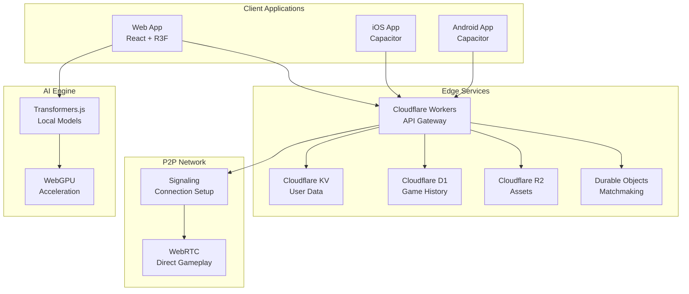
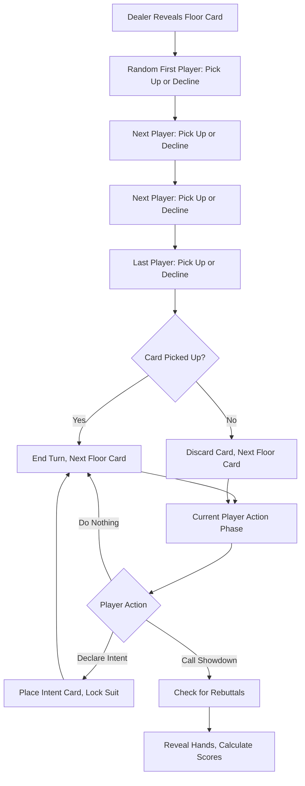

# CLAIM Card Game - Design Document

## Overview

CLAIM is architected as a modern, serverless, peer-to-peer card game that delivers AAA gaming experiences through web technologies. The system leverages React Three Fiber for stunning 3D graphics, Transformers.js for intelligent AI opponents, WebRTC for low-latency multiplayer, and Cloudflare's edge computing platform for global scalability. The design prioritizes performance, user experience, and cost-effectiveness while maintaining the psychological intensity that makes CLAIM unique.

### Game Rules Reference

CLAIM is a high-stakes 4-player card game using a standard 52-card deck. Key mechanics include:

**Core Gameplay:**

- Each player starts with 3 cards
- Initial simultaneous declaration phase with 30-second countdown
- Players take turns revealing Floor Cards from the deck
- Players can Pick Up or Decline each Floor Card
- Players can Declare Intent (choose a suit) at any time
- Any player can Call a Showdown to end the game immediately
- Blitz Showdown: Can be called immediately after initial declaration
- Dealer is not a player and rotates randomly each round

**Scoring System (Hoarder's Multiplier):**

- **Declared Players:** Calculate each sequence of consecutive cards separately using (Sum of card values in sequence) × (Number of cards in sequence), then sum all sequence scores. Subtract penalty cards (non-declared suit cards).
- **Undeclared Players:** Same sequence calculation method, but all scores are negative. If no sequences, sum face values of all cards as negative points.
- **A-K Wraparound:** Aces and Kings wrap around to 2s for sequence calculation
- **Example with sequences:** A♠, K♠, 2♠, 3♠, 4♠, 5♠ = Sequence 1 (A-K): (14+13) × 2 = 54 + Sequence 2 (2-3-4-5): (2+3+4+5) × 4 = 56 = Total: 110
- **Example without sequences:** J♥, 9♦, 7♠, 4♣, 3♣ = -(11 + 9 + 7 + 4 + 3) = -34

**Card Values:** A=14, K=13, Q=12, J=11, 10=10, 9=9, 8=8, 7=7, 6=6, 5=5, 4=4, 3=3, 2=2

**Strategic Elements:**

- **Suit Lock:** Once declared, no other player can declare that suit
- **Rebuttals:** Undeclared players can contest Showdowns with 3-card runs
- **Psychological Warfare:** Public declarations create targets for blocking
- **Time Pressure:** Hand size increases penalty risk for undeclared players
- **Budget System:** Each player starts with 1352-point budget (maximum possible penalty)

This creates intense psychological gameplay where aggression is rewarded and hesitation is brutally punished.

## Architecture

### High-Level System Architecture



### 3D Top-Down Perspective Design

**Camera Setup:**

```jsx
function GameCamera() {
  return (
    <OrthographicCamera
      makeDefault
      position={[0, 10, 3]} // Slightly angled top-down
      rotation={[-Math.PI / 3, 0, 0]} // 60° angle for depth
      zoom={50}
      near={0.1}
      far={100}
    />
  )
}
```

**Card Layout (Top-Down View):**

```
    Player 3 Hand
         ↑
Player 2 ← Table → Player 4
         ↓
    Player 1 Hand (You)

Floor Card: Center of table
Discard Pile: Side of table
```

**3D Effects in Top-Down:**

- **Card Thickness**: Visible edges create 3D depth
- **Shadows**: Realistic drop shadows on table surface
- **Animations**: Cards arc through 3D space when dealt/played
- **Hover Effects**: Cards lift slightly when selectable
- **Particle Effects**: 3D particles for showdowns and declarations

### Game Flow Implementation

**Turn Structure:**



**Scoring Implementation:**

``typescript
function calculateScore(player: Player, gameState: GameState): number {
  // For undeclared players, same calculation but all negative
  const isDeclared = player.declaredSuit !== null;
  
  // Find all sequences in player's hand
  const sequences = findSequences(player.hand, isDeclared ? player.declaredSuit : null);
  
  if (sequences.length === 0) {
    // No sequences - sum all card values (negative for undeclared players)
    const totalValue = player.hand.reduce((sum, card) => sum + card.value, 0);
    return isDeclared ? -totalValue : -totalValue; // Wait, this needs correction
  }
  
  // Calculate score for each sequence
  const sequenceScores = sequences.map(seq => {
    const sum = seq.reduce((sum, card) => sum + card.value, 0);
    return sum * seq.length;
  });
  
  const totalSequenceScore = sequenceScores.reduce((sum, score) => sum + score, 0);
  
  if (!isDeclared) {
    // Undeclared players have negative scores
    return -totalSequenceScore;
  }
  
  // For declared players, subtract penalty cards
  const suitCards = player.hand.filter(card => card.suit === player.declaredSuit);
  const penaltyCards = player.hand.filter(card => card.suit !== player.declaredSuit);
  const penalty = penaltyCards.reduce((sum, card) => sum + card.value, 0);
  
  return totalSequenceScore - penalty;
}

function findSequences(hand: Card[], suit: Suit | null): Card[][] {
  // Implementation to find consecutive sequences
  // A-K wraps around to 2
  // If suit is specified, only consider cards of that suit
  // Otherwise, consider cards of any suit
}
```

### Technology Stack

**Frontend Framework:**

- **React 18** with Concurrent Features for smooth UI updates
- **React Three Fiber** for 3D graphics and WebGL rendering
- **@react-three/drei** for pre-built 3D components and helpers
- **@react-three/cannon** for physics simulation
- **@react-three/postprocessing** for visual effects and shaders

**State Management:**

- **Zustand** for global application state
- **Valtio** for reactive game state synchronization
- **React Query** for server state and caching

**AI and Machine Learning:**

- **Transformers.js** for local model inference
- **ONNX Runtime Web** with WebGPU backend
- **Web Workers** for non-blocking AI processing
- **IndexedDB** for model caching and offline storage

**Networking and Real-time Communication:**

- **WebRTC** for peer-to-peer game sessions
- **Socket.io Client** for signaling and matchmaking
- **WebSocket** fallback for older browsers
- **Service Workers** for offline functionality

**Mobile and Cross-Platform:**

- **Capacitor** for native iOS and Android deployment
- **PWA** features for web app installation
- **Workbox** for advanced caching strategies

**Backend Services (Serverless):**

- **Cloudflare Workers** for API endpoints and business logic
- **Cloudflare KV** for user profiles and session data
- **Cloudflare D1** for relational data (leaderboards, tournaments)
- **Cloudflare R2** for asset storage and CDN
  - Host complete card asset library (Assets/Cards/)
  - 3D models and textures (Poker Table.fbx, backgrounds)
  - Suit symbols and UI elements for customization
- **Cloudflare Durable Objects** for stateful services

## Asset Management

### Existing Asset Library

The project includes a comprehensive asset library in `/Assets/`:

**Card Assets (`/Assets/Cards/`):**

- **52 Individual Cards**: Complete deck with high-quality PNG images
  - Format: `{value}_of_{suit}.png` (e.g., `ace_of_spades.png`)
  - Includes all values: 2-10, jack, queen, king, ace
  - All suits: clubs, diamonds, hearts, spades
- **Card Backs**: Multiple back designs for customization
  - `BackCard.png` - Standard card back
  - `BackCardEdge.png` - Edge-highlighted version
  - `BackCardEdgeHighLight.png` - Enhanced highlight effect
- **Card Templates**: Base card designs for custom content
  - `PlainCard.png` - Blank card template
  - `DeckCard.png` - Deck representation

**3D Models:**

- **Poker Table.fbx**: Professional 3D poker table model ready for R3F import

**UI Elements:**

- **Suit Symbols**: Multiple variants for each suit
  - Filled versions: `{suit}Filled.png`
  - Hollow versions: `{suit}Hollow.png`
  - Decorated versions: `{suit}WithCirclesFilled.png`
- **Backgrounds**: `background.png` for table environments
- **Game Elements**: `Pot.png`, `coins.png` for scoring displays

### Asset Loading Strategy

**Texture Management:**

```typescript
interface AssetLoader {
  loadCardTextures(): Promise<Map<string, Texture>>
  load3DModel(path: string): Promise<GLTF>
  preloadCriticalAssets(): Promise<void>
  loadAssetBundle(bundle: AssetBundle): Promise<void>
}
```

**Progressive Loading:**

1. **Critical Assets**: Card backs, table model, basic UI elements
2. **Card Faces**: Load on-demand based on game state
3. **Cosmetic Assets**: Load when accessed in store/customization
4. **Caching Strategy**: IndexedDB for offline asset storage

## Components and Interfaces

### Frontend Architecture

#### Core Game Engine (`/src/engine/`)

**GameEngine.tsx**

```typescript
interface GameEngine {
  initializeGame(config: GameConfig): Promise<void>
  startSinglePlayer(difficulty: AIDifficulty): void
  startMultiplayer(roomId: string): void
  processPlayerAction(action: PlayerAction): void
  getGameState(): GameState
  subscribeToUpdates(callback: StateUpdateCallback): void
}
```

**3D Rendering System (`/src/engine/rendering/`)**

- **CardRenderer**: 3D card models with top-down perspective
  - Cards as 3D planes with realistic thickness and shadows
  - Individual card faces (ace_of_spades.png, etc.) as textures
  - Card back textures (BackCard.png, BackCardEdge.png)
  - Smooth flip animations between face/back
  - Hover effects and selection highlights
- **TableEnvironment**: 3D poker table with fixed top-down camera
  - Poker Table.fbx positioned for overhead view
  - Realistic table surface with felt texture
  - Ambient lighting for card visibility
  - Subtle depth shadows for 3D feel
- **CameraController**: Fixed orthographic top-down camera
  - Slight angle (15-20°) for depth perception
  - Smooth zoom for different game phases
  - No rotation - maintains card game orientation
- **ParticleSystem**: 3D effects that work in top-down view
  - Card dealing animations with arc trajectories
  - Showdown explosion effects
  - Suit symbol particles for declarations

**Game Logic (`/src/engine/logic/`)**

- **RuleEngine**: CLAIM game rules implementation and validation
  - Floor Card reveal and player action cycles
  - Declare Intent mechanics and suit locking
  - Showdown triggers and Rebuttal validation
  - Blitz Showdown special case handling
- **ScoreCalculator**: Hoarder's Multiplier and bonus calculations
  - Declared player scoring: (base × multiplier) - penalties + bonuses
  - Undeclared player penalties: -(total value × hand size)
  - Clean Sweep (+50) and Long Run (+25) bonus detection
- **TurnManager**: Player turn order and action validation
  - Clockwise turn progression from dealer's left
  - Floor Card action phase (Pick Up/Decline)
  - Player action phase (Declare/Showdown/Wait)
- **StateValidator**: Anti-cheat and game integrity checks
  - Validate all actions against current game state
  - Ensure deterministic card dealing across peers
  - Detect impossible hands or invalid moves

#### AI System (`/src/ai/`)

**AIOpponent.tsx**

```typescript
interface AIOpponent {
  id: string
  personality: AIPersonality
  skillLevel: number
  makeDecision(gameState: GameState): Promise<PlayerAction>
  updateStrategy(gameHistory: GameEvent[]): void
}

enum AIPersonality {
  AGGRESSIVE = 'aggressive', // Frequent early showdowns
  CONSERVATIVE = 'conservative', // Waits for strong hands
  ADAPTIVE = 'adaptive', // Learns from player behavior
  UNPREDICTABLE = 'unpredictable', // Random strategy changes
}
```

**Model Management (`/src/ai/models/`)**

- **ModelLoader**: Downloads and caches AI models
- **InferenceEngine**: Runs predictions using Transformers.js
- **StrategyAnalyzer**: Analyzes player patterns and adapts AI behavior
- **DecisionTree**: Implements game theory optimal strategies

#### Networking Layer (`/src/network/`)

**P2PManager.tsx**

```typescript
interface P2PManager {
  createRoom(config: RoomConfig): Promise<string>
  joinRoom(roomId: string): Promise<void>
  sendGameAction(action: PlayerAction): void
  onGameAction(callback: (action: PlayerAction) => void): void
  handleDisconnection(): void
  reconnect(): Promise<void>
}
```

**Connection Management (`/src/network/connection/`)**

- **WebRTCHandler**: Manages peer connections and data channels
- **SignalingClient**: Communicates with Cloudflare Workers for setup
- **ConnectionRecovery**: Handles network failures and reconnection
- **StateSync**: Ensures game state consistency across peers

#### User Interface (`/src/ui/`)

**Component Hierarchy:**

```
App
├── AuthProvider
├── GameProvider
├── Router
│   ├── MainMenu
│   │   ├── PlayButton
│   │   ├── ProfileCard
│   │   └── LeaderboardPreview
│   ├── GameLobby
│   │   ├── RoomSettings
│   │   ├── PlayerList
│   │   └── ChatPanel
│   └── GameView
│       ├── GameTable (3D)
│       ├── PlayerHUD
│       ├── ActionPanel
│       └── ScoreDisplay
└── NotificationSystem
```

### Backend Architecture

#### API Gateway (`/workers/api/`)

**Authentication Service**

```typescript
interface AuthService {
  register(email: string, password: string): Promise<User>
  login(credentials: LoginCredentials): Promise<AuthToken>
  refreshToken(token: string): Promise<AuthToken>
  validateSession(token: string): Promise<User>
}
```

**User Management**

```typescript
interface UserService {
  getProfile(userId: string): Promise<UserProfile>
  updateProfile(userId: string, updates: ProfileUpdates): Promise<void>
  getFriends(userId: string): Promise<Friend[]>
  addFriend(userId: string, friendId: string): Promise<void>
  getStatistics(userId: string): Promise<PlayerStats>
}
```

#### Matchmaking Service (`/workers/matchmaking/`)

**Durable Object Implementation**

```typescript
class MatchmakingRoom {
  private players: Map<string, Player> = new Map()
  private gameState: GameState | null = null

  async handleRequest(request: Request): Promise<Response>
  private addPlayer(player: Player): void
  private removePlayer(playerId: string): void
  private startGame(): void
  private broadcastUpdate(update: GameUpdate): void
}
```

**Skill-Based Matching Algorithm:**

- **ELO Rating System**: Dynamic skill ratings based on game outcomes
- **Connection Quality**: Prioritizes players with good network conditions
- **Geographic Proximity**: Reduces latency by matching nearby players
- **Wait Time Balancing**: Expands search criteria for faster matching

#### Tournament System (`/workers/tournaments/`)

**Tournament Management**

```typescript
interface TournamentService {
  createTournament(config: TournamentConfig): Promise<Tournament>
  registerPlayer(tournamentId: string, playerId: string): Promise<void>
  startTournament(tournamentId: string): Promise<void>
  reportMatch(matchId: string, result: MatchResult): Promise<void>
  getLeaderboard(tournamentId: string): Promise<Leaderboard>
}
```

## Data Models

### Core Game Models

**GameState**

```typescript
interface GameState {
  id: string
  players: Player[]
  currentPlayer: number
  phase: GamePhase
  deck: Card[]
  floorCard: Card | null
  discardPile: Card[]
  round: number
  startTime: Date
  lastAction: Date
}

enum GamePhase {
  DEALING = 'dealing',
  FLOOR_REVEAL = 'floor_reveal',
  PLAYER_ACTION = 'player_action',
  SHOWDOWN = 'showdown',
  SCORING = 'scoring',
  GAME_END = 'game_end',
}
```

**Player**

```typescript
interface Player {
  id: string
  name: string
  avatar: string
  hand: Card[]
  declaredSuit: Suit | null
  intentCard: Card | null
  score: number
  isConnected: boolean
  isAI: boolean
  aiPersonality?: AIPersonality
}
```

**Card**

```typescript
interface Card {
  suit: Suit
  value: CardValue
  id: string
}

enum Suit {
  SPADES = 'spades',
  HEARTS = 'hearts',
  DIAMONDS = 'diamonds',
  CLUBS = 'clubs',
}

type CardValue = 2 | 3 | 4 | 5 | 6 | 7 | 8 | 9 | 10 | 11 | 12 | 13 | 14
```

### User and Social Models

**UserProfile**

```typescript
interface UserProfile {
  id: string
  email: string
  username: string
  avatar: string
  createdAt: Date
  lastActive: Date
  preferences: UserPreferences
  cosmetics: CosmeticInventory
  subscription: SubscriptionStatus
}

interface PlayerStats {
  gamesPlayed: number
  gamesWon: number
  averageScore: number
  bestScore: number
  winStreak: number
  eloRating: number
  achievements: Achievement[]
  tournamentWins: number
}
```

**Social Features**

```typescript
interface Friend {
  id: string
  username: string
  avatar: string
  status: OnlineStatus
  lastSeen: Date
}

interface ChatMessage {
  id: string
  senderId: string
  content: string
  timestamp: Date
  type: MessageType
}

enum MessageType {
  TEXT = 'text',
  EMOTE = 'emote',
  SYSTEM = 'system',
}
```

### Tournament and Competition Models

**Tournament**

```typescript
interface Tournament {
  id: string
  name: string
  description: string
  type: TournamentType
  status: TournamentStatus
  maxPlayers: number
  entryFee: number
  prizePool: Prize[]
  startTime: Date
  endTime: Date
  bracket: TournamentBracket
}

enum TournamentType {
  SINGLE_ELIMINATION = 'single_elimination',
  DOUBLE_ELIMINATION = 'double_elimination',
  ROUND_ROBIN = 'round_robin',
  SWISS = 'swiss',
}
```

## Error Handling

### Client-Side Error Management

**Error Boundaries**

- **GameErrorBoundary**: Catches and recovers from game logic errors
- **NetworkErrorBoundary**: Handles connection failures gracefully
- **AIErrorBoundary**: Manages AI processing errors and fallbacks

**Error Recovery Strategies**

```typescript
interface ErrorRecovery {
  retryConnection(): Promise<boolean>
  fallbackToAI(): void
  saveGameState(): void
  reportError(error: GameError): void
}

enum ErrorSeverity {
  LOW = 'low', // Log only
  MEDIUM = 'medium', // Show user notification
  HIGH = 'high', // Attempt recovery
  CRITICAL = 'critical', // Force restart
}
```

### Network Resilience

**Connection Monitoring**

- **Heartbeat System**: Regular ping/pong to detect disconnections
- **Quality Metrics**: Track latency, packet loss, and bandwidth
- **Adaptive Bitrate**: Adjust data transmission based on connection quality
- **Graceful Degradation**: Reduce features when network is poor

**Reconnection Logic**

``typescript
class ConnectionManager {
  private reconnectAttempts = 0
  private maxReconnectAttempts = 5
  private backoffMultiplier = 1.5

  async attemptReconnection(): Promise<boolean>
  private calculateBackoffDelay(): number
  private notifyReconnectionStatus(): void
}
```

### Data Integrity and Anti-Cheat

**Game State Validation**

- **Deterministic Random**: Shared seed for consistent card dealing
- **Action Validation**: Verify all player actions against game rules
- **State Checksums**: Detect tampering or desynchronization
- **Consensus Mechanism**: Majority agreement on disputed actions

**Cheat Detection**

```typescript
interface CheatDetection {
  validateAction(action: PlayerAction, gameState: GameState): boolean
  detectSpeedHacking(actionTiming: number[]): boolean
  checkStateConsistency(localState: GameState, peerStates: GameState[]): boolean
  reportSuspiciousActivity(playerId: string, evidence: CheatEvidence): void
}
```

## Testing Strategy

### Unit Testing

**Game Logic Testing**

- **Rule Engine**: Comprehensive test coverage for all CLAIM rules
- **Score Calculator**: Verify Hoarder's Multiplier and bonus calculations
- **AI Decision Making**: Test AI opponent behavior and strategy adaptation
- **State Management**: Validate game state transitions and consistency

**Component Testing**

- **3D Rendering**: Visual regression tests for card animations
- **UI Components**: Interaction testing with React Testing Library
- **Network Layer**: Mock WebRTC connections and test failure scenarios
- **Authentication**: Test user registration, login, and session management

### Integration Testing

**End-to-End Game Flow**

```typescript
describe('Complete Game Session', () => {
  test('Single player game with AI opponents', async () => {
    // Test full game from start to finish
  })

  test('Multiplayer game with reconnection', async () => {
    // Test P2P gameplay with simulated disconnections
  })

  test('Tournament bracket progression', async () => {
    // Test tournament creation and match progression
  })
})
```

**Performance Testing**

- **Load Testing**: Simulate thousands of concurrent players
- **Stress Testing**: Test system limits and failure points
- **Memory Profiling**: Ensure no memory leaks in long sessions
- **Network Testing**: Validate performance under various network conditions

### AI Model Testing

**Model Validation**

- **Strategy Effectiveness**: Measure AI win rates against human players
- **Behavioral Consistency**: Ensure AI personalities remain distinct
- **Learning Validation**: Verify AI adaptation to player strategies
- **Performance Benchmarks**: Test inference speed and resource usage

**A/B Testing Framework**

```typescript
interface ABTest {
  id: string
  name: string
  variants: TestVariant[]
  metrics: string[]
  startDate: Date
  endDate: Date
  targetAudience: AudienceSegment
}

interface TestVariant {
  name: string
  weight: number
  config: VariantConfig
}
```

### Security Testing

**Authentication Security**

- **JWT Token Validation**: Test token expiration and refresh
- **Rate Limiting**: Verify API endpoint protection
- **Input Sanitization**: Prevent injection attacks
- **Session Management**: Test concurrent session handling

**Game Integrity Testing**

- **Cheat Detection**: Validate anti-cheat mechanisms
- **State Tampering**: Test protection against modified game states
- **Network Security**: Ensure WebRTC connections are secure
- **Data Privacy**: Verify compliance with privacy regulations

This comprehensive design provides the foundation for building CLAIM as a world-class card game that delivers on the "Minimum Lovable Product" philosophy while maintaining technical excellence and scalability.
