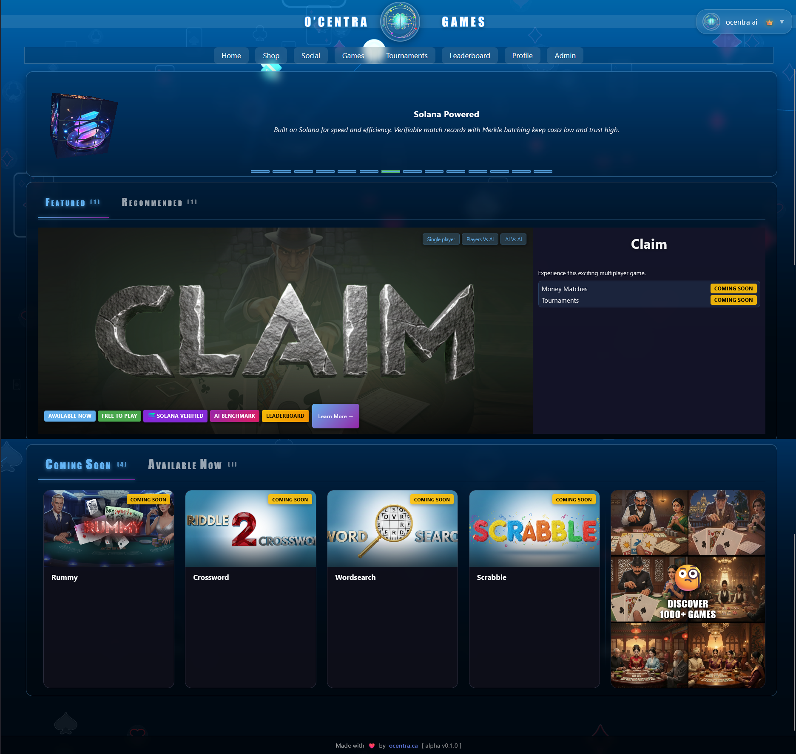
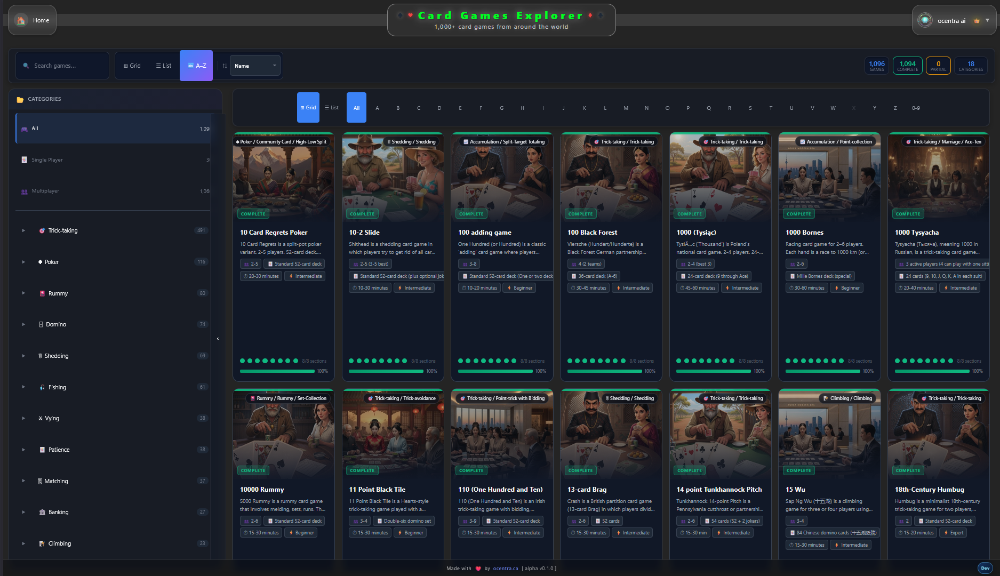
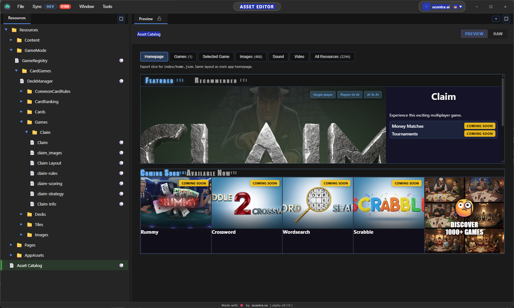
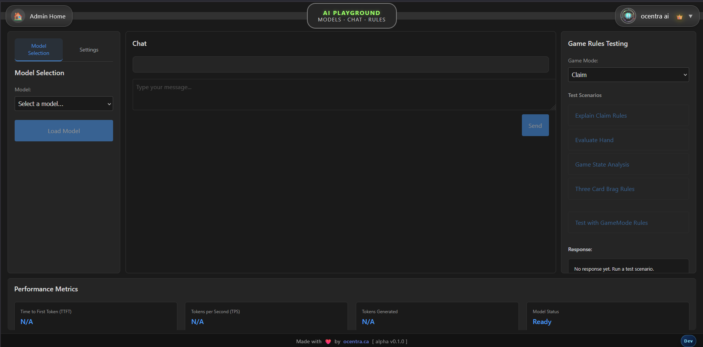
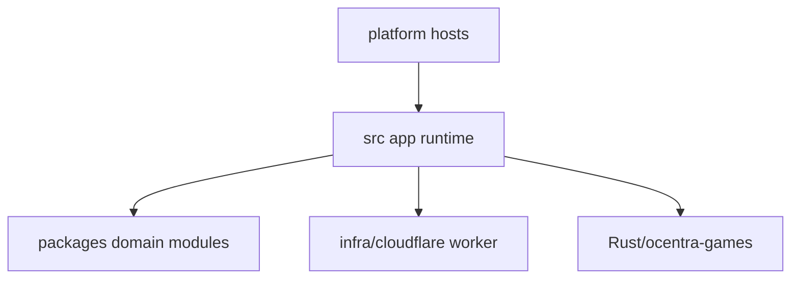
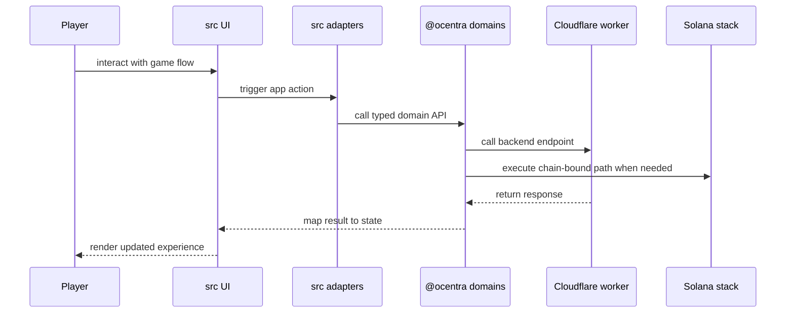

# Ocentra Games

Web-first multiplayer game platform with a domain-driven monorepo,
cross-platform runtime shells, and Solana-integrated workflows.



Built for transparent, high-trust gameplay with modular architecture.

**Live app:** [game.ocentra.ca](https://game.ocentra.ca/)  
**Website:** [ocentra.ca](https://ocentra.ca/)

---

## Quick Navigation

- [What Ocentra Is](#what-ocentra-is)
- [Platform Highlights](#platform-highlights)
- [Game Catalog and AI Direction](#game-catalog-and-ai-direction)
- [Developer Tools](#developer-tools)
- [Architecture Overview](#architecture-overview)
- [Repository Map](#repository-map)
- [Local Development](#local-development)
- [Testing and Security Coverage](#testing-and-security-coverage)
- [Links](#links)
- [License](#license)

---

## What Ocentra Is

Ocentra Games is a full-stack game platform that combines:

- domain-driven architecture via focused `@ocentra/*` packages
- event-driven runtime composition across app and domains
- Cloudflare backend services for API and coordination
- Solana-integrated paths for blockchain-bound workflows
- AI integration for local and cloud model flows
- web, desktop, and mobile host delivery from one shared runtime

The goal is to keep gameplay, infrastructure, platform delivery, and AI
capabilities modular and verifiable as the product surface grows.

---

## Platform Highlights

### Domain-first monorepo

- explicit boundaries across app, backend, blockchain, and domains
- shared contract domains to align frontend and backend behavior
- typed interfaces and direct imports instead of hidden wiring

### Product runtime

- React runtime with gameplay, lobby, social, and competition flows
- app adapter layer for auth, assets, AI, storage, networking, and Solana
- route and shell gating by platform (`web`, `desktop`, `mobile`)

### Infrastructure and data

- Cloudflare Worker backend in `infra/cloudflare`
- Durable Objects for stateful coordination
- R2-backed storage paths for platform and match data
- local-first cache and storage behavior in app layers

### Solana integration

- Anchor workspace in `Rust/ocentra-games`
- client integration paths in app/domain layers
- chain-bound logic and tests isolated to dedicated workspace/docs

### AI integration

- provider/model abstractions in `packages/ai-domain`
- local and cloud provider paths
- in-app and package-level tooling for model/runtime validation

---

## Game Catalog and AI Direction

### Traditional game catalog

The repo includes a large data-driven game catalog under:

- `packages/card-games/src/processed-games`

Current scope is 1,100+ entries, with expansion toward 1,500+.
Catalog and pipeline details:

- `packages/card-games/README.md`
- `packages/data-explorer/README.md`



Main app explorer route:

- `/CardGamesExplorer`

Local example:

- `http://localhost:3000/CardGamesExplorer`

### AI competition and replayability

- AI-only leaderboard paths are handled in Cloudflare logic:
  - `infra/cloudflare/src/logic/leaderboard.ts`
- replay and rich verification fixtures exist in:
  - `scripts/solana/verification/examples`
- AI vs AI and AI vs human flows share the same platform runtime foundations

### Voice and table presence direction

AI domain includes speech and TTS-related paths:

- `packages/ai-domain`
- `packages/ai-domain/docs/OVERVIEW.md`

---

## Developer Tools

### Asset Editor



Standalone editor package:

- `packages/asset-editor/README.md`
- `packages/asset-editor/docs/RUNTIME-FLOWS.md`

### AI Playground



In-app dev surface:

- `src/ui/pages/dev/AIPlayground`

Related AI architecture:

- `packages/ai-domain/docs/OVERVIEW.md`

---

## Architecture Overview

Cross-cutting **asset delivery** (Worker `download-url`, main app vs asset editor, dev/prod/Tauri/mobile) is documented in **[docs/ocentra/asset-handling.md](docs/ocentra/asset-handling.md)**.





---

## Repository Map

### Main app

- `src/README.md`
- `src/ARCHITECTURE.md`
- `src/ui/README.md`
- `src/ui/ARCHITECTURE.md`
- `src/adapters/README.md`
- `src/adapters/ARCHITECTURE.md`

### Product and platform docs

- `docs/ocentra/README.md` — documentation hub (e.g. [asset handling](docs/ocentra/asset-handling.md))

### Domain packages

- `packages/asset-domain/README.md`
- `packages/game-domain/README.md`
- `packages/game-asset-domain/README.md`
- `packages/game-ui-types/README.md`
- `packages/eventing-domain/README.md`
- `packages/endpoint-domain/README.md`
- `packages/logging-domain/README.md`
- `packages/network-domain/README.md`
- `packages/solana-domain/README.md`
- `packages/storage-domain/README.md`
- `packages/crypto-domain/README.md`
- `packages/verification-domain/README.md`
- `packages/ai-domain/README.md`
- `packages/api-domain/README.md`
- `packages/boundary-domain/README.md`
- `packages/behaviour-domain/README.md`
- `packages/contracts-domain/README.md`
- `packages/credentials-domain/README.md`
- `packages/auth-domain/README.md`
- `packages/card-games/README.md`
- `packages/core-ui/README.md`
- `packages/data-explorer/README.md`

### Backend, blockchain, and platforms

- `infra/cloudflare/README.md`
- `infra/cloudflare/docs/ARCHITECTURE.md`
- `infra/cloudflare/docs/OVERVIEW.md`
- `Rust/README.md`
- `Rust/ocentra-games/README.md`
- `platforms/desktop/tauri/README.md`
- `platforms/mobile/README.md`

---

## Local Development

### Prerequisites

- Node.js 22+
- npm 11+
- optional for Solana work: Rust + Anchor CLI + Solana toolchain

### First-time setup

Read:

- `docs/SETUP.md`

### Typical startup

```bash
npm install
npm run dev
```

Common commands:

```bash
npm run lint
npm run test
npm run build
```

Solana workspace:

```bash
cd Rust/ocentra-games
npm install
anchor build
anchor test
```

Platform and backend workflows:

- `platforms/desktop/tauri/README.md`
- `platforms/mobile/README.md`
- `infra/cloudflare/README.md`

---

## Testing and Security Coverage

Cloudflare worker has large automated coverage (2,000+ test cases) across:

- API correctness and contract behavior
- auth/session and origin/CORS boundaries
- abuse/rate-limit and concurrency/idempotency paths
- economic and rollback-sensitive flows
- integration/runtime modes (local worker, pool workers, deployed target)

Details and commands:

- `infra/cloudflare/docs/TEST-README.md`

Repository-level quality/security expectations:

- `.cursor/rules/ocentra-test-rules.mdc`
- `.cursor/rules/ocentra-security-rules.mdc`

---

## Current Engineering Direction

Active focus areas:

- strengthen domain boundaries and typed contracts
- expand data-driven runtime and asset workflows
- improve parity across web, desktop, and mobile shells
- keep observability and test coverage aligned with runtime changes
- keep docs close to code and reduce stale artifacts

---

## Collaboration Model

This repository is public for transparency, while direct development access
is invite-only and coordinated by the Ocentra team.

For collaboration or partnership inquiries:

- [ocentra.ca](https://ocentra.ca/)
- [LinkedIn](https://www.linkedin.com/in/sujanmishra/)

---

## Links

- local setup: `docs/SETUP.md`
- live app: [game.ocentra.ca](https://game.ocentra.ca/)
- website: [ocentra.ca](https://ocentra.ca/)
- Cloudflare backend docs: `infra/cloudflare/README.md`
- Solana workspace docs: `Rust/ocentra-games/README.md`
- app docs: `src/README.md`
- platform docs: `platforms/mobile/README.md`,
  `platforms/desktop/tauri/README.md`
- game catalog docs: `packages/card-games/README.md`
- AI overview docs: `packages/ai-domain/docs/OVERVIEW.md`
- asset editor docs: `packages/asset-editor/README.md`

---

## License

This repository is public for transparency and educational access,
while remaining proprietary.

See `LICENSE` for complete terms.

- allowed: view and study code
- not allowed: unauthorized copying, modification, redistribution,
  or commercial use

For licensing questions, contact:

- [ocentra.ca](https://ocentra.ca/)
- [LinkedIn](https://www.linkedin.com/in/sujanmishra/)
