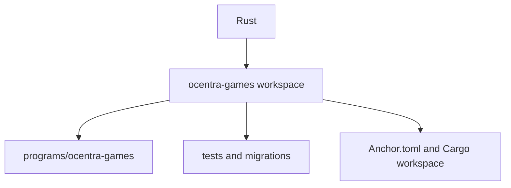
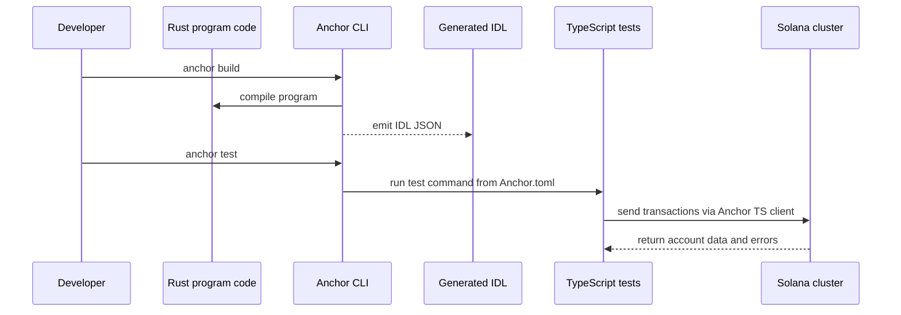

# Rust Architecture

## Scope

`Rust` is a container for Solana program workspaces. Each workspace can combine:

- Rust crates for on-chain execution
- Anchor configuration
- Node.js/TypeScript orchestration for tests and migrations

At the moment, `Rust/ocentra-games` is the active workspace.

## Workspace Map

## Cross-Language Build And Test Flow

## Boundaries

- Rust code is the source of truth for instruction behavior and account constraints.
- TypeScript here is for test and migration orchestration, not protocol ownership.
- The generated IDL is the contract between Rust and TypeScript tooling.
