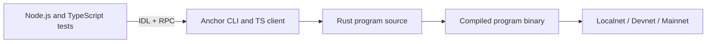

# Rust Workspace

This folder contains Rust-based blockchain workspaces used by Ocentra Games.
Right now it contains one Anchor workspace at `Rust/ocentra-games`.

## What Is Here

- `ocentra-games`: Solana program workspace with:
  - Rust on-chain program code in `programs/ocentra-games`
  - Node.js/TypeScript tooling for tests, migrations, and linting
  - Anchor config and build/deploy entrypoints

## Runtime Model

## Why Both Rust And Node Exist

- Rust defines the on-chain program and account/instruction logic.
- Anchor compiles Rust and generates an IDL from that program.
- Node.js/TypeScript uses the generated IDL for typed program calls in tests.
- Migrations and local test orchestration are script-driven from the Node side.

## Main References

- `Rust/ocentra-games/README.md`
- `Rust/ocentra-games/ARCHITECTURE.md`
