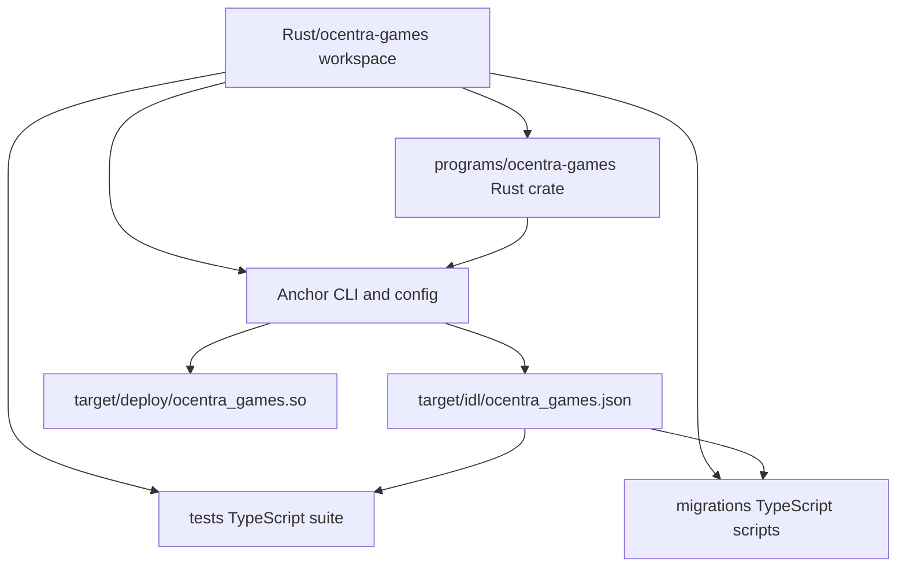
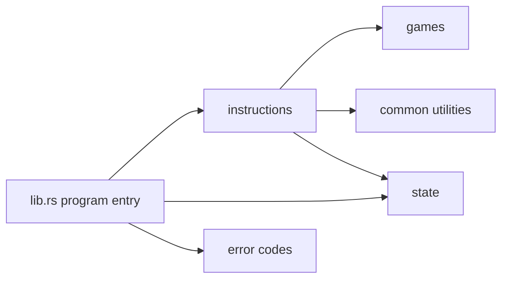
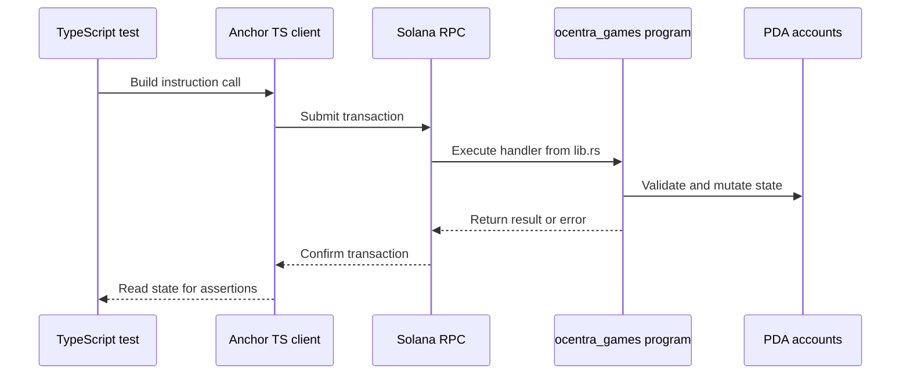

# Ocentra Games Rust Architecture

## Scope

This workspace is an Anchor project that combines:

- On-chain Rust program code
- Anchor build/deploy pipeline
- Node.js/TypeScript integration tests and migrations

## High-Level Components

## Program Layering

## Runtime Interaction

## Node And Rust Boundaries

- Rust is authoritative for instruction logic and state constraints.
- TypeScript orchestrates execution and validation of outcomes.
- IDL is the shared contract produced from Rust by Anchor build.
- Test aliases in `tsconfig.json` are scoped to the `tests` tree.

## Primary Entry Files

- `programs/ocentra-games/src/lib.rs`
- `programs/ocentra-games/Cargo.toml`
- `Anchor.toml`
- `package.json`
- `tests/root-hooks.ts`
