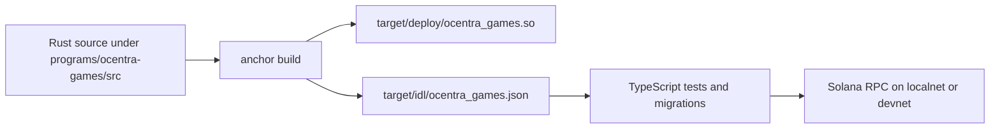

# Ocentra Games Anchor Workspace

`Rust/ocentra-games` is a mixed Rust + Node workspace:

- Rust implements the on-chain Solana program.
- Anchor builds and deploys the program.
- TypeScript tests and migrations interact with that program via IDL.

## Workspace Layout

- `programs/ocentra-games`: Rust Anchor program crate.
- `tests`: TypeScript Mocha/Chai integration tests.
- `migrations`: Anchor migration scripts.
- `Anchor.toml`: cluster/provider config and test command.
- `Cargo.toml`: Rust workspace config.
- `package.json`: Node scripts and dependencies for test tooling.

## Rust And Node Integration



## Main Program Areas

The program entry point is `programs/ocentra-games/src/lib.rs`.
It exposes instruction handlers for:

- Match lifecycle (`create_match`, `join_match`, `start_match`, `end_match`)
- Move submission (`submit_move`, `submit_batch_moves`)
- Registry/config (`initialize_registry`, `register_game`, `update_game`)
- Economic actions (credits, rewards, subscriptions, escrow flows)
- Disputes, validator actions, and score calculations

Supporting modules live in:

- `programs/ocentra-games/src/instructions`
- `programs/ocentra-games/src/state`
- `programs/ocentra-games/src/games`
- `programs/ocentra-games/src/common`

## Scripts

From `Rust/ocentra-games/package.json`:

- `npm run build`: `anchor build`
- `npm run test`: `anchor test`
- `npm run deploy`: `anchor deploy`
- `npm run lint`: prettier check + TypeScript noEmit
- `npm run type-check`: TypeScript type check

## Program ID

- `7eWx3H8bXMif7SDyPS1j5LZw1yUGDNZY592WzEKNf696`

Configured in:

- `programs/ocentra-games/src/lib.rs` via `declare_id!`
- `Anchor.toml` for devnet and mainnet sections

## Quick Start

```bash
cd Rust/ocentra-games
npm install
anchor build
anchor test
```

## Related Docs

- `ARCHITECTURE.md`
- `programs/ocentra-games/README.md`
- `tests/README.md`
