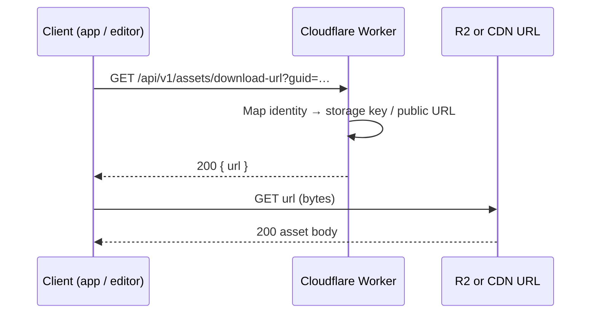
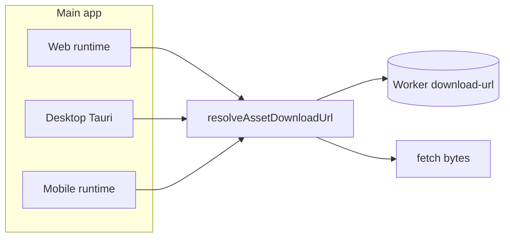
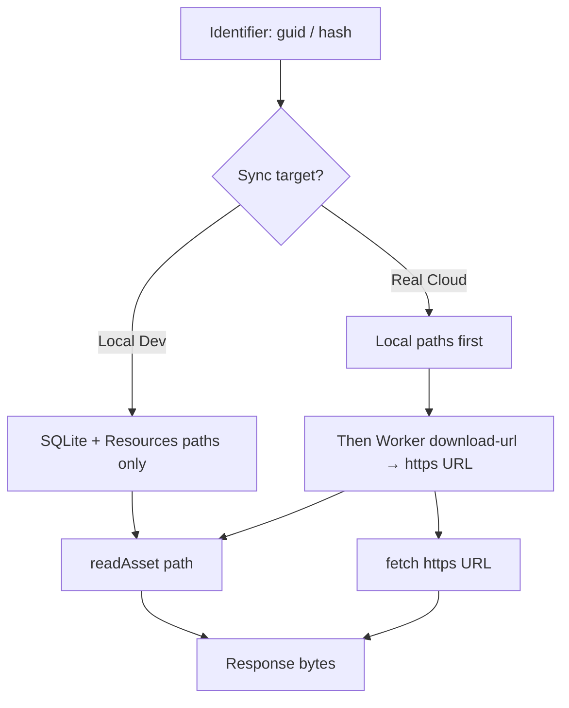

# Asset handling — expectations and implementation scope

**Last updated:** 2026-03-31

This document records the **intended mental model** for how game assets and content slices are resolved across **main app** and **asset editor**, in **development** and **production**, including **Tauri** and **mobile** where the codebase implements a distinct path.

It also states **what is implemented in-repo** versus **what is out of scope** so expectations stay honest.

---

## Canonical mental model (bytes for a known identity)

For **arbitrary asset bytes** addressed by **guid**, **hash**, or **checksum**, the authoritative pattern is:

1. **Resolve** a concrete URL via the Cloudflare Worker: **`GET /api/v1/assets/download-url`** with query params (`guid` and/or `hash` and/or `checksum`).
2. **Response** JSON includes **`{ "url": "<https?://...>" }`**. 
   - **CRITICAL EXPECTATION**: The worker **MUST NEVER** be involved in downloading or serving the actual asset bytes. The returned URL must be a **Pre-signed R2 S3 URL** (using AWS signature v4) or a direct public CDN link (`ASSETS_PUBLIC_URL`). Returning a URL pointing back to the worker to proxy bytes is strictly forbidden.
3. **Fetch/Stream** that URL with the host’s normal HTTP client (`fetch` in browser/WebView, or the desktop bridge where applicable). 
   - **Streaming Expectation**: The frontend should be able to stream assets (e.g. lists of assets or images) correctly and concurrently, rather than waiting synchronously for each bloated payload.
4. **Cache** (optional layers): in-memory/session dedupe for resolve URLs; IndexedDB or native caches for slice JSON and images — implementation varies by runtime.



### Explicit Implementation Instructions (For AI & Developers)

To fulfill the signed-URL expectation properly, you must follow these rules exactly:

1. **Do not use native worker proxying**: The `download-url` endpoint in `assets.ts` must **not** return `delivery: 'worker'` with a URL pointing back to the worker's own `GET /api/v1/assets/:key` route. 
2. **Generate S3 Pre-signed URLs**: Cloudflare R2 provides an S3-compatible API. You must use a standard library like `aws4fetch` (or `@aws-sdk/client-s3`) using the AWS Signature v4 algorithm to generate a signed URL for the R2 item.
3. **Use Environment Variables (No Hardcoding)**: The required variables are already defined in `src/constants/env.ts`. You must use:
   - `env.CLOUDFLARE_ACCOUNT_ID`
   - `env.R2_ASSETS_BUCKET_NAME`
   - `env.R2_ACCESS_KEY_ID`
   - `env.R2_SECRET_ACCESS_KEY`
   Never hardcode these. They belong in `wrangler secrets` (production) or `.dev.vars` (local dev).
4. **Endpoint Construction**: The base URL for the S3 API is always `https://${env.CLOUDFLARE_ACCOUNT_ID}.r2.cloudflarestorage.com/${env.R2_ASSETS_BUCKET_NAME}/${r2Key}`.
5. **Update Integration Tests**: The `tests/integration/assets-api.test.ts` currently assert the wrong behavior (they expect the worker to serve the bytes). Update the tests so they expect a pre-signed URL. You must inject dummy/mock credentials into the test environment (e.g., in `vitest.config` or test setup) so the URL signer does not throw missing-credential errors during CI.

**Single source of path constants:** `@ocentra/endpoint-domain` (`ApiEndpoint.Assets.DownloadUrl`, `buildApiUrl`, etc.). **Shared resolve helper:** `@ocentra/endpoint-domain/utils/resolve-asset-download-url` (`resolveAssetDownloadUrl`, `getWorkerBaseUrl`, `clearAssetDownloadUrlResolveCache`).

**Operational note:** after changing endpoint-domain **source**, run **`npm run build`** in `packages/endpoint-domain` (or root domain build) so **`dist/`** matches — stale `dist` breaks routing and imports in Worker and apps.

---

## Content slices (JSON manifests, not arbitrary blobs)

Entry index, home page games, game catalog, per-game slices, etc. are fetched as **JSON** from URLs built from the **same worker base** (`getSliceUrl` / `getEntryIndexUrl` in `PlatformAssetRuntimeShared`), using **`StorageConfig.r2Assets.workerUrl`** (and related env). These are **not** the same code path as `download-url` for raw bytes, but they share the **same worker origin** in a correctly configured environment.

---

## Main app (`src/`)

Runtime selection: `getPlatformAssetRuntime()` in `src/adapters/assets/PlatformAssetRuntime.ts`.

| Surface | Asset bytes (`fetchAsset` / by guid/hash) | Notes |
|--------|--------------------------------------------|--------|
| **Web** (`WebPlatformAssetRuntime`) | `resolveAssetDownloadUrl` → `fetch(url)` | Browser `fetch`; slices use `fetchJsonSlice` + IndexedDB cache. |
| **Desktop Tauri** (`DesktopPlatformAssetRuntime`, lazy-loaded) | Same resolve → fetch via native/desktop bridge where applicable | See `DesktopPlatformAssetRuntime.ts` — still **resolve then fetch** aligned with web semantics. |
| **Mobile** (`MobilePlatformAssetRuntime`) | Extends web path; asset fetches use `resolveAssetDownloadUrl` then `fetch` | Capacitor/WebView; same logical model as web. |



**Configuration:** `src/services/storage/StorageConfig.ts` and Vite env (e.g. worker URL, public asset base). **Shipped** desktop/mobile/web builds must embed a **real** worker base for production; local-only R2 is for dev.

**Direct public URL (legacy/alternate):** `getAssetUrl` in `PlatformAssetRuntimeShared` builds a URL from `assetsPublicUrl` + key — used where the product explicitly expects a **stable public base** without going through `download-url`. Prefer **`download-url`** for authoritative mapping from identity to bytes unless you have a specific reason.

---

## Asset editor (`packages/asset-editor`)

The editor is **not** the same binary as the main app. It uses a **local SQLite-backed index** and Tauri **`readAsset`** for workspace files under `Resources/`.

### Sync targets (user intent: Local Dev vs Real Cloud)

Configured in `src/services/storage/syncTarget.ts` and surfaced in the editor UI (e.g. Sync menu: **DEV** vs **REAL**).

| Target | Worker URL used for sync/config | **download-url appended to load candidates?** |
|--------|-----------------------------------|-----------------------------------------------|
| **Local Dev** | Local worker (default `http://127.0.0.1:8787` when env not set) | **No** — load stays **seed/local**: SQLite index + `Resources/...` paths only. |
| **Real Cloud** | Production/deployed worker from env (`VITE_EDITOR_SYNC_REAL_*`, etc.) | **Yes** — after local candidates, **`resolveAssetDownloadUrl`** may append an **`https?://`** URL. |



**Load implementation:** `NetworkRouter.getResource` (`packages/asset-editor/src/adapters/network/NetworkRouter.ts`):

- **`http://` / `https://`** candidates → **`fetch(url)`**.
- Otherwise → relative path → **`readAsset`** (Tauri local file).

Candidate URLs are assembled in `TauriAssetUrlResolver.ts` (`getAssetUrlByGuidAsync`, `getAssetCandidateUrls`). **Real Cloud** only calls `appendRealCloudDownloadUrl` (worker resolve).

**Deletion:** `deleteAsset` **filters out** `https?://` candidates so remote URLs are never passed to local file delete.

### Editor: web vs Tauri

| Mode | Role |
|------|------|
| **Vite dev / web** | Development shell; full asset editing still expects Tauri + DB for the primary path. |
| **Tauri (dev or release)** | Canonical editor deployment; local index + `readAsset`; Real Cloud adds remote fetch fallback. |

**Expectation:** The **shipped** editor product is **Tauri**; a web build may exist for dev convenience but is not the primary production distribution.

---

## Cloudflare Worker (`infra/cloudflare`)

- Implements **`GET`** `ApiEndpoint.Assets.DownloadUrl` (and related asset routes). See `infra/cloudflare/src/handlers/assets.ts` and integration tests under `infra/cloudflare/tests/`.
- **`ASSETS_PUBLIC_URL`** (or equivalent) on the Worker influences what **`download-url`** returns when public CDN delivery is desired.

---

## `packages/card-games` (full corpus) vs what the main app shows

**Yes — you keep using `@packages/card-games` while you migrate.** What we remove or avoid is **only the main app frontend** treating that corpus (DuckDB, Vite `serve-game-data`, bulk `games.json` slices, etc.) as if it were the live product catalog.

| Concern | Role |
|--------|------|
| **`packages/card-games`** | Holds the **intended large set** of games over time: `processed-games` JSON, ingest/validation scripts, DuckDB tooling, descriptors. It stays the **working corpus** for migration, QA, and batch operations. |
| **Main app (production / real site)** | Should list and offer only games that exist as **real shipped assets** (entry index + `Resources/GameMode/CardGames/Games`-style game modes), not the full Duck-backed list. |
| **Editor (dev)** | May still use card-games **indirectly** during migration (validators, generated bundles, reference JSONs, local scripts). That is **tooling**, not the same path as “homepage carousel source of truth”. |
| **`packages/data-explorer`** | Optional **local** explorer over the corpus JSONs for you; it is **not** a dependency of the shipped main app UI. |

So: **card-games package = long-term corpus + pipelines.** **Main app UI = subset aligned with assets you have actually shipped.** The frontend change is about **which data source drives the app**, not deleting the package.

---

## Implementation checklist (honest scope)

| Item | Status |
|------|--------|
| Shared `resolveAssetDownloadUrl` in `endpoint-domain` | ✅ Implemented |
| Main app web/desktop/mobile: resolve → fetch for asset bytes | ✅ Implemented (see `PlatformAssetRuntime.ts`) |
| Worker `GET download-url` + tests | ✅ Implemented |
| Editor: Local Dev = no worker URL in load list | ✅ Implemented |
| Editor: Real Cloud = local first, then `download-url` + `fetch` for `https` | ✅ Implemented |
| Editor: delete skips remote URLs | ✅ Implemented |
| Workspace package resolution (`src` vs `dist`) — “Option A” | ❌ Not this doc; see `.cursor/plans/option-a-source-first-workspace-resolution-plan.md` |
| Mobile-specific native asset pipeline beyond WebView `fetch` | ❌ Not separate; same as web resolve + fetch in current code |

---

## Quick reference — key files

| Area | Path |
|------|------|
| Resolve helper | `packages/endpoint-domain/src/utils/resolve-asset-download-url.ts` |
| Main app shared | `src/adapters/assets/PlatformAssetRuntimeShared.ts` (re-exports resolve helpers) |
| Main app runtimes | `src/adapters/assets/PlatformAssetRuntime.ts`, `DesktopPlatformAssetRuntime.ts` |
| Editor candidates + sync gate | `packages/asset-editor/src/adapters/assets/TauriAssetUrlResolver.ts` |
| Editor load loop | `packages/asset-editor/src/adapters/network/NetworkRouter.ts` |
| Editor storage config | `packages/asset-editor/src/services/storage/StorageConfig.ts` |
| Editor sync targets | `packages/asset-editor/src/services/storage/syncTarget.ts` |

---

## Deploy and environment variables (presigned asset URLs)

`GET /api/v1/assets/download-url` needs either **`ASSETS_PUBLIC_URL`** (public CDN base; JSON returns `delivery: "public"`) **or** full **R2 S3 API** configuration so the worker can mint **presigned GET** URLs (`delivery: "signed"`). Nothing here belongs in application source as literals; use Wrangler vars and secrets.

| Variable | Secret? | Role |
|----------|---------|------|
| `CLOUDFLARE_ACCOUNT_ID` | No (public account id) | Host segment in `https://<id>.r2.cloudflarestorage.com/...` |
| `R2_ASSETS_BUCKET_NAME` | No | Path segment; **must match** the R2 bucket name bound as `ASSETS_BUCKET` in Wrangler for that environment |
| `R2_ACCESS_KEY_ID` | **Yes** | R2 S3 API access key (Dashboard → R2 → Manage R2 API Tokens) |
| `R2_SECRET_ACCESS_KEY` | **Yes** | R2 S3 API secret |

### Local development (`wrangler dev --env development`)

1. In the Cloudflare dashboard: **R2** → **Manage R2 API Tokens** → create a token with read access to the dev assets bucket (or scoped as needed).
2. Copy [`infra/cloudflare/.dev.vars.example`](../../infra/cloudflare/.dev.vars.example) to **`infra/cloudflare/.dev.vars`** and fill in the four values above.
3. Ensure `R2_ASSETS_BUCKET_NAME` equals the `bucket_name` for the `ASSETS_BUCKET` binding in [`infra/cloudflare/wrangler.toml`](../../infra/cloudflare/wrangler.toml) (`env.development`).

### Production (deployed Worker)

1. Set **`R2_ASSETS_BUCKET_NAME`** in **[`env.production.vars`](../../infra/cloudflare/wrangler.production.toml)** to the production bucket name that backs `ASSETS_BUCKET` (repo default: `ocentra-assets`). Deploy merges this with the dashboard.
2. Set **`CLOUDFLARE_ACCOUNT_ID`** as a Worker **var** (same value as in the account overview) via Wrangler or the dashboard, or add it to `[env.production.vars]` in `wrangler.production.toml` if your team commits non-secret account ids.
3. Put the S3 API credentials as **secrets** (not in git):

```bash
cd infra/cloudflare
npx wrangler secret put R2_ACCESS_KEY_ID --config wrangler.production.toml --env production
npx wrangler secret put R2_SECRET_ACCESS_KEY --config wrangler.production.toml --env production
```

4. Redeploy the Worker after changing secrets (`npm run deploy` from `infra/cloudflare` with production config as documented in that package).

GitHub Actions **`production-deploy.yml`** already passes **`CLOUDFLARE_ACCOUNT_ID`** and **`CLOUDFLARE_API_TOKEN`** for deploy; **runtime** R2 API keys are **not** duplicated in GitHub — they live on the Worker as secrets above.

### Optional: public CDN instead of presigning

If **`ASSETS_PUBLIC_URL`** is set to your static asset base (e.g. `https://assets.example.com`), `download-url` returns that base + object path and `delivery: "public"`. Presign variables are not used for that response path, but direct anonymous GETs on the worker for raw bytes remain disabled (403) unless you rely on redirects to the public URL for legacy query routes.

### Full end-to-end checklist (local, Worker runtime, GitHub)

Use this as the single ordered path when setting up **everything**.

#### 1. Bucket names must match (both sides)

| Environment | Config file | Worker name | `ASSETS_BUCKET` → `bucket_name` | `R2_ASSETS_BUCKET_NAME` in `[env.*.vars]` |
|-------------|-------------|-------------|----------------------------------|--------------------------------------------|
| Development | [`infra/cloudflare/wrangler.toml`](../../infra/cloudflare/wrangler.toml) `[env.development]` | `claim-storage-dev` | `ocentra-assets-test` | `ocentra-assets-test` |
| Production | [`infra/cloudflare/wrangler.production.toml`](../../infra/cloudflare/wrangler.production.toml) `[env.production]` | `claim-storage` | `ocentra-assets` | `ocentra-assets` (in `[env.production.vars]`) |

If you rename a bucket in Cloudflare, update **both** the `[[env.*.r2_buckets]]` entry where `binding = "ASSETS_BUCKET"` **and** `R2_ASSETS_BUCKET_NAME`.

#### 2. Cloudflare dashboard (account-wide)

1. Copy **Account ID** from the dashboard (Workers sidebar or account overview).
2. **R2** → confirm buckets exist (`ocentra-assets-test`, `ocentra-assets`) or create them.
3. **R2** → **Manage R2 API Tokens** → create **S3-compatible** tokens:
   - One scoped for dev read access to `ocentra-assets-test` (local).
   - One scoped for prod read access to `ocentra-assets` (production Worker secrets).
4. Store **Access Key ID** + **Secret** securely; they map to **`R2_ACCESS_KEY_ID`** and **`R2_SECRET_ACCESS_KEY`**.

#### 3. Local development (your machine)

1. `npx wrangler login` (once).
2. Copy [`infra/cloudflare/.dev.vars.example`](../../infra/cloudflare/.dev.vars.example) → **`infra/cloudflare/.dev.vars`** (gitignored).
3. Set **`CLOUDFLARE_ACCOUNT_ID`**, **`R2_ASSETS_BUCKET_NAME`** (`ocentra-assets-test`), **`R2_ACCESS_KEY_ID`**, **`R2_SECRET_ACCESS_KEY`** (dev token).
4. From **`infra/cloudflare`**: `npm run dev` (runs `wrangler dev --env development`).
5. Call **`GET /api/v1/assets/download-url`** (with whatever auth your dev env expects). Expect **`delivery: "signed"`** and an `https://<accountid>.r2.cloudflarestorage.com/...` URL, or **503** if presign env is incomplete.

#### 4. Production Worker runtime (not GitHub)

These live on the **deployed** Worker (`claim-storage`), not in the repo:

1. **`CLOUDFLARE_ACCOUNT_ID`** — plain **variable** on the Worker (or in `[env.production.vars]` in `wrangler.production.toml` if you commit it).
2. **`R2_ASSETS_BUCKET_NAME`** — already set in repo to **`ocentra-assets`**; change only if your prod bucket name differs (and keep `ASSETS_BUCKET` in sync).
3. **`R2_ACCESS_KEY_ID`** / **`R2_SECRET_ACCESS_KEY`** — **secrets** (prod R2 S3 token):

```bash
cd infra/cloudflare
npx wrangler secret put R2_ACCESS_KEY_ID --config wrangler.production.toml --env production
npx wrangler secret put R2_SECRET_ACCESS_KEY --config wrangler.production.toml --env production
```

4. Redeploy: `npm run deploy` from **`infra/cloudflare`** (or your CI deploy job).

**Do not** put the R2 S3 secret keys in GitHub Actions secrets for this flow; they are Worker secrets.

#### 5. GitHub repository secrets (`production-deploy.yml`)

Configure these in the repo **Settings → Secrets and variables → Actions** so the workflow can build and deploy:

| Secret | Used for |
|--------|----------|
| `CLOUDFLARE_API_TOKEN` | Wrangler deploy, Pages deploy, asset sync |
| `CLOUDFLARE_ACCOUNT_ID` | Deploy and sync (same id as dashboard) |
| `VITE_R2_WORKER_URL` | Production web build |
| `VITE_R2_BUCKET_NAME` | Production web build |
| `VITE_LOGS_WORKER_URL` | Production web build |
| `LOGS_API_KEY` | Production web build (Vite `VITE_LOGS_API_KEY`) |
| `CLAIM_STORAGE_ASSETS_URL_PROD` | `sync:assets:prod` step |
| `CLAIM_STORAGE_ASSETS_TOKEN_PROD` | `sync:assets:prod` step |
| `ASSETS_WORKER_URL_PROD` | `sync:assets:prod` step |
| `ASSETS_WORKER_TOKEN_PROD` | `sync:assets:prod` step |

**`development-r2-worker.yml`** (push to **`main`**, path filter): syncs to **`ocentra-assets-test`** and deploys **`claim-storage-dev`**. Required: **`CLAIM_STORAGE_ASSETS_URL_DEV`** (base URL of the dev Worker, e.g. `https://claim-storage-dev.<account>.workers.dev`). Optional: `CLAIM_STORAGE_ASSETS_TOKEN_DEV`, `ASSETS_WORKER_URL_DEV`, `ASSETS_WORKER_TOKEN_DEV`.

#### 6. Suggested order

1. Dashboard: buckets + R2 S3 tokens.  
2. Local **`.dev.vars`** + `npm run dev` until `download-url` is **signed** (or you intentionally use **`ASSETS_PUBLIC_URL`** only).  
3. Production Worker: **`CLOUDFLARE_ACCOUNT_ID`** + **`wrangler secret put`** for both R2 keys + deploy.  
4. GitHub: add secrets from the table, then run **Production Deploy** (or deploy Worker locally with logged-in Wrangler).

---

## Env variables (non-exhaustive — apps and editor)

Exact names evolve; prefer **`packages/asset-editor/README.md`**, **`src/services/storage/StorageConfig.ts`**, and **`syncTarget.ts`** for editor-specific variables (`VITE_EDITOR_SYNC_LOCAL_*`, `VITE_EDITOR_SYNC_REAL_*`, `VITE_CLAIM_STORAGE_URL`, etc.). Main app uses **`StorageConfig`** in `src/services/storage/StorageConfig.ts` and Vite prefixes documented in app setup.

When in doubt, **the worker base URL must point at the same Worker** that serves `download-url` and slice routes for the environment you are testing.
