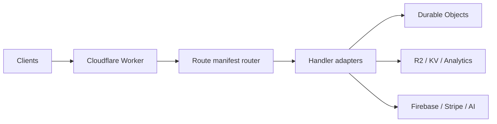

# Cloudflare Worker Infrastructure

This package is the off-chain backend for Ocentra APIs on Cloudflare Workers.

## Primary docs

- `../../docs/ocentra/asset-handling.md` — **`/api/v1/assets/download-url`**, R2/CDN delivery, main app vs asset editor, and **deploy vars** for presigned URLs.
- `.dev.vars.example` — template for local **`CLOUDFLARE_ACCOUNT_ID`**, **`R2_*`** S3 API keys, and **`R2_ASSETS_BUCKET_NAME`** (copy to **`.dev.vars`**, gitignored). Production: `wrangler secret put` for the two secrets; see *Deploy and environment variables* in asset-handling.
- `docs/ARCHITECTURE.md` — main architecture document (mermaid diagrams, request flow, components).
- `docs/OVERVIEW.md` — quick scope: what this worker does and does not do.
- `docs/DOMAIN-DEPENDENCIES.md` — domain package boundaries.
- `docs/DOC-INDEX.md` — full docs index by task.
- `docs/features/README.md` — feature-level docs.
- `docs/durable-objects/README.md` — per-DO docs.
- `docs/TEST-README.md` — test systems, modes, and commands.

## Runtime shape



## Source layout

- `src/index.ts` — worker entrypoint and cross-cutting guards.
- `src/utils/routes.ts` — route-manifest-based handler mapping + middleware.
- `src/handlers/` — HTTP adapters.
- `src/durable-objects/` — stateful actor implementations.
- `src/logic/` — business logic units.
- `tests/` — unit, integration, e2e, and security tests.

## Commands

- `npm run dev`
- `npm run test`
- `npm run build`
- `npm run deploy`

## Admin auth requirements

Admin endpoints (`/api/v1/admin/dashboard-data`, `/api/v1/admin/user-status/:id`) require:

- valid Firebase user token from client (`Authorization: Bearer <id-token>`)
- successful token verification in worker auth middleware
- admin role resolution from Firestore user document (`users/{uid}.isAdmin`)

Firestore role lookup in worker uses service-account auth, so local and deployed environments must provide:

- `FIREBASE_PROJECT_ID`
- `FIREBASE_SERVICE_ACCOUNT_JSON`

Without service-account JSON, admin role checks fail closed and admin endpoints may return `401`/`403`.

## Admin auth smoke tests (real Firebase path)

Run these to validate service-account Firestore access used by admin checks:

```bash
cd infra/cloudflare
npm run test -- tests/integration/firebase-service-auth-real.test.ts
```

or:

```bash
cd infra/cloudflare
npx tsx scripts/run-firebase-real-smoke.ts
```
