# Cloudflare Worker Architecture

**Purpose:** Comprehensive architecture documentation for the Ocentra Games Cloudflare Worker infrastructure.

**Last Updated:** 2026-02-10

---

## Table of Contents

1. [System Overview](#system-overview)
2. [Architecture Diagrams](#architecture-diagrams)
3. [Request Flow](#request-flow)
4. [Flow Layer](#flow-layer)
5. [Component Breakdown](#component-breakdown)
6. [Durable Objects](#durable-objects)
7. [Storage Layer](#storage-layer)
8. [API Endpoints](#api-endpoints)
9. [Security Model](#security-model)
10. [Testing Architecture](#testing-architecture)
11. [Deployment](#deployment)

---

## System Overview

The Cloudflare Worker serves as the **off-chain backend API** for Ocentra Games, providing:

- Match storage and retrieval with R2-based persistent archives
- Real-time coordination through Durable Objects for local state and WebSocket channels
- Flow-first orchestration for multi-step work across multiple DOs and external services
- Asset delivery, economy, AI integration, logging, and leaderboard data

## Current Runtime State

This section is a code-derived snapshot of what is active now.

- **Worker entrypoint:** `src/index.ts`
- **Routing model:** `src/utils/routes.ts` uses `CloudflareRouteManifest` from endpoint-domain
- **Handler surface:** 32 handler files in `src/handlers/`
- **Flow surface:** 6 orchestration flows in `src/flows/`
- **Exported Durable Objects:** 27 DO classes exported from `src/index.ts`
- **Scheduled tasks in worker:** reconciliation (`runReconciliation`), leaderboard refresh (`runLeaderboardRefresh`), audit retention heartbeat (`AUDIT_ARCHIVE.put(...)`)

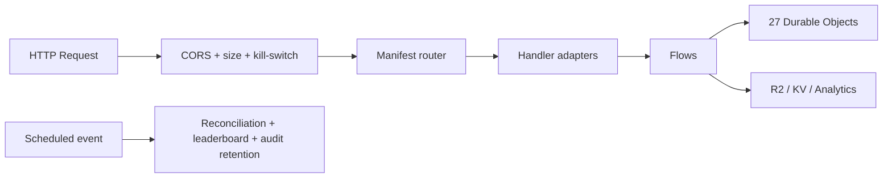

### Tech Stack

| Component | Technology |
|-----------|------------|
| Runtime | Cloudflare Workers (V8 Isolates) |
| Storage | R2 (S3-compatible object storage) |
| Coordination | Durable Objects (SQLite-backed) |
| Logging | Analytics Engine (time-series) |
| Rate Limiting | KV Namespace |
| Auth | Firebase JWT Verification |

---

## Architecture Diagrams

### High-Level System Architecture

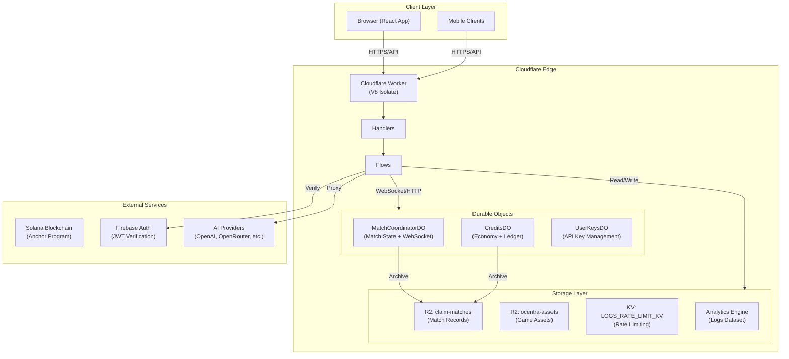

### Request Processing Flow

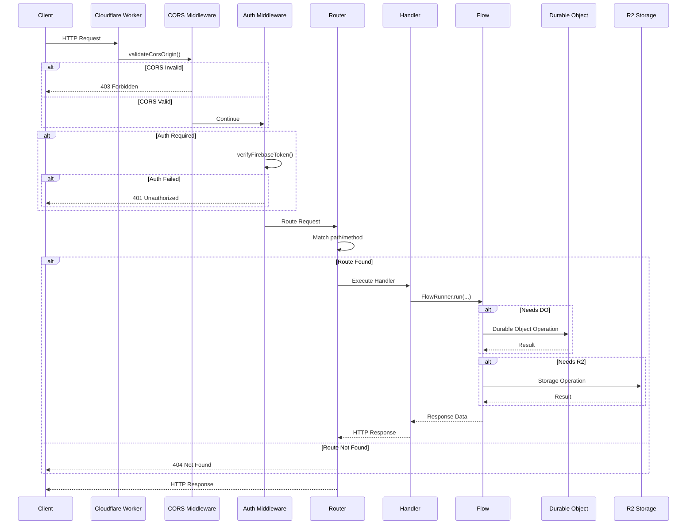

### Match Lifecycle Flow

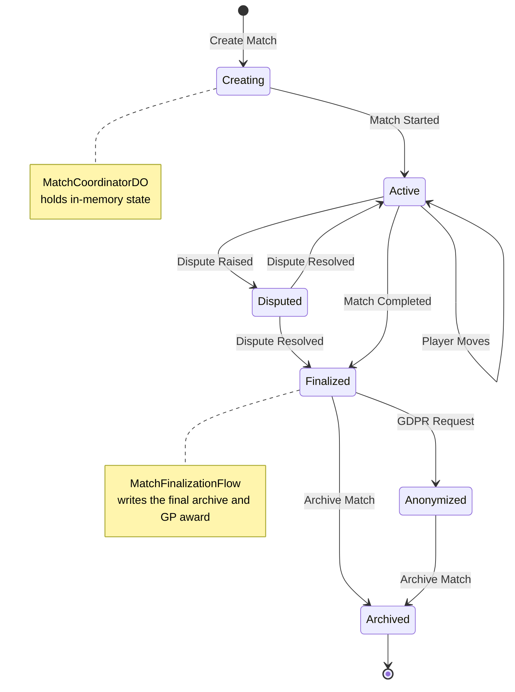

### Credits/GP Economy Flow

```mermaid
flowchart LR
    subgraph Sources["GP Sources"]
        Matches["Match Completion"]
        Badges["Achievement Badges"]
        Daily["Daily Login"]
        Events["Special Events"]
    end

    FlowOrchestration["Flow orchestration<br/>MatchFinalizationFlow / RewardClaimFlow<br/>TournamentPrizeDistributionFlow / StripeWebhookFlow"]

    subgraph CreditsDO["CreditsDO (Durable Object)"]
        Balance["Current Balance<br/>gp_balance / ac_balance"]
        Ledger["Transaction Ledger<br/>(Last 30 days)"]
        Processed["Idempotency Cache"]
    end

    subgraph Usage["Credit Usage"]
        Entry["Match Entry Fees"]
        Shop["In-game Shop"]
        Boost["Power-ups"]
    end

    subgraph Archive["R2 Archive"]
        R2Ledger["CREDITS_LEDGER_ARCHIVE"]
        R2Audit["MATCHES_BUCKET<br/>(Audit Trail)"]
    end

    Sources --> FlowOrchestration
    FlowOrchestration -->|earnGP()| CreditsDO
    CreditsDO -->|consumeCredits()| Usage

    CreditsDO -->|Age > 30 days| Archive
    CreditsDO -.->|Immediate| R2Audit
```

---

## Request Flow

### 1. Entry Point (`src/index.ts`)

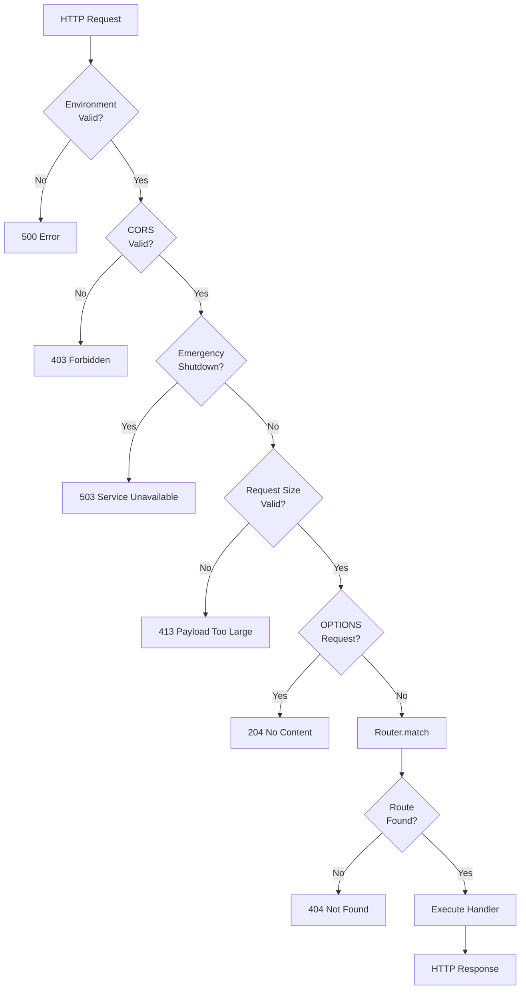

### 2. Router Matching (`src/utils/routes.ts`)

The router uses a **manifest-based routing system** defined in `@ocentra/endpoint-domain`:

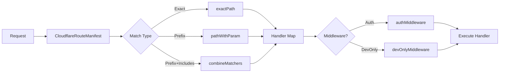

---

## Flow Layer

Flows are the cross-domain orchestration boundary. Handlers dispatch into flows, and flows coordinate the Durable Objects and external services that a request needs.

| Flow | Doc | What it coordinates |
| ---- | --- | --- |
| MatchFinalizationFlow | [flows/match-finalization-flow.md](flows/match-finalization-flow.md) | Final match archive, chat and AI dump persistence, GP award |
| PaymentCheckoutFlow | [flows/payment-checkout-flow.md](flows/payment-checkout-flow.md) | PaymentDO setup and Stripe checkout session creation |
| StripeWebhookFlow | [flows/stripe-webhook-flow.md](flows/stripe-webhook-flow.md) | Stripe event settlement, payment transitions, credit purchase |
| RewardClaimFlow | [flows/reward-claim-flow.md](flows/reward-claim-flow.md) | Reward claims, mission progress, GP and XP forwarding |
| InventoryTransferFlow | [flows/inventory-transfer-flow.md](flows/inventory-transfer-flow.md) | Gifts and trades across inventory DOs |
| TournamentPrizeDistributionFlow | [flows/tournament-prize-distribution-flow.md](flows/tournament-prize-distribution-flow.md) | Winner payout distribution through CreditsDO |

See [flows/README.md](flows/README.md) for the flow-layer overview and core abstractions.

---

## Component Breakdown

Handlers in `src/handlers/` are thin HTTP adapters: they parse requests, authorize, and dispatch into flows. Flows own the multi-step coordination path. Durable Objects own local state, journaling, and invariants. Routing is driven by the Route Manifest from `@ocentra/endpoint-domain`. Detailed request flows and message types are in the feature, flow, and DO docs linked below.

### Handlers and feature / DO links

| Handler | Feature / DO | Detail |
|---------|--------------|--------|
| matches.ts, ws.ts | Match coordination | [features/match-coordination.md](features/match-coordination.md) |
| credits.ts, webhooks-stripe.ts, ai-escrow.ts | Credits, economy, payments | [features/credits-and-economy.md](features/credits-and-economy.md), [features/payments-and-stripe.md](features/payments-and-stripe.md) |
| payments.ts | Payments, Stripe | [features/payments-and-stripe.md](features/payments-and-stripe.md) |
| ai.ts, ai-keys.ts, ai-oauth.ts | AI integration | [features/ai-integration.md](features/ai-integration.md) |
| feature-handlers (lobby, matchmaking, presence, friends, etc.) | Lobby, matchmaking, presence, profile, messages, feed, party, etc. | [features/lobby.md](features/lobby.md), [features/matchmaking.md](features/matchmaking.md), [features/presence-and-friends.md](features/presence-and-friends.md), [features/profile.md](features/profile.md), [features/messages.md](features/messages.md), [features/activity-feed.md](features/activity-feed.md), [features/party.md](features/party.md), [features/leaderboard.md](features/leaderboard.md), [features/notifications.md](features/notifications.md), [features/discovery.md](features/discovery.md) |
| leaderboard.ts | Leaderboard | [features/leaderboard.md](features/leaderboard.md) |
| assets.ts, resources.ts | Assets, resources | R2 + endpoint-domain |
| logs.ts | Logging | Analytics Engine |
| players.ts, badges.ts, disputes.ts, archive.ts, data.ts, signed-url.ts, explore.ts, homepage.ts, image-proxy.ts, test.ts | Various | See route manifest and handler files |

---

## Durable Objects

Durable Objects provide per-entity state (per user, per match, per room, etc.) and are addressed by shard key (`idFromName(...)`). Each DO exposes HTTP and optionally WebSocket; paths and segments come from `@ocentra/endpoint-domain`. Detailed purpose, message types, storage keys, and local state behavior are in the per-DO docs. Multi-DO orchestration lives in the flow docs.

### DO summary and detail links

| DO | Purpose (one line) | Detail |
|----|---------------------|--------|
| ActivityFeedDO | Per-user activity feed; append/list; fan-out to friends | [durable-objects/ActivityFeedDO.md](durable-objects/ActivityFeedDO.md) |
| AntiCheatDO | Per-user anti-cheat analyze/report/status | [durable-objects/AntiCheatDO.md](durable-objects/AntiCheatDO.md) |
| AuditLogDO | Store and query audit events; optional R2 archive | [durable-objects/AuditLogDO.md](durable-objects/AuditLogDO.md) |
| CreditsDO | GP/AC balance and ledger; idempotent award/earn/consume/purchase; escrow; used by flow-driven awards and settlement | [durable-objects/CreditsDO.md](durable-objects/CreditsDO.md) |
| FraudDetectionDO | Per-user fraud risk check | [durable-objects/FraudDetectionDO.md](durable-objects/FraudDetectionDO.md) |
| InventoryDO | Per-user inventory; list/equip/gift/trade; flow-driven transfer path | [durable-objects/InventoryDO.md](durable-objects/InventoryDO.md) |
| LeaderboardDO | Cached leaderboard entries per shard; top/rank/nearby/upsert/refresh | [durable-objects/LeaderboardDO.md](durable-objects/LeaderboardDO.md) |
| LobbyDO | Rooms; join/leave; WebSocket chat/countdown | [durable-objects/LobbyDO.md](durable-objects/LobbyDO.md) |
| MarketplaceDO | Global marketplace list/buy/sell/history | [durable-objects/MarketplaceDO.md](durable-objects/MarketplaceDO.md) |
| MatchCoordinatorDO | Per-match state and WebSocket; validate/upload/finalize; archive R2; finalized by MatchFinalizationFlow | [durable-objects/MatchCoordinatorDO.md](durable-objects/MatchCoordinatorDO.md) |
| MatchmakingDO | Queue join/leave/status; ELO matching | [durable-objects/MatchmakingDO.md](durable-objects/MatchmakingDO.md) |
| MatchShardDO | Per-match shard cache for state sync | [durable-objects/MatchShardDO.md](durable-objects/MatchShardDO.md) |
| MessageDO | Per-conversation messages; send/list/read-receipt | [durable-objects/MessageDO.md](durable-objects/MessageDO.md) |
| NotificationDO | Per-user notifications; push/list/mark-read/preferences | [durable-objects/NotificationDO.md](durable-objects/NotificationDO.md) |
| PartyDO | Party create/join/leave/invite/kick/transfer-leader | [durable-objects/PartyDO.md](durable-objects/PartyDO.md) |
| PaymentDO | Payment event storage; Stripe webhook ingestion; coordinated by PaymentCheckoutFlow and StripeWebhookFlow | [durable-objects/PaymentDO.md](durable-objects/PaymentDO.md) |
| PenaltyDO | Per-user penalties; issue/appeal/review-appeal | [durable-objects/PenaltyDO.md](durable-objects/PenaltyDO.md) |
| PlayerShardDO | Per-player shard for match coordination | [durable-objects/PlayerShardDO.md](durable-objects/PlayerShardDO.md) |
| PresenceDO | Presence status; friends; block; typing | [durable-objects/PresenceDO.md](durable-objects/PresenceDO.md) |
| ProfileDO | User profile; avatar; badges; stats; social card | [durable-objects/ProfileDO.md](durable-objects/ProfileDO.md) |
| ProgressionDO | Per-user XP, level, skills, achievements | [durable-objects/ProgressionDO.md](durable-objects/ProgressionDO.md) |
| RewardDO | Per-user daily/missions/battle-pass rewards; coordinated by RewardClaimFlow | [durable-objects/RewardDO.md](durable-objects/RewardDO.md) |
| SettingsDO | Per-user settings get/update | [durable-objects/SettingsDO.md](durable-objects/SettingsDO.md) |
| SignalingDO | WebRTC signaling; offer/answer/ICE; WebSocket | [durable-objects/SignalingDO.md](durable-objects/SignalingDO.md) |
| StateSyncCoordinatorDO | State sync coordination | [durable-objects/StateSyncCoordinatorDO.md](durable-objects/StateSyncCoordinatorDO.md) |
| TournamentDO | Per-tournament register/bracket/start/result/winners; payout handled by TournamentPrizeDistributionFlow | [durable-objects/TournamentDO.md](durable-objects/TournamentDO.md) |
| UserKeysDO | Per-user encrypted API keys (AI providers) | [durable-objects/UserKeysDO.md](durable-objects/UserKeysDO.md) |

---

## Storage Layer

### R2 Buckets

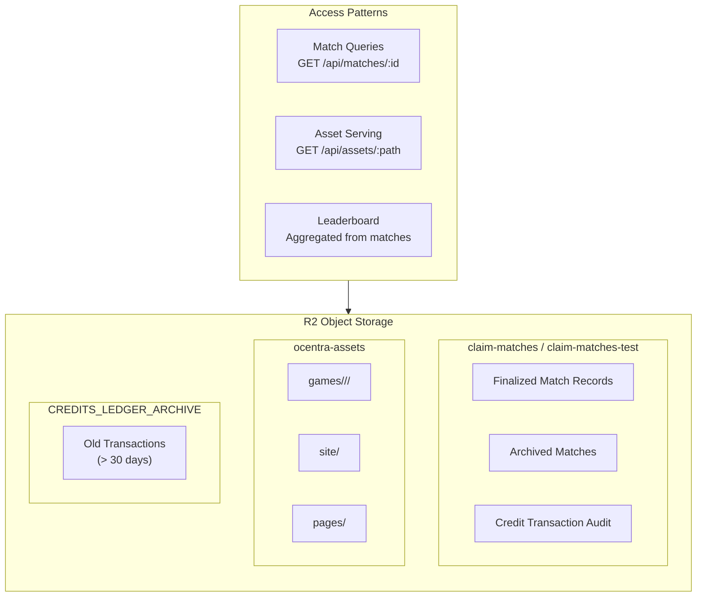

### Analytics Engine (Logs)

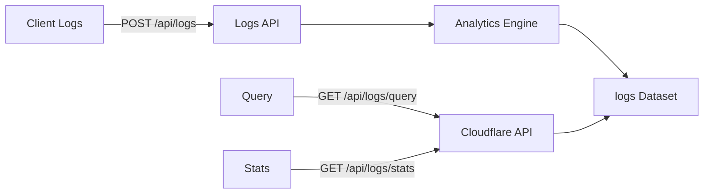

---

## API Endpoints

> **API definitions live in:** `packages/endpoint-domain/docs/ARCHITECTURE.md`
>
> The Cloudflare Worker consumes API definitions from `@ocentra/endpoint-domain`; it does not define them.

### Endpoint Categories

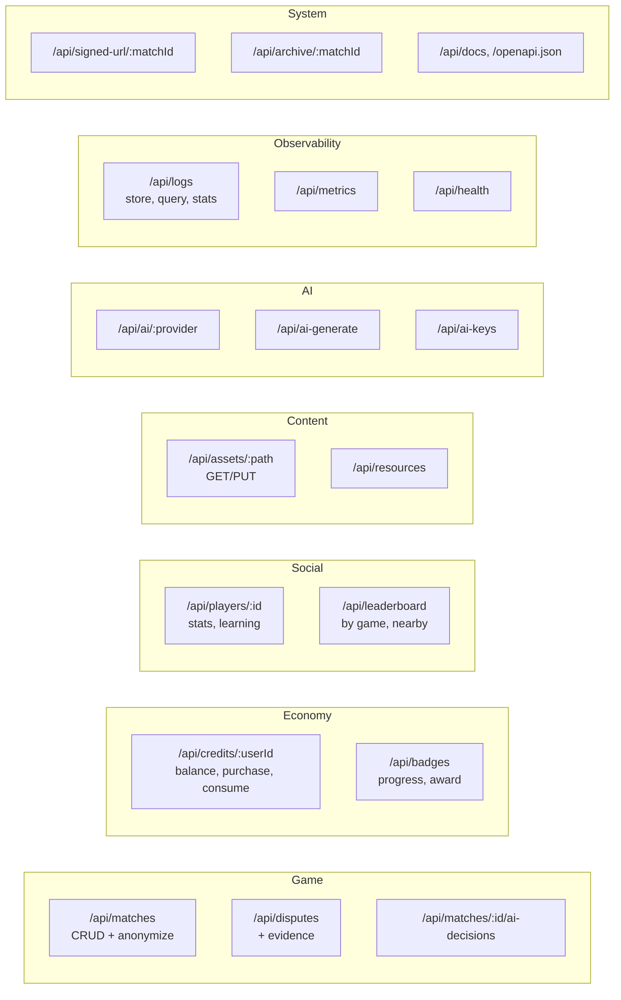

| Category | Endpoints | Purpose |
|----------|-----------|---------|
| Game | `/api/matches`, `/api/disputes` | Match lifecycle, disputes, AI decisions |
| Economy | `/api/credits`, `/api/badges` | GP/AC credits, achievements |
| Social | `/api/players`, `/api/leaderboard` | Player profiles, rankings |
| Content | `/api/assets`, `/api/resources` | Game assets, resources |
| AI | `/api/ai`, `/api/ai-generate`, `/api/ai-keys` | AI provider proxy, key management |
| Observability | `/api/logs`, `/api/metrics`, `/api/health` | Logging, monitoring |
| System | `/api/signed-url`, `/api/archive`, `/api/docs` | Utilities, docs |

### By feature

For request flows, flow docs, and DO usage per area, see: [features/match-coordination.md](features/match-coordination.md), [features/credits-and-economy.md](features/credits-and-economy.md), [features/payments-and-stripe.md](features/payments-and-stripe.md), [features/ai-integration.md](features/ai-integration.md), [features/lobby.md](features/lobby.md), [features/matchmaking.md](features/matchmaking.md), [features/presence-and-friends.md](features/presence-and-friends.md), [features/profile.md](features/profile.md), [features/messages.md](features/messages.md), [features/activity-feed.md](features/activity-feed.md), [features/party.md](features/party.md), [features/leaderboard.md](features/leaderboard.md), [features/notifications.md](features/notifications.md), [features/discovery.md](features/discovery.md), and [flows/README.md](flows/README.md).

### Route Manifest System

The Cloudflare Worker uses the **Route Manifest** from `@ocentra/endpoint-domain`:

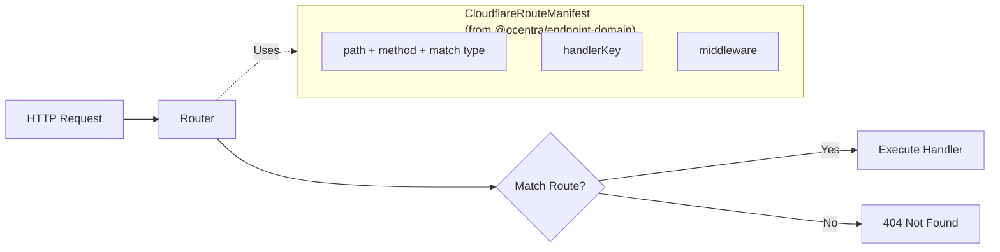

**See full API documentation:**
- [`packages/endpoint-domain/docs/ARCHITECTURE.md`](../../packages/endpoint-domain/docs/ARCHITECTURE.md) - Full endpoint inventory
- [`packages/endpoint-domain/docs/DESIGN-CONVENTIONS.md`](../../packages/endpoint-domain/docs/DESIGN-CONVENTIONS.md) - API design rules

---

## Security Model

### Defense Layers

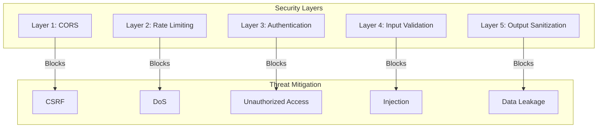

### Authentication Flow

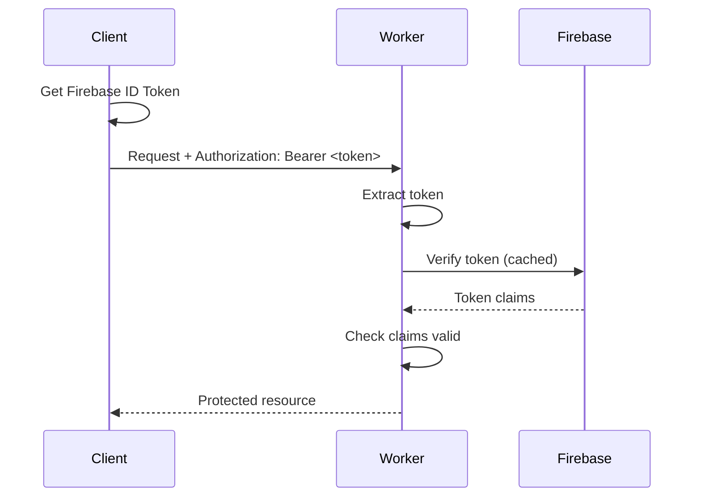

### Admin Dashboard Auth Sequence

`/api/v1/admin/dashboard-data` and `/api/v1/admin/user-status/:id` follow a two-stage gate:

1. `requireAuth` verifies Firebase ID token from `Authorization` header.
2. `checkAdminStatus` resolves caller role from Firestore `users/{uid}` and requires `isAdmin === true`.

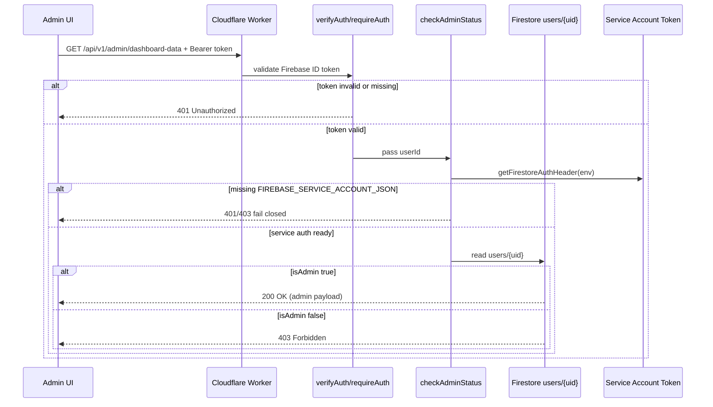

Operational requirement for admin routes:

- `FIREBASE_PROJECT_ID` must be set
- `FIREBASE_SERVICE_ACCOUNT_JSON` must be set

---

## Testing Architecture

### Test Pyramid

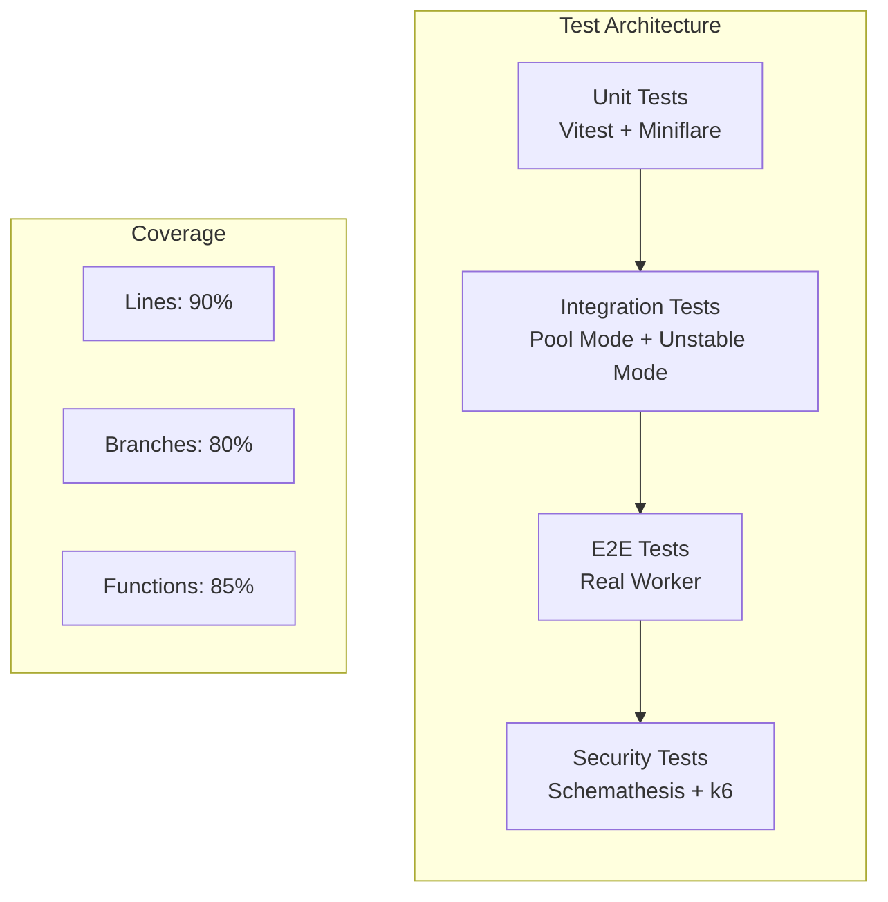

### Pool vs Unstable Execution

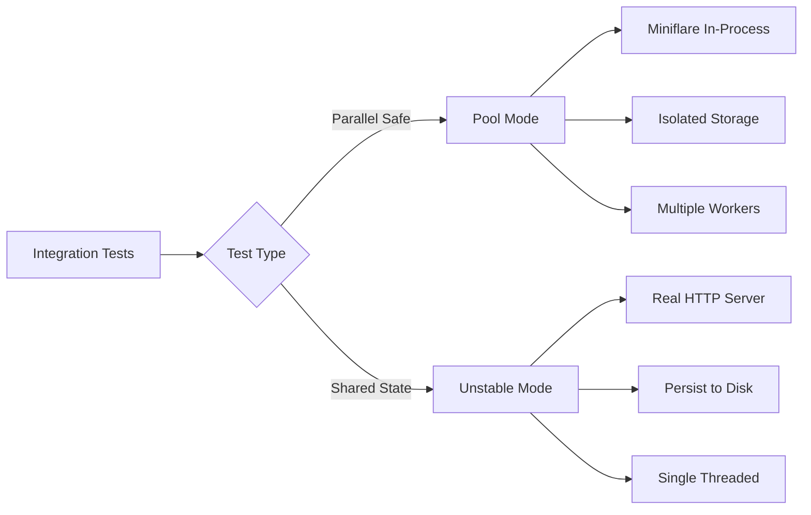

---

## Deployment

### CI/CD Pipeline

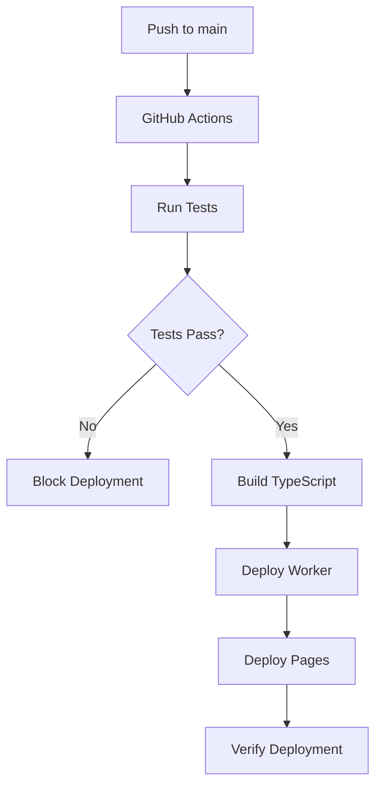

### Environment Configuration

| Environment | Worker Name | R2 Bucket | CORS Origin |
|-------------|-------------|-----------|-------------|
| Development | `claim-storage-dev` | `claim-matches-test` | `*` |
| Production | `claim-storage` | `claim-matches` | `https://game.ocentra.ca` |

---

## Key Design Principles

1. **Fail-Fast Validation** - CORS, auth, and input validation happen before business logic
2. **Durable Objects for State** - Real-time state in DO, permanent records in R2
3. **Idempotency** - All credit operations are idempotent with processed ID tracking
4. **Event-Driven Logging** - Structured logs via Analytics Engine
5. **Domain Package Boundaries** - API definitions from `@ocentra/endpoint-domain`
6. **No Raw Strings** - All paths, headers, and constants are typed via endpoint-domain

## Domain Package Integration

The Cloudflare Worker **consumes** API definitions from **`@ocentra/endpoint-domain`**:

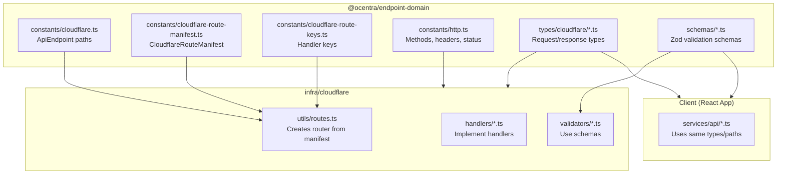

**Benefits:**
- **Single source of truth** for API paths and types
- **Type safety** across frontend and backend
- **No hardcoded strings** - all paths from `ApiEndpoint`
- **Automatic validation** - Zod schemas shared

**Full API architecture:** See [`packages/endpoint-domain/docs/ARCHITECTURE.md`](../../packages/endpoint-domain/docs/ARCHITECTURE.md)

---

## Related Documentation

- [OVERVIEW.md](OVERVIEW.md) - What the worker does and does not do
- [DOMAIN-DEPENDENCIES.md](DOMAIN-DEPENDENCIES.md) - Domain packages used by the worker
- [features/](features/) - Feature-level docs (lobby, matchmaking, credits, payments, match coordination, AI, etc.)
- [durable-objects/](durable-objects/) - Per-DO docs (purpose, shard key, HTTP/WS, message types)
- [TEST-README.md](TEST-README.md) - Worker testing modes and runner docs
- [DOC-INDEX.md](DOC-INDEX.md) - Task-based documentation index
