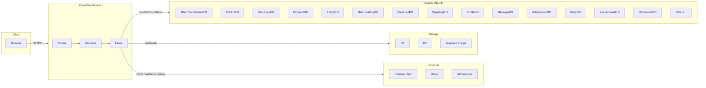

# Cloudflare Worker: What It Does and Does Not Do

Source of truth: derived from `src/index.ts`, `src/utils/routes.ts`, handler map, flow implementations, and exported Durable Objects.
Primary deep-dive: `ARCHITECTURE.md` (main diagrams and component mapping).

---

## Responsibilities (What the worker does)

- Request gateway: validates CORS, optional auth, request size; routes by path and method via endpoint-domain manifest; returns 404 when no route matches.
- Flow orchestration: hands off multi-step or cross-domain work to flows; handlers stay thin.
- Match storage and coordination: stores match records in R2; MatchCoordinatorDO and MatchShardDO for in-match state and WebSocket; PlayerShardDO for per-player state; StateSyncCoordinatorDO for sync.
- Economy: CreditsDO for GP/AC ledger and balance; idempotent earn, consume, purchase; Stripe webhooks and reward flows update payment and reward state.
- Payments and Stripe: payment creation and status; Stripe webhook handling with signature verification and idempotent processing; scheduled reconciliation when PAYMENT_DO and STRIPE_SECRET_KEY are set.
- AI integration: proxy to AI providers; UserKeysDO for API key storage; AI escrow reserve and consume via CreditsDO; AI OAuth and catalog endpoints.
- Lobby and matchmaking: LobbyDO for rooms and default instance; MatchmakingDO for matchmaking requests.
- Presence and friends: PresenceDO for presence; friends routes via feature handlers.
- Signaling: SignalingDO for signaling paths.
- Social and profile: ProfileDO, MessageDO, ActivityFeedDO, PartyDO, LeaderboardDO, NotificationDO; discovery via handler and KV.
- Inventory, marketplace, tournament, settings: InventoryDO, MarketplaceDO, TournamentDO, SettingsDO via feature handlers and flows where required.
- Trust and safety when bound: AuditLogDO, AntiCheatDO, FraudDetectionDO, PenaltyDO via feature handlers.
- Progression and rewards: ProgressionDO and RewardDO via feature handlers and reward flows.
- Assets and resources: Asset handler (R2); resources handler (manifest, validation via endpoint-domain).
- Observability: Analytics Engine logging; metrics collector; alerts; health and health-detail endpoints.
- Operational: Kill-switch (reject state-changing methods when EMERGENCY_SHUTDOWN); scheduled cron reconciliation, leaderboard refresh, and audit retention.

### Admin auth detail

Admin routes use a two-stage gate:

1. Firebase ID token verification from `Authorization` header.
2. Firestore admin-role lookup (`users/{uid}.isAdmin`) using worker service-account auth.

That second stage requires `FIREBASE_SERVICE_ACCOUNT_JSON` in worker environment.

---

## Boundaries (What the worker does not do)

- Game logic execution: no simulation of game rules; flows and DOs own state transitions.
- DO orchestration inside DOs: no sibling-DO orchestration from Durable Objects; flows own multi-DO sequences.
- Chain signing: worker does not sign Solana transactions; verifies and stores.
- Firebase: verifies JWT and reads Firestore user role state for admin checks; does not manage users or auth state.
- Stripe: receives webhooks and records payment events; payment creation uses Stripe API; no direct custody of card data.
- AI: proxies requests and manages keys and escrow; does not host models.

---

## High-Level Diagram

---

## Related docs

- `ARCHITECTURE.md`
- `features/README.md`
- `flows/README.md`
- `durable-objects/README.md`
- `DOMAIN-DEPENDENCIES.md`
- `TEST-README.md`
