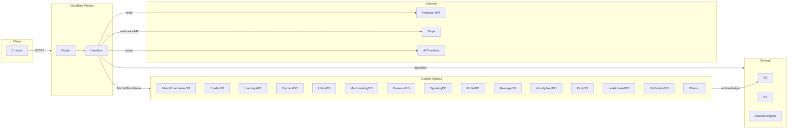

# Cloudflare Worker: What It Does and Does Not Do

**Source of truth:** Derived from `src/index.ts`, `src/utils/routes.ts`, handler map, and exported Durable Objects.
**Primary deep-dive:** `ARCHITECTURE.md` (main diagrams and component mapping).

---

## Responsibilities (What the worker does)

- **Request gateway:** Validates CORS, optional auth, request size; routes by path/method via endpoint-domain manifest; returns 404 when no route matches.
- **Match storage and coordination:** Stores match records in R2; MatchCoordinatorDO and MatchShardDO for in-match state and WebSocket; PlayerShardDO for per-player state; StateSyncCoordinatorDO for sync.
- **Economy:** CreditsDO for GP/AC ledger and balance; idempotent earn/consume/purchase; Stripe webhooks for payment events; PaymentDO for payment state.
- **Payments and Stripe:** Payment creation and status; Stripe webhook handler (signature verification, idempotent processing); scheduled reconciliation when PAYMENT_DO and STRIPE_SECRET_KEY are set.
- **AI integration:** Proxy to AI providers (AI handler); UserKeysDO for API key storage; AI escrow (reserve/consume) via CreditsDO; AI OAuth and catalog endpoints.
- **Lobby and matchmaking:** LobbyDO (rooms, default instance); MatchmakingDO for matchmaking requests.
- **Presence and friends:** PresenceDO for presence; friends routes via feature handlers.
- **Signaling:** SignalingDO for signaling paths.
- **Social and profile:** ProfileDO, MessageDO, ActivityFeedDO (feed/fan-out), PartyDO, LeaderboardDO, NotificationDO; discovery via handler and KV.
- **Inventory, marketplace, tournament, settings:** InventoryDO, MarketplaceDO, TournamentDO, SettingsDO via feature handlers.
- **Trust and safety (when bound):** AuditLogDO (AuditTrailService); AntiCheatDO, FraudDetectionDO, PenaltyDO via feature handlers.
- **Progression and rewards:** ProgressionDO, RewardDO via feature handlers.
- **Assets and resources:** Asset handler (R2); resources handler (manifest, validation via endpoint-domain).
- **Observability:** Analytics Engine logging (domain-logger-init); metrics collector; alerts; health and health-detail endpoints.
- **Operational:** Kill-switch (reject state-changing methods when EMERGENCY_SHUTDOWN); scheduled cron: reconciliation, leaderboard refresh, audit retention.

### Admin auth detail

Admin routes use a two-stage gate:

1. Firebase ID token verification from `Authorization` header.
2. Firestore admin-role lookup (`users/{uid}.isAdmin`) using worker service-account auth.

That second stage requires `FIREBASE_SERVICE_ACCOUNT_JSON` in worker environment.

---

## Boundaries (What the worker does not do)

- **Game logic execution:** No simulation of game rules; coordinates state and storage only.
- **Chain signing:** Worker does not sign Solana transactions; verifies and stores.
- **Firebase:** Verifies JWT and reads Firestore user role state for admin checks; does not manage users or auth state.
- **Stripe:** Receives webhooks and records payment events; payment creation uses Stripe API; no direct custody of card data.
- **AI:** Proxies requests and manages keys/escrow; does not host models.

---

## High-Level Diagram

---

## Trust boundary (short)

The worker is an off-chain API. It verifies JWTs (Firebase) and Stripe webhook signatures; it does not trust client-supplied chain data for economic decisions. Solana and Stripe are authoritative for on-chain and payment state; the worker persists match data, credits ledger, and payment events and coordinates real-time state via Durable Objects.

---

## Related docs

- `ARCHITECTURE.md`
- `features/README.md`
- `durable-objects/README.md`
- `DOMAIN-DEPENDENCIES.md`
- `TEST-README.md`
