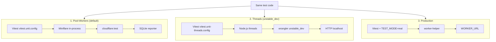
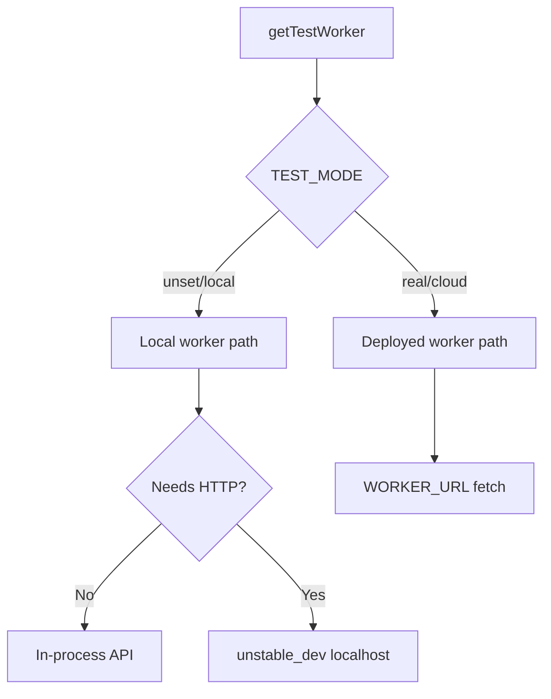

# Test Readme — Cloudflare Worker Tests

This is the main test documentation for `infra/cloudflare`: how to run tests, scripts, modes, and security requirements.

## Test Modes: Local vs Real

**All tests support both local and real modes** via the test runner scripts. You can:
1. Test locally first (free, no costs) with `npm test` or `npm run test:all-cloudflare`
2. Test against real deployed worker when ready (costs apply) by setting `TEST_MODE=real` and `WORKER_URL`

## Firebase service-auth smoke tests (admin path)

Admin dashboard routes depend on worker-side Firestore reads with service-account auth. Validate this path with:

```bash
cd infra/cloudflare
npm run test -- tests/integration/firebase-service-auth-real.test.ts
```

or:

```bash
cd infra/cloudflare
npx tsx scripts/run-firebase-real-smoke.ts
```

Required env:

- `FIREBASE_PROJECT_ID`
- `FIREBASE_SERVICE_ACCOUNT_JSON` or `FIREBASE_SERVICE_ACCOUNT_JSON_PATH`

## Unified Test Runner: Three Execution Systems

We use **three execution systems** for the same test code. Each mode is selected by config and env (e.g. `TEST_RUNNER`, `TEST_MODE`). `worker-helper` chooses in-process, HTTP (`unstable_dev`), or production fetch.



| System | Config | Command | Worker | SQL logs | Worker logs |
|--------|--------|---------|--------|----------|-------------|
| **Pool-workers** | `vitest.unit.config.ts` | `npm run test:unit` | In-process Miniflare | ✅ | ✅ |
| **Threads** | `vitest.unit-threads.config.ts` | `npm run test:unstable` | `unstable_dev` HTTP | ✅ | ❌ |
| **Production** | same + `TEST_MODE=real` | `TEST_MODE=real WORKER_URL=… npm run test:production` | Deployed worker | ❌ | N/A |

**What works in pool vs threads:**

- **Pool-workers**: Full Workers runtime, `cloudflare:test` (`env`, `SELF`), Durable Objects, WebSockets, KV, R2. Use for normal unit/integration runs. Some tests (e.g. websocket, DO) run **only** in pool.
- **Threads**: Node.js threads + `unstable_dev`. Same test files, but no `cloudflare:test` in setup. Tests that use `env` / `SELF` directly (e.g. `cors.test`, `logic/data.test`) may show **0** under threads; use pool for those. Use threads when pool has issues or you want HTTP-level debugging.
- **Production**: Real deployed worker. `worker-helper` fetches `WORKER_URL`. No SQL log capture; use for smoke/E2E against live worker.

**How to run (unified runner):**

```bash
# Pool (default) – all types or by path
npm test
npm test -- tests/unit/auth.test.ts
npm test -- tests/integration/credits.test.ts

# By type
npm run test:unit
npm run test:integration
npm run test:e2e
npm run test:websocket

# Unstable (threads / unstable_dev)
npm run test:unstable
npm run test:unstable -- tests/integration/credits.test.ts

# Production (real worker)
TEST_MODE=real WORKER_URL=https://your-worker.workers.dev npm run test:production -- tests/unit/auth.test.ts
```

**Test setups and log bridge flow:** For how **pool**, **pool with isolation**, and **threads** setups work, and how the **helper → log bridge → reporter** flow keeps runId/runType correct and writes NDJSON, see **[TEST-RUN-SETUPS-AND-BRIDGE-FLOW.md](TEST-RUN-SETUPS-AND-BRIDGE-FLOW.md)**. That doc is the single source of truth for the A→B→C flow and for not regressing bridge/reporter behavior.

### Unified worker helper

`tests/helpers/worker-helper.ts` is the single worker bootstrap used by tests. It supports local in-process usage, local HTTP usage, and real deployed-worker usage.



Use this helper directly in tests:

```typescript
import { getTestWorker } from '@tests/helpers/worker-helper';

const worker = await getTestWorker();
```

## Automated Test Runners

**Default flow:** The primary "run all tests" flow is `npm run test:helper` (Vitest only) or `npm run test:full` (Vitest + coverage + Schemathesis + k6 + mutation + static analysis + observability + report). Legacy `run-all-tests.ts` remains as reference; use `test:full` for full orchestration.

**Script inventory:** See `test-runner/script/SCRIPT-INVENTORY.md` for what's new vs legacy.

### 1. Full orchestrated runner: `run-full-suite.ts` (recommended)

The **refactored orchestrator** runs Vitest via `run-suite-helper`, then optional steps (coverage, Schemathesis, k6, mutation, static analysis, observability), and generates the HTML report. No prompts; suitable for CI.

```bash
npm run test:full
npm run test:full -- --skip-tests=coverage,schemathesis,k6,mutation,static-analysis,observability
```

**Full suite:** `npm run test:full` — terminal menu to pick steps (Vitest, coverage, analytics, etc.) and whether to open the report. Cross-platform.

### 2. Legacy full runner: `test-runner/script/run-all-tests.ts`

The **legacy TypeScript runner** (reference only) orchestrates Vitest, coverage, analytics, Schemathesis, k6, mutation, and static analysis. It can prompt for which steps to run.

**Direct usage (from `infra/cloudflare/`):**
```bash
npx tsx test-runner/script/run-all-tests.ts [local|real|cloud]
npx tsx test-runner/script/run-all-tests.ts local --skip-tests=vitest,coverage  # optional skip list
npx tsx test-runner/script/run-all-tests.ts local --yes  # run all steps without prompts
```

**Full suite (all platforms):** `npm run test:full` — Vitest, coverage, schemathesis, k6, mutation, static analysis, observability, report. Worker auto-starts for k6/Schemathesis. Use `--skip-tests=k6,mutation` to skip heavy steps.


### 3. Cloudflare-only Vitest runner: `run-all-cloudflare-tests.ts`

Runs only unit + integration + e2e (no Schemathesis, k6, or static analysis):

```bash
npm run test:all-cloudflare           # Pool only (unit, integration, e2e)
npm run test:all-cloudflare:both     # Pool then unstable per type
```

### 4. Other npm test entry points

- `npm run test:all` — runs `test:security` + `test:e2e` + `test:comprehensive` (subset)
- `npm test` — runs `tsx scripts/test-runner.ts` (all tests, pool mode)

### What the full runner does (`run-all-tests.ts`)

When you run `npx tsx test-runner/script/run-all-tests.ts` (optionally with `--yes` to skip prompts), it can run (depending on your choices):

1. Vitest (unit, integration, e2e, security)
2. Coverage analysis
3. Analytics comprehensive tests
4. Worker start (if needed for Schemathesis/k6)
5. Schemathesis (API fuzzing) — requires worker on port 8787
6. k6 (concurrency/load)
7. Mutation tests (Stryker)
8. Static analysis (Semgrep, CodeQL, Trivy)
9. Observability checks
10. Unified HTML report generation and optional browser open

The exact steps and order are defined in `test-runner/script/run-all-tests.ts`. Use `--skip-tests=...` to skip specific steps.

### What to expect from the full runner

Output and steps depend on the options you choose in `test-runner/script/run-all-tests.ts` (or the GUI). The script can start a worker on 8787 for Schemathesis/k6, run Vitest, coverage, analytics, mutation, and static analysis, then generate a unified HTML report. Reports and logs are written under `test-runner/` (e.g. `test-runner/reports/`, `test-runner/logs/`, `test-runner/coverage/`). See the script source for exact paths and worker/report behavior.

### Quick Start

**From `infra/cloudflare/`:**

```bash
# Default: run all tests (pool mode)
npm test

# By type
npm run test:unit
npm run test:integration
npm run test:e2e

# Helper-driven runs (pool + threads, log bridge, DuckDB ingest)
npm run test:unit:helper
npm run test:integration:helper
npm run test:e2e:helper
npm run test:helper          # all types, both modes

# Full orchestrated (Vitest + coverage + Schemathesis + k6 + mutation + static analysis + report)
npm run test:full

# Legacy full runner (with prompts)
npx tsx test-runner/script/run-all-tests.ts local
npx tsx test-runner/script/run-all-tests.ts real   # requires WORKER_URL

# Generate HTML report only (from existing ReportJson + DuckDB/current-run)
npm run test:report

# Cloudflare-only (unit + integration + e2e, no external tools)
npm run test:all-cloudflare
npm run test:all-cloudflare:both
```

**Full suite:** From `infra/cloudflare/`, run `npm run test:full`.

### Environment Variables

- `TEST_MODE` — Set by full runner or manually (`local` or `real`). Default is local.
- `WORKER_URL` — Required when `TEST_MODE=real` or `TEST_MODE=cloud`.
- `WORKER_HTTP_PORT` — Port for worker HTTP server (default 8787). Used by worker-helper when starting HTTP server for external tools.

**Note:** Mutation tests are opt-in in the full runner; use the runner's prompts or run `npm run test:mutation` separately.

## Individual Test Commands

### Prerequisites

**Worker Required:**
- Schemathesis (API fuzzing)
- k6 (concurrency/load testing)

**No Worker Required:**
- Mutation testing (Stryker)
- Property-based tests
- Coverage checks
- Unit/Integration/E2E tests (use local worker via Vitest)

### 1. Start Worker (Required for k6 & Schemathesis)

```powershell
cd infra/cloudflare
npm run dev
# Or with explicit port:
npx wrangler dev --env development --port 8787
```

**What to expect:**
- Worker starts on `http://localhost:8787`
- Health endpoint available at `http://localhost:8787/health`
- OpenAPI spec available at `http://localhost:8787/openapi.json`
- Worker runs until you stop it (Ctrl+C)

### 2. Schemathesis (API Fuzzing)

**Purpose:** Property-based API fuzzing based on OpenAPI specification. Tests all endpoints with malformed, replayed, and edge-case inputs.

**Required:** Worker running on `localhost:8787`

```powershell
cd infra/cloudflare
npm run test:schemathesis
```

**What it does:**
- Reads OpenAPI spec from `http://localhost:8787/openapi.json`
- Generates test cases using Hypothesis (property-based testing)
- Tests all endpoints with:
  - Unauthenticated requests
  - Malformed payloads
  - Replayed requests
  - Partial payloads
  - Type coercion attempts
  - Edge cases (empty, null, extreme values)
- Runs 50 examples per endpoint (configurable)

**What to expect:**
```
schemathesis run http://localhost:8787/openapi.json
...
GET /api/health ... PASSED
POST /api/logs ... PASSED
GET /api/resources ... PASSED
...
Check finished: 45 passed, 0 failed
```

**Configuration:**
- Max examples: 50 (set in `package.json`)
- Checks: `all` (all security checks enabled)
- Base URL: `http://localhost:8787`

**Why it's required:**
- Ensures API contract compliance
- Finds edge cases in input validation
- Tests replay protection
- Validates schema enforcement

### 3. k6 (Concurrency & Load Testing)

**Purpose:** Simulates attacker parallelism and concurrent abuse. Tests race conditions, retry storms, and concurrent conflicting requests.

**Required:** Worker running on `localhost:8787`

```powershell
cd infra/cloudflare
npm run test:k6
```

**What it does:**
- Simulates concurrent users (ramps up to 50 users over 30 seconds)
- Tests parallel identical requests (replay attempts)
- Tests parallel conflicting requests (race conditions)
- Tests retry storms (rapid retries)
- Measures response times and error rates

**What to expect:**
```
running (0m30.0s), 00/50 VUs, 1250 complete and 0 interrupted iterations
...
✓ http_req_duration < 2000ms (95% of requests)
✓ http_req_failed < 10% (error rate)
...
```

**Configuration:**
- Stages: Ramp up to 50 VUs over 30s
- Thresholds: 95% of requests < 2s, error rate < 10%
- Test file: `tests/k6/concurrency.test.js`

**Why it's required:**
- Tests concurrency as a first-class threat
- Validates rate limiting under load
- Tests race condition handling
- Ensures no double-execution under concurrency

**Installation:**
k6 must be installed separately (not via npm):
- **Windows**: `choco install k6`
- **macOS**: `brew install k6`
- **Linux**: See `tests/k6/README.md` for installation

### 4. Stryker (Mutation Testing)

**Purpose:** Tests test quality by mutating code and verifying tests catch the mutations. Ensures tests are not weak or fake.

**Required:** No worker needed

```powershell
cd infra/cloudflare
npm run test:mutation
```

**What it does:**
- Mutates code (changes operators, conditions, values)
- Runs tests against mutated code
- Verifies tests fail (kill the mutation)
- Reports mutation score (percentage of mutations killed)

**What to expect:**
```
Mutant 1: Killed (test failed as expected)
Mutant 2: Survived (test passed - WEAK TEST!)
...
Mutation score: 85% (15% mutations survived)
```

**Configuration:**
- Mutates: `src/auth.ts`, `src/resources-api.ts`, `src/admin-check.ts`
- Thresholds: High 80%, Low 70%, Break 60%
- Excluded mutations: StringLiteral, BooleanLiteral

**Why it's required:**
- Ensures tests are not fake or weak
- Validates test assertions are strong
- Proves tests can detect regressions
- Required per security testing standards

**Note:** Mutation testing is slow (can take 5-10 minutes). It's optional in the automated runner (set `RUN_MUTATION_TESTS=true` to enable).

### 5. Property-Based Tests (fast-check)

**Purpose:** Tests economic invariants and retry protection. Ensures partial failures are economically neutral and retries don't mutate state.

**Required:** No worker needed (runs via Vitest)

```powershell
cd infra/cloudflare
npm run test:property
```

**What it does:**
- Tests economic invariants:
  - Same request twice ≠ more value
  - Failure ≠ reward
  - Retry ≠ mutation
  - Partial failure ≠ profit
  - Order of independent actions ≠ advantage
- Uses `fast-check` to generate test cases
- Tests idempotency guarantees
- Tests partial failure neutrality

**What to expect:**
```
✓ Property: Same request twice does not increase value
✓ Property: Failure does not produce reward
✓ Property: Retry does not mutate state
✓ Property: Partial failure is economically neutral
```

**Test file:** `tests/integration/property-invariants.test.ts`

**Why it's required:**
- Protects economic invariants (money-critical)
- Ensures replay protection
- Validates idempotency
- Tests partial failure handling

### 6. Coverage Check

**Purpose:** Ensures code coverage meets thresholds. Coverage is a signal, not a goal - but thresholds are enforced.

**Required:** No worker needed

```powershell
cd infra/cloudflare
npm run test:coverage
npm run test:coverage:open  # Opens HTML report
```

**What it does:**
- Runs all Vitest tests with coverage collection
- Generates coverage report (text, JSON, HTML, LCOV)
- Checks thresholds:
  - Lines: 90%
  - Branches: 80%
  - Functions: 85%
  - Statements: 90%
- Fails if thresholds not met

**What to expect:**
```
Coverage Summary:
  Lines:      92.3% (threshold: 90%) ✓
  Branches:   81.5% (threshold: 80%) ✓
  Functions:  87.2% (threshold: 85%) ✓
  Statements: 91.8% (threshold: 90%) ✓
```

**Reports:**
- `coverage/coverage-summary.json` - Machine-readable summary
- `coverage/index.html` - Interactive HTML report
- `coverage/lcov.info` - LCOV format (for CI)

**Why it's required:**
- Ensures tests exist for all code paths
- Enforced in CI (fails if thresholds not met)
- Coverage is a signal (not a goal, but required)

### 7. All Security Tests (Combined)

**Purpose:** Runs all security-related tests (excluding fuzzing that requires worker).

**Required:** No worker needed

```powershell
cd infra/cloudflare
npm run test:security-full
```

**What it does:**
- Runs `test:security` (Vitest security tests)
- Runs `test:property` (property-based invariants)
- Runs `test:mutation` (mutation testing)

**What to expect:**
- All security tests pass
- Property invariants hold
- Mutation score meets thresholds

**Note:** This does NOT include Schemathesis or k6 (those require worker running).

## How It Works

This aligns with the [Unified Test Runner](#unified-test-runner-three-execution-systems): three execution systems, same test code.

### 1. Script / Config set environment

- **`test-runner/script/run-all-tests.ts`**: sets `TEST_MODE=local` or `TEST_MODE=real`, and `WORKER_URL` in real mode when used.
- **`scripts/run-all-cloudflare-tests.ts`**: runs `npm run test:unit` (and optionally integration/e2e in both modes); does not set TEST_MODE for production worker.
- **Vitest config**: pool uses `vitest.unit.config.ts` / `vitest.integration.config.ts` / `vitest.e2e.config.ts`; threads use `vitest.unit-threads.config.ts` etc. Threads (unstable) set `TEST_RUNNER=unstable` so `worker-helper` uses `unstable_dev`.

### 2. Tests Use `getTestWorker()`

Tests that hit the worker use `getTestWorker()` from `worker-helper.ts`:

```typescript
import { getTestWorker } from '@tests/helpers/worker-helper';

const worker = await getTestWorker({
  ENVIRONMENT: 'development',
  CORS_ORIGIN: '*'
});
```

### 3. `worker-helper` Priority

**If `TEST_MODE=real` (production):** fetch wrapper uses `WORKER_URL`; replaces `https://api.test` with deployed worker URL.

**If `TEST_RUNNER=unstable` (threads):** uses `unstable_dev`; HTTP to `localhost`. Rewrites `https://api.test` → `http://localhost:port`. No worker logs in Node.

**Otherwise (pool-workers):** in-process Miniflare via `cloudflare:test` (`SELF`). SQL logs enabled.

## Test Organization

```
tests/
├── unit/              # Unit tests (no worker, but can test real if needed)
├── integration/       # Integration tests (local or real worker)
├── e2e/              # E2E tests (local or real worker)
│   ├── real-worker.test.ts      # Worker E2E tests
│   ├── security.test.ts         # Security E2E tests
│   └── upload-download.test.ts  # Upload/download E2E tests
└── production/        # Production-specific tests (if any)
```

## Test Categories & Security Requirements

### Vitest Tests (Auto-discovered)

All `.test.ts` files in `tests/` are automatically discovered and run.

**Unit Tests** (`tests/unit/`):
- `auth.test.ts` - Authentication & authorization
- `cors.test.ts` - CORS & origin enforcement
- `admin-check.test.ts` - Admin access control
- `security-monitoring.test.ts` - Security event logging

**Integration Tests** (`tests/integration/`):
- `resources-api.test.ts` - Resources API with rate limiting
- `assets-api.test.ts` - Asset serving & upload
- `ai-endpoint.test.ts` - AI service integration
- `archive.test.ts` - Match archiving
- `kv.test.ts` - KV storage operations
- `durable-objects.test.ts` - Durable Objects coordination
- `manifest-loader.test.ts` - Manifest loading & caching
- `property-invariants.test.ts` - Economic invariants (property-based)
- `path-traversal.test.ts` - Path traversal attacks
- `ssrf.test.ts` - SSRF attack prevention
- `dos.test.ts` - DoS attack prevention
- `auth-real-jwt.test.ts` - Real JWT validation
- `header-injection.test.ts` - Header injection attacks
- `fuzzing.test.ts` - Input fuzzing
- `request-smuggling.test.ts` - HTTP request smuggling
- `websocket-security.test.ts` - WebSocket security
- `observability.test.ts` - Security event observability
- ... and more

**E2E Tests** (`tests/e2e/`):
- `real-worker.test.ts` - Full worker E2E tests
- `security.test.ts` - Security E2E scenarios
- `upload-download.test.ts` - File upload/download E2E
- `auth-order.test.ts` - Authentication flow E2E
- `credits-security.test.ts` - Credits system security E2E

### External Security Tools (All Required)

**Schemathesis (API Fuzzing):**
- **Purpose**: Property-based API fuzzing based on OpenAPI spec
- **Tests**: All endpoints with malformed, replayed, edge-case inputs
- **Required**: Worker running on `localhost:8787`
- **Installation**: `pip install schemathesis` or `pipx install schemathesis`
- **Why Required**: Ensures API contract compliance, finds edge cases, tests replay protection
- **Exit Codes**: 0 = no findings, 1 = error, 2 = findings found (normal)

**k6 (Concurrency & Load Testing):**
- **Purpose**: Simulates attacker parallelism and concurrent abuse
- **Tests**: Race conditions, retry storms, concurrent conflicting requests
- **Required**: Worker running on `localhost:8787`
- **Installation**:
  - Windows: `choco install k6` (or download from https://k6.io)
  - macOS: `brew install k6`
  - Linux: See `tests/k6/README.md`
- **Why Required**: Tests concurrency as first-class threat, validates rate limiting, ensures no double-execution
- **Default Path**: `C:\Program Files\k6\k6.exe` (Windows, if not in PATH)

**Stryker (Mutation Testing):**
- **Purpose**: Tests test quality by mutating code
- **Tests**: Ensures tests are not weak or fake
- **Required**: No worker needed
- **Installation**: Already in `package.json` (`@stryker-mutator/core`, `@stryker-mutator/vitest-runner`, `@stryker-mutator/typescript-checker`)
- **Why Required**: Ensures tests can detect regressions, validates test assertions are strong
- **Note**: Slow (5-10 minutes), but now **REQUIRED** (runs automatically)

**Semgrep (Static Analysis):**
- **Purpose**: Scans source code for security patterns and vulnerabilities
- **Tests**: Common vulnerabilities (SQL injection, XSS, etc.), misconfigurations, bad practices
- **Required**: No worker needed
- **Installation**: `pip install semgrep` or `pipx install semgrep`
- **Why Required**: Catches obvious security mistakes, finds exploitable patterns
- **Exit Codes**: 0 = no findings, 1 = error, 2 = findings found (normal)

**CodeQL (Advanced Static Analysis):**
- **Purpose**: Advanced code analysis with data flow and taint tracking
- **Tests**: Complex security issues, data flow vulnerabilities, advanced patterns
- **Required**: No worker needed
- **Installation**: Download from https://github.com/github/codeql-cli-binaries/releases
- **Why Required**: Finds complex security issues Semgrep might miss, industry-standard scanning
- **Database Management**:
  - Creates database on first run (5-15 minutes, multi-threaded)
  - Automatically detects file changes and recreates database when needed
  - Reuses database if no changes detected (fast, ~30 seconds)
- **Multi-threading**: Uses all CPU cores (`--threads=0` = auto-detect)
- **Default Path**: `E:\tools\codeql\codeql.exe` (if not in PATH, customize in script)

**Trivy (Vulnerability Scanner):**
- **Purpose**: Scans filesystem and dependencies for known vulnerabilities (CVEs)
- **Tests**: Dependency vulnerabilities, CRITICAL and HIGH severity issues
- **Required**: No worker needed
- **Installation**:
  - Windows: `winget install AquaSecurity.Trivy` or download from https://aquasecurity.github.io/trivy/
  - macOS: `brew install trivy`
  - Linux: See https://aquasecurity.github.io/trivy/latest/getting-started/installation/
- **Why Required**: Ensures dependencies don't have known vulnerabilities, prevents supply chain attacks
- **Default Path**: `E:\tools\trivy_0.68.2_windows-64bit\trivy.exe` (if not in PATH, customize in script)

### Coverage Thresholds (Enforced in CI)

**Required Thresholds:**
- **Lines**: 90% (fails CI if below)
- **Branches**: 80% (fails CI if below)
- **Functions**: 85% (fails CI if below)
- **Statements**: 90% (fails CI if below)

**Why Enforced:**
- Ensures tests exist for all code paths
- Coverage is a signal (not a goal, but required)
- CI automatically fails if thresholds not met

### Security Test Categories (Mandatory)

Per security testing standards, ALL categories below must be covered:

**Authentication & Authorization:**
- Missing auth → 401/403
- Wrong role → 403
- Revoked auth → 401
- Stale session → 401
- Cross-user access → 403

**CORS & Origin Enforcement:**
- Missing Origin → Rejected
- Null origin → Rejected
- Untrusted origin → Rejected
- Wildcard misuse → Rejected
- Preflight cache poisoning → Prevented

**Input Validation & Schema Enforcement:**
- Type coercion → Rejected
- Precision loss → Handled
- Missing vs null → Validated
- Extra fields → Rejected
- Schema drift → Rejected

**URL & Path Manipulation:**
- Encoded traversal → Rejected
- Double encoding → Rejected
- Case confusion → Normalized
- Trailing slash bypass → Handled

**Replay & Idempotency (Money-Critical):**
- Replay after success → Idempotent (no double execution)
- Replay after failure → Idempotent
- Replay after timeout → Idempotent
- Replay under concurrency → Idempotent
- Idempotency key collision → Handled

**Partial Failure Exploitation:**
- Backend success / chain failure → Economically neutral
- Chain success / backend failure → Economically neutral
- Retry after partial execution → No profit
- Worker crash mid-mutation → No corruption

**State & Logic Abuse:**
- Illegal state transitions → Rejected
- Skipped steps → Rejected
- Out-of-order actions → Rejected
- Concurrent mutation → Handled atomically

**DDoS & Resource Exhaustion:**
- CPU-heavy payloads → Rate limited
- Memory-heavy payloads → Rejected
- Slow-loris variants → Timeout
- WebSocket pinning → Prevented

**Request Smuggling & Protocol Abuse:**
- CL/TE mismatches → Rejected
- HTTP/1 ↔ HTTP/2 desync → Prevented
- Proxy parsing differences → Handled

**Error Handling & Information Leakage:**
- Differential errors → Same error for same failure
- Timing leaks → Constant-time where possible
- Stack traces → Never exposed
- Debug flags → Never enabled in prod

## Test Files That Support Both Modes

**All 21+ test files** (247+ test cases) automatically support both modes:

- ✅ `tests/unit/*.test.ts` - Unit tests
- ✅ `tests/integration/*.test.ts` - Integration tests
- ✅ `tests/e2e/*.test.ts` - E2E tests

**Examples:**
- `tests/integration/path-traversal.test.ts`
- `tests/integration/ssrf.test.ts`
- `tests/integration/dos.test.ts`
- `tests/e2e/real-worker.test.ts`
- `tests/e2e/upload-download.test.ts`
- `tests/e2e/security.test.ts`
- ... and 17+ more

## Workflow

### Step 1: Develop & Test Locally (Free)

```bash
cd infra/cloudflare
npm test
# or by type: npm run test:unit, npm run test:integration, npm run test:e2e
# or with helper (pool + threads): npm run test:unit:helper, etc.
```

**Benefits:** No Cloudflare costs, fast iteration, no rate limits, safe to run repeatedly.

### Step 2: Test Against Real Worker (After Deploy)

```bash
export TEST_MODE=real
export WORKER_URL=https://your-worker.workers.dev
npm run test:production -- tests/unit/auth.test.ts
# or: npx tsx test-runner/script/run-all-tests.ts real
```

**⚠️ WARNING:** Real HTTP requests, real rate limits, real logs/metrics; **costs money**.

## Test Scripts

| Script | What It Does | Cost | Platform |
|--------|-------------|------|----------|
| `npm test` | All tests (pool mode) | Free | Cross-platform |
| `npm run test:unit` | Unit tests (pool) | Free | Cross-platform |
| `npm run test:integration` | Integration tests (pool) | Free | Cross-platform |
| `npm run test:e2e` | E2E tests (pool) | Free | Cross-platform |
| `npm run test:unit:helper` | Unit tests pool + threads, log bridge | Free | Cross-platform |
| `npm run test:integration:helper` | Integration pool + threads, log bridge | Free | Cross-platform |
| `npm run test:e2e:helper` | E2E pool + threads, log bridge | Free | Cross-platform |
| `npm run test:helper` | All types, both modes, log bridge | Free | Cross-platform |
| `npm run test:all-cloudflare` | Unit + integration + e2e (pool) | Free | Cross-platform |
| `npm run test:all-cloudflare:both` | Unit + integration + e2e in both modes | Free | Cross-platform |
| `npm run test:full` | Full orchestrated (Vitest + coverage + Schemathesis + k6 + mutation + static analysis + report). Use `--skip-tests=k6,mutation` to skip heavy steps. | Free | Cross-platform |
| `npm run test:report` | Generate HTML report from ReportJson + DuckDB | Free | Cross-platform |
| `npx tsx test-runner/script/run-all-tests.ts local` | Legacy full run (with prompts) | Free | Cross-platform |
| `npx tsx test-runner/script/run-all-tests.ts real` | Legacy full run vs real worker (set WORKER_URL) | **Costs** | Cross-platform |
| `npm run test:schemathesis` | API fuzzing (worker on 8787) | Free | Cross-platform |
| `npm run test:k6` | k6 load test | Free | Cross-platform |
| `npm run test:mutation` | Stryker mutation tests | Free | Cross-platform |
| `npm run test:property` | Property-based invariants | Free | Cross-platform |

## Environment Variables

| Variable | Set By | Values | Description |
|----------|--------|--------|-------------|
| `TEST_MODE` | Script | `local` (default) or `real` | Controls test mode |
| `WORKER_URL` | Script (real mode only) | `https://claim-storage-dev.ocentraai.workers.dev` | Real worker URL |
| `WORKER_HTTP_PORT` | Script | `8787` (default) | Port for worker HTTP server |

## Custom Worker URL

To test against a different worker, set `WORKER_URL` and `TEST_MODE=real` before running tests (e.g. `npm run test:production` or the full runner with `real`).

## Reports

- **Helper runs** (`test:unit:helper`, etc.): Results and summaries go to `test-runner/logs/` (e.g. `unit-test-helper-results.txt`). NDJSON logs go to `packages/logging-domain/logs/cloudflare/`; use `npm run test:query` from `packages/logging-domain` to query. See [TEST-HELPER-COMMANDS.md](../../../packages/logging-domain/docs/TEST-HELPER-COMMANDS.md).
- **Full runner** (`test:full` or `run-all-tests.ts`): Unified HTML report, coverage, and JSON results (Schemathesis, k6, Semgrep, CodeQL, Trivy) are written under `test-runner/` (reports, coverage, ReportJson, etc.).
- **Coverage**: `npm run test:coverage` / `test:runner:coverage` write to `test-runner/coverage/`.

### Generating the HTML report

Run `npm run test:report` to generate the HTML report from existing data. The report reads:

- **Vitest results**: From `test-runner/ReportJson/test-results.json` if present, or from DuckDB using `runId` in `tests/.test-storage/current-run.json` (written by `test:helper` when the log bridge is used).
- **Other sections**: Coverage, Schemathesis, k6, mutation, Semgrep, CodeQL, Trivy from `test-runner/ReportJson/*.json`.

After running `npm run test:helper` (or `test:full`), `current-run.json` contains the runId. The report uses DuckDB as the source of truth for Vitest data when `test-results.json` is not present.

## Troubleshooting

**Worker not starting:**
- Check port 8787: `netstat -ano | findstr :8787`
- Check logs: `.worker-output.log`
- Try manual start: `npm run dev`

**Port 8787 busy:**
- Script waits up to 30 seconds for worker to be ready
- If port is busy but not a worker, script will fail with troubleshooting steps

**Tests failing:**
- Check test output in console
- Review `test-results.json` for details
- Check coverage thresholds in `coverage/coverage-summary.json`

## Verification

- **Pool vs threads**: Determined by Vitest config (`vitest.unit.config.ts` = pool, `vitest.unit-threads.config.ts` = threads). Helper runs both when using `--mode=both`.
- **Real worker**: Set `TEST_MODE=real` and `WORKER_URL`; tests then use that URL via `getTestWorker()` from `@tests/helpers/worker-helper`.

## Implementation Details

### `worker-helper.ts`

Central test worker provider that all tests use (lives at `tests/helpers/worker-helper.ts`). Uses `TEST_MODE` and `WORKER_URL` env; see source for `getTestWorker(overrides?, options?)`.

### `test-runner/script/run-all-tests.ts`

Full orchestrated runner; sets `TEST_MODE` and (in real/cloud mode) requires `WORKER_URL`. Invoke from `infra/cloudflare/` as:

```bash
npx tsx test-runner/script/run-all-tests.ts [local|real|cloud] [--skip-tests=...] [--yes]
```

**Features:** Cross-platform, optional prompts, worker lifecycle for Schemathesis/k6, coverage, mutation, static analysis (Semgrep, CodeQL, Trivy), unified HTML report. See script source for exact steps and env handling.

## URL Handling

Tests use `https://api.test/...` as a test URL:
- **Local mode**: Handled by local worker (no replacement needed)
- **Real mode**: Automatically replaced with actual `WORKER_URL` by `worker-helper.ts`

## Summary

✅ **All tests support both modes**  
✅ **Script handles mode switching**  
✅ **Local mode is default (free)**  
✅ **Real mode requires explicit flag**  
✅ **23+ test files automatically respect mode**  
✅ **Security fuzzing tests run sequentially after normal tests**  
✅ **Worker auto-starts if needed for security tests**
