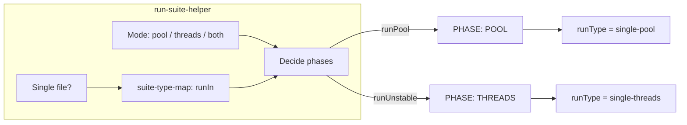
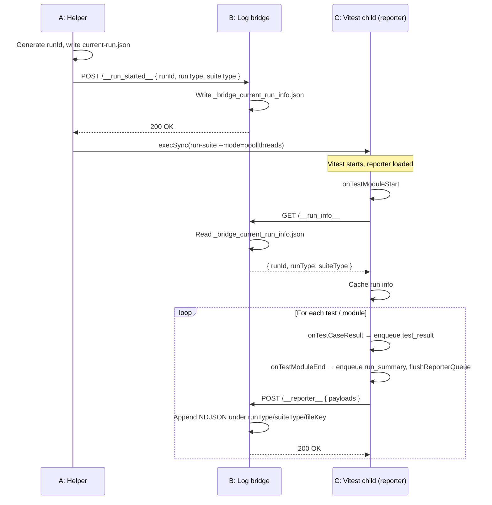

# Test Run Setups and Log Bridge Flow

This document describes **how test setups (pool, pool with isolation, threads) work** and **how the log bridge ties the helper, Vitest child, and reporter together** so run IDs and run types stay correct and NDJSON is written to the right place. Use this as the single source of truth to avoid regressions.

---

## 1. Test Setups: What Each One Does

We have **three execution setups** for the same test code. The **helper** (run-suite-helper) decides which **phase(s)** to run (pool and/or threads) based on mode and, for single-file runs, on `runIn` from the suite-type map.

### 1.1 Pool (default)

| Aspect | Detail |
|--------|--------|
| **Config** | `vitest.unit.config.ts` / integration / e2e (pool mode) |
| **Setup file** | `tests/test-setup-pool.ts` |
| **Runtime** | Miniflare in-process; tests run inside worker via `SELF.fetch` / `cloudflare:test` |
| **Run type** | `single-pool` |
| **Use when** | Normal unit/integration; Durable Objects; WebSockets; tests that need full Workers runtime |

Pool uses **isolated storage** for integration (e.g. `isolatedStorage: true`). Some suites (e.g. websocket) use pool **without** isolation (different config). Both still report as `single-pool`; the difference is test environment, not run type.

### 1.2 Pool with isolation off (e.g. websocket)

| Aspect | Detail |
|--------|--------|
| **Config** | Same pool config but with isolation disabled where needed |
| **Run type** | Still `single-pool` |
| **Use when** | Tests that require shared or non-isolated storage (e.g. `npm run test:websocket`) |

Run type and bridge flow are the same as pool; only the Vitest/worker config differs.

### 1.3 Threads (unstable)

| Aspect | Detail |
|--------|--------|
| **Config** | `vitest.unit-threads.config.ts` (or equivalent for integration/e2e) |
| **Setup file** | `tests/test-setup-threads.ts` |
| **Runtime** | Node.js worker threads; worker via HTTP (`unstable_dev`) |
| **Run type** | `single-threads` |
| **Use when** | Pool has issues, or you want HTTP-level debugging; tests that opt in via `runIn: 'unstable'` |

Tests that require `env` / `SELF` / DOs often run only in pool; threads may show 0 for those. The suite-type map (`test-runner/suite-type-map.json` and `suite-type-map.ts`) marks which files use `runIn: 'unstable'`.

### 1.4 How pool vs threads is chosen (helper)

- **Full suite:** Helper runs **both** phases when mode is "both" (default for `test:unit:helper` etc.): first **pool** (`--mode=pool`), then **threads** (`--mode=threads`). Each phase gets its own runId and runType.
- **Single file:** Helper looks up the file in the suite-type map. `runIn: 'pool'` (or missing) → only **pool** phase runs. `runIn: 'unstable'` → only **threads** phase runs. So for a single file, only one of the two phases runs.



### 1.5 Unstable-only tests

Some tests can **only** run in the **threads phase** (unstable), not in the pool. They are marked in the suite-type map with **`runIn: 'unstable'`** and are **excluded from the pool**; the helper runs them only in the threads phase (or, for websocket, in the dedicated websocket phase).

**Category rule (pool vs unstable)**

| Category | Use when |
|----------|----------|
| **Pool** (default) | Test needs pool isolation (R2/KV/DO per run), or is “normal” integration with no reason to opt out. |
| **Unstable** | Test (a) must not run in pool (WebSocket+DO, persistent storage, thread isolation), or (b) is plain HTTP and does not need pool; running in threads reduces pool load and avoids pool runner issues (e.g. SpanParent). |

**Why a test is unstable-only**

| Reason | Meaning |
|--------|--------|
| **Persistent storage** | Test needs real or persistent storage (e.g. upload/download) that does not behave correctly in the pool’s isolated environment. |
| **Thread isolation** | Test needs per-thread isolation (storage, env, or Miniflare behavior) that the pool does not provide; running in pool can cause cross-test interference or wrong behavior. |
| **WebSocket + Durable Objects** | Test uses WebSockets and DOs; Cloudflare requires `isolatedStorage: false`. These run in the **websocket phase** (separate config), not the generic threads phase, but are still unstable-only in the sense that they do not run in the main pool. |
| **Plain HTTP / reduce pool load** | Test only uses `worker.fetch()` (no DO/WebSocket); it can run in threads. Marking it unstable reduces the number of files in the pool and avoids pool runner I/O boundary issues (e.g. SpanParent). |

**Where the list comes from**

The suite-type collector scans top-level `describe(..., { runIn: TestRunIn.Unstable })` (or equivalent) and writes **`test-runner/suite-type-map.json`**. The authoritative list of unstable-only files is in that JSON under entries with `"runIn": "unstable"`.

**Current unstable-only files (as of last suite-type map)**

| File | Suite | Typical reason |
|------|--------|-----------------|
| `tests/e2e/upload-download.test.ts` | e2e | Persistent storage |
| `tests/integration/data.test.ts` | integration | Thread isolation |
| `tests/integration/match-query.test.ts` | integration | Thread isolation |
| `tests/integration/security/header-injection-raw.test.ts` | integration | Raw request / low-level behavior |
| `tests/integration/websocket-isolated-storage.test.ts` | websocket | WebSocket + DO (`isolatedStorage: false`) |
| `tests/integration/websocket-security.test.ts` | websocket | WebSocket + DO (`isolatedStorage: false`) |
| `tests/integration/match-ws-*.test.ts` (connect, ai-dump, chat, finalize, hibernation, move) | websocket | Same; declare in test (see below). |
| `tests/integration/turnstile.test.ts` | integration | Plain HTTP; reduce pool load (SpanParent workaround). |

**Match WebSocket tests** (`match-ws-connect`, `match-ws-ai-dump`, etc.) declare `TestSuiteType.Websocket` and `runIn: RunIn.Unstable` in the test; the suite-type collector reads that from the source (no path matching). Those tests run in the websocket phase only.

To add or change an unstable-only test: set `runIn: TestRunIn.Unstable` in the test’s top-level describe options, then regenerate the suite-type map (see `test-runner/script/suite-type-collector.ts` and your workflow for how the map is updated).

### 1.6 Parallelism constraints (why “non-pool” and `isolatedStorage: false` cannot be parallel)

**Rule of thumb:** Any run that is **not** the normal pool (e.g. threads phase or websocket phase) **cannot safely run tests in parallel**. The same applies when **`isolatedStorage: false`** is used (websocket config): tests must run sequentially within that worker to avoid request-context mixing.

**Why this can cause the SpanParent error**

The “Cannot perform I/O on behalf of a different request (I/O type: SpanParent)” error occurs when the runtime attributes I/O (or tracing) to the wrong request. That can happen when:

1. **Pool with `isolatedStorage: true`** runs WebSocket/DO tests: WebSocket + Durable Objects require `isolatedStorage: false` in Miniflare. Running those tests in the integration pool (isolatedStorage: true) can trigger SpanParent or similar errors, so websocket tests are excluded from the pool and run only in the websocket config.
2. **Websocket config (`isolatedStorage: false`)** with shared context: We use a single worker (`singleWorker: true`). If tests run with **`isolate: false`**, they share the same environment; async I/O from one test can complete in another’s “request” context, so the runtime may attribute I/O to the wrong request → SpanParent. So with `isolatedStorage: false`, tests must **not** run in parallel (e.g. use `isolate: true` or enforce sequential execution).
3. **Threads phase:** Unstable-only tests run in the threads pool. If `singleThread: false`, multiple threads run in parallel, each with its own worker; that can cause port clashes or shared-resource issues. For unstable-only tests, parallelism is across threads (multiple workers), not within a single worker; the main constraint for SpanParent is (1) and (2).

**Summary**

| Setup | Can run in parallel? | Note |
|--------|----------------------|------|
| Pool, `isolatedStorage: true` | Yes (within one worker) | Each test gets isolated storage; request boundaries are clear. |
| Pool, `isolatedStorage: false` (websocket) | No | Single worker; tests must run sequentially or with per-file isolation to avoid I/O attributed to wrong request. |
| Threads (unstable) | Risky across threads | `singleThread: false` = multiple workers in parallel; can cause port/resource clashes. Unstable-only tests are often run in a way that avoids parallelism. |

So: **non-pool runs (threads, websocket phase) and any config with `isolatedStorage: false` must not assume safe parallelism**; running them in parallel (or with shared context and `isolate: false`) is a likely cause of the SpanParent error when WebSocket/DO tests were run under the wrong config.

**What we enforce in code**

- **Unstable-only and websocket test files:** Each has `concurrent: false` in the top-level `describe` options so Vitest does not run tests concurrently within the file.
- **Websocket config** (`vitest.websocket.config.ts`): `singleWorker: true`, `isolate: true` (no shared context), `isolatedStorage: false`.
- **Integration/e2e threads configs** (`vitest.integration-threads.config.ts`, `vitest.e2e-threads.config.ts`): `singleThread` is **derived from the suite-type map**, not hardcoded. Integration-threads: when running the unstable-only list (from the map), `singleThread: true`; when running an explicit file set (`VITEST_INTEGRATION_THREADS_EXPLICIT_FILES=1`), `singleThread: false`. E2E-threads: when the map has any e2e file with `runIn: 'unstable'`, `singleThread: true`; otherwise `singleThread: false`. So “how tests say they should run” (runIn: unstable) drives whether we run in a single thread.

### 1.7 Consume response at call site (Workers I/O rule)

In the Workers runtime, **I/O is request-scoped**. Leaving response bodies unconsumed can keep a request’s context “live” and contribute to “Cannot perform I/O on behalf of a different request (I/O type: SpanParent)” when the next I/O runs (e.g. pool runner sending task updates).

**Rule: Whoever sends must consume at site.**

- Any code that performs `fetch()` (or initiates an outbound request that returns a response) **must** consume the response body at the **same call site**.
- Do not leave the body unread; do not fire-and-forget. **Consume** means: call `response.json()`, `response.text()`, `response.arrayBuffer()`, or `response.body?.cancel()` (or otherwise fully read the body) before the function is done or before passing control on.
- Applies to: test code that calls `worker.fetch(...)`, log bridge/transport code that POSTs to the bridge or any external URL, and any handler or service under `infra/cloudflare/` that does outbound `fetch()`.

This is enforced as a project rule; see `.cursor/rules/ocentra-cloudflare-workers-io.mdc`.

---

## 2. End-to-End Flow: A → B → C

The flow has three main actors: **A = Helper**, **B = Log bridge**, **C = Vitest child (reporter inside it)**. The bridge is the single place that holds current run info and writes NDJSON so that all reporters (including in remote or multi-instance setups) see the same runId/runType.

### 2.1 High-Level Sequence



### 2.2 Path A: Helper

1. **Generate runId** (e.g. UUID), optionally write `tests/.test-storage/current-run.json` for local use.
2. **POST /__run_started__** to the log bridge with body: `{ runId, runType, suiteType }`.
   - For **pool phase**: `runType: 'single-pool'`.
   - For **threads phase**: `runType: 'single-threads'`.
3. **Spawn Vitest** via `run-suite.ts --type=<unit|integration|e2e|contract> --mode=pool|threads` (and optionally `--file=...` for single file). The child process uses the same bridge URL (e.g. tunnel); it does **not** receive runId/runType via env or argv — it gets them from the bridge.

### 2.3 Path B: Log bridge

The bridge (`packages/logging-domain/scripts/log-bridge.ts`) is an HTTP server that:

| Endpoint | Method | Role |
|----------|--------|------|
| **/__run_started__** | POST | Receives `{ runId, runType?, suiteType?, testFiles?, wipeAll? }`. If both `runId` and valid `runType` are present, **writes** run info to `_bridge_current_run_info.json` (so all bridge consumers see the same run). Does **not** overwrite with missing/invalid runType. May wipe NDJSON dirs (by runType/suiteType/testFile or wipeAll). |
| **/__run_info__** | GET | **Reads** `_bridge_current_run_info.json` and returns `{ runId, runType, suiteType, startedAt }`. Used by the reporter to get run context. |
| **/__reporter__** | POST | Accepts `{ payloads: [ { type: 'run_summary' \| 'test_result', scope, fileKey, ... } ] }`. Appends NDJSON under `logs/cloudflare/<runType>/<suiteType>/<fileKey>/`. |

Storing run info in a **file** (not only in memory) ensures that multiple processes or instances hitting the same bridge (e.g. tunnel) get the same runId/runType. Without that, the reporter could see stale or wrong runType (e.g. single-threads vs single-pool).

### 2.4 Path C: Reporter (inside Vitest child)

The summary reporter (`test-runner/script/summary-reporter.ts`) runs inside the Vitest process:

1. **onTestModuleStart:** **Awaits** `getRunInfoFromBridge()` (GET /__run_info__). Caches result so all later callbacks use the same runId/runType. This must complete before tests run so the queue is not flushed with empty runId.
2. **onTestCaseResult:** For each test, enqueues a `test_result` payload (with runId/runType from cache) to the bridge transport; no flush yet.
3. **onTestModuleEnd:** Builds `run_summary`, enqueues it, then calls `flushReporterQueue()`, which POSTs all queued payloads to the bridge at **POST /__reporter__**. After flush, emits `testModuleEnd` for any listeners.

The **bridge transport** (`packages/logging-domain/src/transport/bridgeTransport.ts`) queues payloads and sends them in batches to the bridge; the bridge writes them under the path derived from `scope.runType` and `scope.suiteType` (e.g. `single-pool/unit/<fileKey>/`).

### 2.5 Flow Diagram: Data and Control

```mermaid
flowchart TB
  subgraph A["A: Helper"]
    A1[Generate runId]
    A2[POST /__run_started__]
    A3[Spawn run-suite --mode=pool|threads]
    A1 --> A2 --> A3
  end

  subgraph B["B: Log bridge"]
    B1["Write _bridge_current_run_info.json"]
    B2["Read file on GET /__run_info__"]
    B3["Append NDJSON on POST /__reporter__"]
    B1 --> B2
  end

  subgraph C["C: Reporter (Vitest child)"]
    C1[onTestModuleStart: GET /__run_info__]
    C2[Cache runId/runType]
    C3[onTestCaseResult: enqueue test_result]
    C4[onTestModuleEnd: enqueue run_summary, flush]
    C5[POST /__reporter__]
    C1 --> C2 --> C3 --> C4 --> C5
  end

  A2 --> B1
  A3 --> C1
  C1 --> B2
  C5 --> B3
```

---

## 3. Run Types and NDJSON Layout

| runType | Directory under `logs/cloudflare/` | Used when |
|---------|------------------------------------|-----------|
| `single-pool` | `single-pool/<suiteType>/<fileKey>/` | Pool phase (Miniflare in-process) |
| `single-threads` | `single-threads/<suiteType>/<fileKey>/` | Threads phase (unstable_dev) |

`suiteType` is `unit` | `integration` | `e2e` | `contract`. The bridge derives it from the reporter payload `scope.suiteType` (and fallbacks). No mixing: a run is either pool or threads for its entire phase.

---

## 4. Single-File vs Full Suite

| Scenario | Pool phase | Threads phase | runType per phase |
|----------|------------|---------------|-------------------|
| Full suite, mode=both | Yes | Yes | single-pool then single-threads |
| Full suite, mode=pool | Yes | No | single-pool |
| Full suite, mode=threads | No | Yes | single-threads |
| Single file, runIn=pool | Yes | No | single-pool |
| Single file, runIn=unstable | No | Yes | single-threads |

For single file, only one phase runs, so only one runId and one runType for that invocation. The bridge must still persist run info to file so that the Vitest process (which may be in a different process or machine when using a tunnel) always sees the correct runType.

---

## 5. Summary Checklist (Don’t Regress)

- **Helper** always POSTs to **/__run_started__** with both `runId` and `runType` before spawning the Vitest child.
- **Bridge** writes run info to **file** on POST /__run_started__ (only when runId and valid runType present) and reads from that file on GET /__run_info__.
- **Reporter** **awaits** `getRunInfoFromBridge()` in **onTestModuleStart** so run info is in cache before any test runs or flush.
- **Run type** is never inferred from env or context in the child; it comes only from the bridge.
- **Single file:** Only one phase runs; `runIn` from suite-type map decides which (pool or threads).

For **helper and query commands**, see [TEST-HELPER-COMMANDS.md](../../../packages/logging-domain/docs/TEST-HELPER-COMMANDS.md) in `packages/logging-domain`. For **unified runner (pool vs threads vs production)** and npm scripts, see [TEST-README.md](TEST-README.md) in this directory.

---

## 6. Writing Tests: Prerequest Standard (Always Do This)

**Rule (from test rules §2.1):** Behavior tests must **never** fail because we forgot a prerequisite (auth, origin, token). Prerequisites belong in centralized helpers; tests assert the actual behavior (“chicken at 350” — we test that the chicken cooks, not that the oven was turned on).

When adding or editing tests that call the worker, **always** do the following so the same test works in both **pool** and **threads** and never fails for “forgot token” or “forgot headers”:

| Do | Don’t |
|----|--------|
| **Get token** at the start of each test that uses the worker: `const token = getTokenForFetch();` (from `@tests/test-setup-core`) | Call `worker.fetch(url, init)` with only two arguments (missing token). |
| **Pass token** to every `worker.fetch` call: `worker.fetch(url, init, token)` | Rely on “it works in pool” and skip token; the test will fail in threads with “Token required for unstable_dev”. |
| **Use headers from a helper** for auth + origin: `getValidRequestHeaders(userId)` (from `@tests/helpers/test-helpers`) | Build `Authorization` or `Origin` by hand unless the test is explicitly testing auth/origin failure. |
| **Use one pattern everywhere** so the same test runs in pool and threads without mode-specific changes | Mix patterns (some tests with token, some without) so that switching mode breaks tests. |

**Minimal pattern per test that uses the worker:**

```ts
it('...', async () => {
  const token = getTokenForFetch();
  const response = await worker.fetch(url, {
    method: HttpMethod.Get,
    headers: getValidRequestHeaders(TestConfig.TestUserId),
  }, token);
  // assert behavior
});
```

**Why:** In **pool**, the worker runs in-process and token is optional; in **threads**, the worker is a real HTTP server and `worker.fetch` **requires** the third argument `token`. If we always pass token (from `getTokenForFetch()`), the test runs in both modes. Headers from `getValidRequestHeaders()` provide auth + origin so the test never fails because we forgot a prerequest.

**Reference:** Full audit and remaining file list: [TEST-PREREQUEST-AUDIT.md](TEST-PREREQUEST-AUDIT.md).
