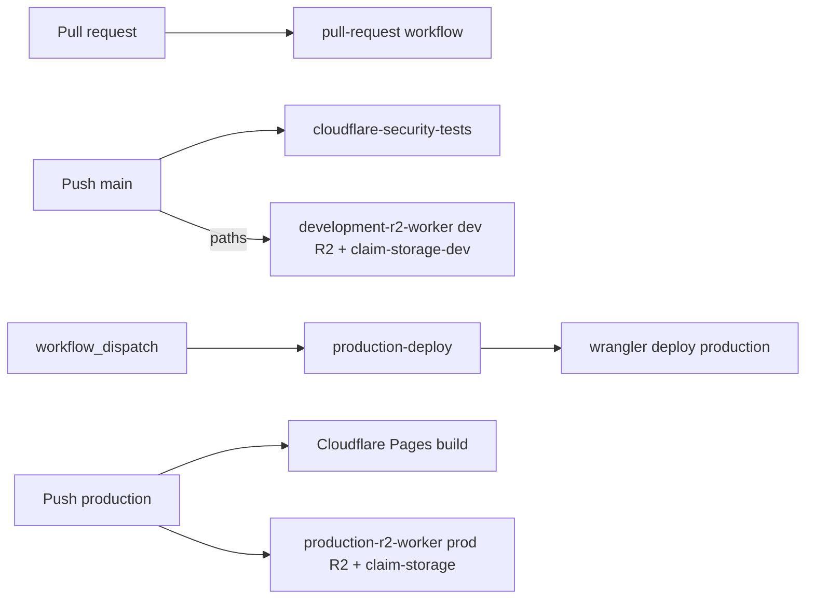

# Workflow Update Guide — Align GitHub Actions with Cloudflare

**Purpose:** Single reference for updating `.github/workflows/` (production-deploy, production-r2-worker, **development-r2-worker**, cloudflare-security-tests, pull-request, sync-assets) after Cloudflare and test runner changes.

**Last updated:** 2026-03-31

---

## CI Shape



**Push to `main` (filtered paths):** **`development-r2-worker.yml`** runs `sync:assets:dev --apply --prune` to **`ocentra-assets-test`**, then **`npm run deploy:dev`** (`claim-storage-dev`). Requires GitHub secret **`CLAIM_STORAGE_ASSETS_URL_DEV`**.

**Push to `production`:** Cloudflare Pages builds the web app from Git. **`production-r2-worker.yml`** runs `sync:assets:prod --apply --prune` and **`wrangler deploy`** (prod Worker) so R2 assets and the Worker match the branch (Pages alone does not upload game assets to R2).

---

## 1. Current Cloudflare facts (source of truth)

### Wrangler (`infra/cloudflare/wrangler.toml`)

| Item | Value |
|------|--------|
| **Default worker name** | `claim-storage` |
| **Development env** | `[env.development]` → `name = "claim-storage-dev"` |
| **Production env** | `[env.production]` → `name = "claim-storage"` |
| **Deploy dev** | `wrangler deploy --env development` |
| **Deploy prod** | `wrangler deploy --env production` |

### R2 buckets (wrangler bindings)

| Binding | Dev bucket | Prod bucket |
|---------|------------|-------------|
| MATCHES_BUCKET | claim-matches-test | claim-matches |
| ASSETS_BUCKET | ocentra-assets-test | ocentra-assets |
| AUDIT_ARCHIVE | ocentra-audit-archive-dev | ocentra-audit-archive |
| AVATAR_BUCKET | ocentra-avatars-dev | ocentra-avatars |

### Env vars (production)

- `ENVIRONMENT = "production"`
- `CORS_ORIGIN = "https://game.ocentra.ca"`
- Secrets (wrangler / dashboard): Stripe, Firebase, AI keys, etc. — not in repo.

### Package identity

- **Package name:** `claim-cloudflare-worker` (`infra/cloudflare/package.json`)
- **Prebuild/predev:** Builds logging-domain, endpoint-domain, boundary-domain; runs `scripts/generate-log-modules.ts`

---

## 2. Test runner and scripts (what CI should call)

### Entry points (from `infra/cloudflare/`, see SCRIPT-INVENTORY.md)

| What | npm script | Notes |
|------|------------|--------|
| **Unit** | `test:unit:helper` | Pool + threads via run-suite-helper |
| **Integration** | `test:integration:helper` | Same |
| **E2E** | `test:e2e:helper` | Same |
| **Contract** | `test:contract:helper` | Same |
| **Flaky gate** | `test:flaky:detect` | detect-flaky.ts |
| **Property** | `test:property` | property-invariants.test.ts |
| **Coverage** | `test:runner:coverage` | run-coverage.ts → Vitest + coverage-summary |
| **Schemathesis** | `test:schemathesis` | run-schemathesis.ts (needs worker on 8787) |
| **k6** | `test:k6` | run-k6.ts |
| **k6 soak** | `test:k6:soak` | soak.test.js |
| **k6 memory** | `test:k6:memory` | memory-pressure.test.js |
| **k6 FD** | `test:k6:fd` | fd-exhaustion.test.js |
| **Full suite** | `test:full` | run-full-suite.ts (orchestrator) |

### Coverage paths (under `infra/cloudflare/`)

| Path | Purpose |
|------|---------|
| `test-runner/coverage/` | Output dir for coverage (run-coverage.ts) |
| `test-runner/coverage/coverage-summary.json` | Summary JSON (lines, branches, functions, statements) |
| `test-runner/coverage/index.html` | HTML report |
| **Vitest config for coverage** | `vitest.coverage.config.ts` |

### Coverage thresholds

- **package.json** `test:coverage:check`: 95% lines, 90% branches, 95% functions, 95% statements (Plan A).
- **CI** (cloudflare-security-tests): 90% lines, 80% branches, 85% functions, 90% statements. Adopt Plan A in CI when coverage is ready.

### Dynamic tests (worker must be running)

- **Schemathesis / k6** need `wrangler dev --env development --port 8787` and `WORKER_URL=http://127.0.0.1:8787`.
- **generate:k6-constants** must run before k6 if URLs/constants changed.

### External tools (see EXTERNAL-TOOLS.md)

- **Schemathesis:** Python — `pip install schemathesis`; workflow uses `pip install schemathesis`.
- **k6:** Standalone binary; workflow installs via apt (Linux).
- **Semgrep:** Action `returntocorp/semgrep-action@v1`.
- **CodeQL:** `github/codeql-action`.
- **Trivy:** `aquasecurity/trivy-action`.

---

## 3. Production deploy workflow checklist

**File:** `.github/workflows/production-deploy.yml`

**Triggers:**
- **Automatic:** When **Cloudflare Security Tests** completes successfully on `main` (`workflow_run`). Only the **worker** is deployed (job `deploy-on-green`), using the commit that passed CI.
- **Manual:** `workflow_dispatch` from the Actions tab. Runs full deploy: build web app → deploy to Cloudflare Pages → deploy worker.

When updating:

- [ ] **Worker:** Deploy from `infra/cloudflare` with `wrangler deploy --env production` (worker name `claim-storage` from wrangler.toml). Use `npm run deploy` (runs same) or `npx wrangler deploy --env production`. Prefer local wrangler from `infra/cloudflare` deps: `cd infra/cloudflare && npm ci && npm run deploy`.
- [ ] **Secrets (CI / deploy):** `CLOUDFLARE_API_TOKEN`, `CLOUDFLARE_ACCOUNT_ID`. No need to pass worker name; wrangler.toml defines it.
- [ ] **Worker runtime (R2 presigned `download-url`):** Not stored in GitHub. After deploy, set on the Worker **vars** `CLOUDFLARE_ACCOUNT_ID`, `R2_ASSETS_BUCKET_NAME` (or rely on `wrangler.production.toml` `[env.production.vars]`) and **secrets** `R2_ACCESS_KEY_ID`, `R2_SECRET_ACCESS_KEY` via `wrangler secret put` or the dashboard. See [`docs/ocentra/asset-handling.md`](../../../docs/ocentra/asset-handling.md) (*Deploy and environment variables*).
- [ ] **Build (web app):** Root `npm run build` with correct `VITE_*` and `LOGS_*` env from secrets. Confirm var names match app (e.g. `VITE_R2_WORKER_URL`, `VITE_R2_BUCKET_NAME`, `VITE_LOGS_WORKER_URL`, `LOGS_API_KEY`).
- [ ] **Pages:** If still using Cloudflare Pages, confirm project name (`ocentra-games` or current) and that `cloudflare/pages-action` inputs match dashboard.
- [ ] **Setup:** Use `./.github/actions/setup-node` for jobs that need root deps; worker deploy job only needs `infra/cloudflare` deps (`npm ci` in that dir).

---

## 4. Cloudflare security tests workflow checklist

**File:** `.github/workflows/cloudflare-security-tests.yml`

**Triggers:** Push to `main` only runs the full suite (no path filter). Push to other branches does not run this workflow. Pull requests to main/develop use path filters. Manual: `workflow_dispatch`.

**Log bridge and CI tunnel:** Both **cloudflare-tests** and **cloudflare-dynamic-security** use the same pattern: start the log bridge on the runner, then start the **CI tunnel** (separate hostname, see [TUNNEL-CI.md](TUNNEL-CI.md)) so the worker can reach the bridge. Each job sets `LOG_BRIDGE_URL` to the CI hostname (e.g. `https://ocentra-log-bridge-ci.ocentra.ca`). Secret `CLOUDFLARE_TUNNEL_CI_TOKEN` is required for both jobs.

When updating:

- **Working directory:** All steps in `infra/cloudflare` except "Start log bridge" (runs from repo root).
- **Prebuild:** After "Install Cloudflare dependencies", run `npm run prebuild`. Same in dynamic job before starting worker.
- **Test steps:** lint → unit (helper) → auth-dependency-resilience → integration (helper) → e2e (helper) → contract (helper) → flaky detect → property → coverage run → coverage threshold check.
- **Coverage path:** `./test-runner/coverage/coverage-summary.json` (relative to `infra/cloudflare`). Thresholds: 90/80/85/90 (see §2).
- **Artifacts:** Upload `test-runner/logs/**`, `test-runner/coverage/**`, `test-runner/reports/**`, `test-runner/ReportJson/**`; `if-no-files-found: ignore`. The **step log** in the Actions UI (and in downloaded run logs) is raw terminal stdout and can be very large (e.g. 46 MB for integration); the **concise per-suite summaries** are in the artifact under `infra/cloudflare/test-runner/logs/` (e.g. `integration-test-helper-results.txt`). Download the `cloudflare-test-artifacts` artifact to get those files.
- **Dynamic job:** Same bridge + tunnel + `LOG_BRIDGE_URL` as the main job (install logging-domain deps, start bridge, install cloudflared, start CI tunnel), then start worker with `npx wrangler dev --env development --port 8787 --local`. Then generate:k6-constants, test:schemathesis, test:k6, etc. Set `WORKER_URL=http://127.0.0.1:8787`.
- **Static job:** Semgrep, CodeQL, Trivy unchanged. Optional: restrict Semgrep to `infra/cloudflare` if the action supports path scope.

---

## 5. Pull-request workflow (future)

**File:** `.github/workflows/pull-request.yml`

- Runs at repo root: lint, type-check, unit (SKIP_SOLANA_TESTS), Rust build, Solana integration, web build.
- When updating: ensure Node version and scripts match root package.json; Cloudflare-specific checks are in cloudflare-security-tests, not here.

---

## 6. Sync-assets workflow (disabled)

**File:** `.github/workflows/sync-assets.yml`

- Currently trigger: `workflow_dispatch` only (push disabled until R2 sync is ready).
- When re-enabling: restore `push` to `main` with `paths: ['packages/asset-editor/Resources/**']`; confirm `upload-assets` script and secrets (`VITE_R2_WORKER_URL`, `VITE_R2_ASSETS_BUCKET`) match current setup.

---

## 7. Doc index

| Doc | Purpose |
|-----|---------|
| `DOC-INDEX.md` | Index of all infra/cloudflare docs |
| `OVERVIEW.md` | What the worker does and does not do |
| `TEST-README.md` | How to run tests, modes, runner |
| `test-runner/script/SCRIPT-INVENTORY.md` | Which scripts are current vs legacy |
| `EXTERNAL-TOOLS.md` | Schemathesis, k6, Semgrep, etc. |
| `README.md` (infra/cloudflare) | Quick start, structure, deploy |

---

## 8. Quick command reference (from repo root)

```bash
# Build worker (domain packages + generate-log-modules)
cd infra/cloudflare && npm run prebuild

# Run all Cloudflare tests (Vitest only)
cd infra/cloudflare && npm run test:helper

# Run full suite (Vitest + coverage + schemathesis + k6 + mutation + static + report)
cd infra/cloudflare && npm run test:full

# Deploy production worker
cd infra/cloudflare && npm run deploy

# Deploy development worker
cd infra/cloudflare && npm run deploy:dev
```

From root, setup-node action runs `npm ci` and optional deps; jobs that only need the worker run `npm ci` inside `infra/cloudflare`.

