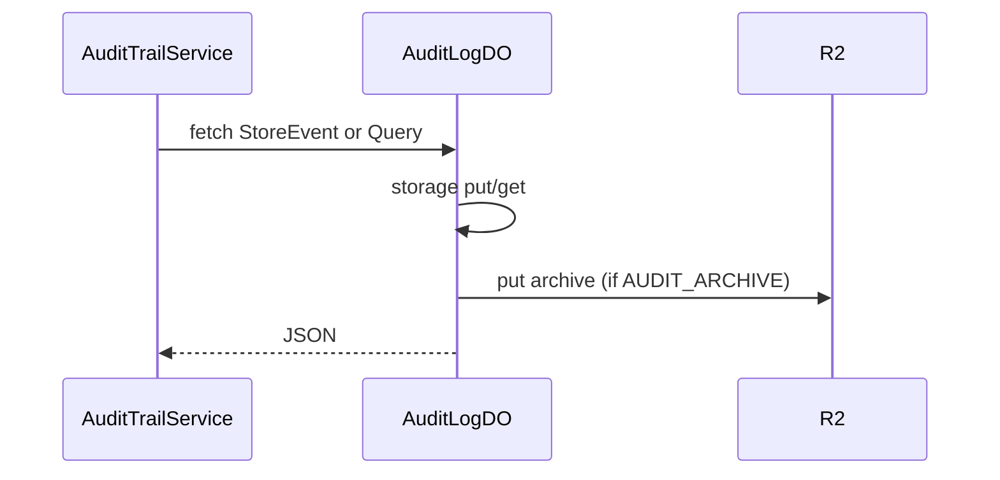

# AuditLogDO

**Purpose:** Store and query audit events. StoreEvent/Log (POST body AuditEventSchema); Query (POST body filters). Writes to AUDIT_ARCHIVE R2 when bound (BucketPath.AuditArchive). AuditEvent, AuditQueryFilters from endpoint-domain schemas.

**Shard key:** userId or 'system' (AuditTrailService: `ns.get(ns.idFromName(userId || 'system'))`).

**HTTP surface:** POST `/${AuditLogDOSegment.StoreEvent}`, `/${AuditLogDOSegment.Log}`; POST `/${AuditLogDOSegment.Query}`.

**Message types:** N/A (HTTP only).

**Storage:** AuditLogDOStoragePrefix.Event + eventId (boundary-domain); optional R2 auditArchiveKey(actorId, eventId, timestamp) to BucketPath.AuditArchive.

**Handlers:** handleAuditRequest (feature-handlers.ts); AuditTrailService (audit, compliance, admin transparency).

**Domain constants:** endpoint-domain: AuditLogDOSegment, AuditEventSchema, AuditQueryFiltersSchema, AuditEvent, AuditIntegrity; boundary-domain: AuditLogDOStoragePrefix, BucketPath.

