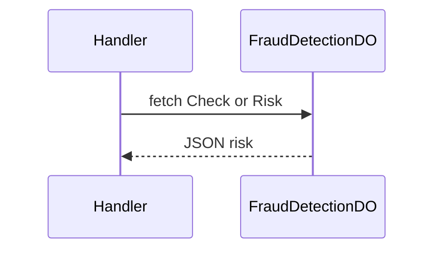

# FraudDetectionDO

**Purpose:** Per-user fraud risk: check (e.g. risk assessment), risk level. Returns risk level (e.g. low).

**Shard key:** userId.

**HTTP surface:** Path endsWith 'check' → FraudDetectionDOPaths.Check; else FraudDetectionDOPaths.Risk. GET/POST as per DO.

**Message types:** N/A (HTTP only).

**Storage:** FraudDetectionDO storage prefix (boundary-domain) if used.

**Handlers:** handleFraudRequest (feature-handlers.ts).

**Domain constants:** endpoint-domain: FraudDetectionDOPaths, Http*; boundary-domain: do-storage-prefixes.

