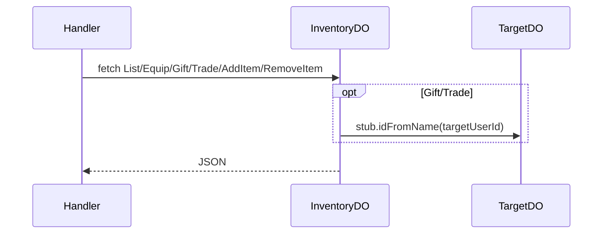

# InventoryDO

**Purpose:** Per-user inventory: list (items, equipped), add-item, remove-item, equip (itemId, slot), gift (itemId, targetUserId), trade (myItemId, theirItemId, targetUserId). Gift/trade call target user's InventoryDO (idFromName(targetUserId)).

**Shard key:** userId. For gift/trade the DO fetches target DO stub via env.INVENTORY_DO.idFromName(targetUserId).

**HTTP surface:** InventoryDOPaths / InventoryDOSegment (endpoint-domain): List, Equip, Gift, Trade, AddItem (Base + '/add-item'), RemoveItem (Base + '/remove-item').

**Message types:** N/A (HTTP only).

**Storage:** InventoryDOStoragePrefix (boundary-domain): items map, equipped map.

**Handlers:** handleInventoryRequest (feature-handlers.ts).

**Domain constants:** endpoint-domain: InventoryDO, InventoryDOSegment, Http*; boundary-domain: InventoryDOStoragePrefix.

