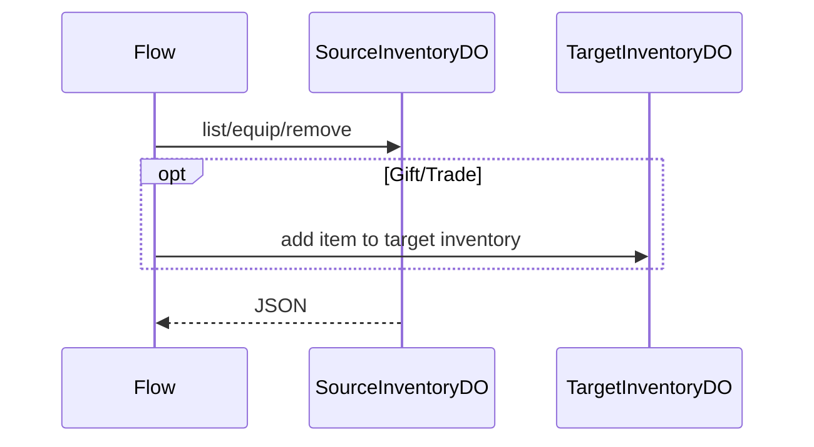

# InventoryDO

**Purpose:** Per-user inventory for list, equip, add-item, remove-item, gift, and trade. The DO owns the item map and equipped map for one user.

**Shard key:** `userId`.

**HTTP surface:** `InventoryDOPaths` and `InventoryDOSegment` from endpoint-domain.

**Storage:** `InventoryDOStoragePrefix` from boundary-domain; local items and equipped state.

**Flows that use it:** `InventoryTransferFlow` coordinates gifts and trades across source and target inventory DOs.

**Handlers:** `handleInventoryRequest` in the feature handler path.

**Domain constants:** endpoint-domain: `InventoryDO`, `InventoryDOSegment`, `Http*`; boundary-domain: `InventoryDOStoragePrefix`.

