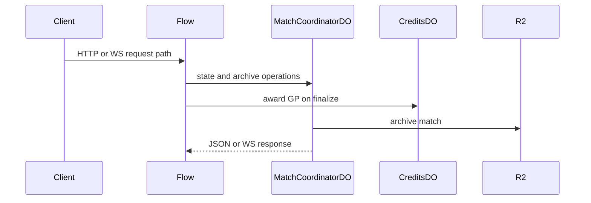

# MatchCoordinatorDO

**Purpose:** Per-match coordination for HTTP validate, upload, get, delete, anonymize, transparency, and the live WebSocket channel. The DO owns match state, pending transactions, checkpoints, and archive metadata.

**Shard key:** `matchId`.

**HTTP surface:** `MatchCoordinatorDOSegment` paths from endpoint-domain for validate, upload, get, delete, anonymize, and transparency.

**WebSocket:** Upgrade accepted for live game messages, sync, chat, voice-text, finalize, AI dump, and checkpoint traffic.

**Storage:** `MatchCoordinatorDOStoragePrefix` from boundary-domain and `BucketPath` for R2 archive data.

**Flows that use it:** `MatchFinalizationFlow` coordinates archive persistence and reward payout around finalized matches.

**Handlers:** `matches.ts` and `ws.ts` route into the match DO. The handler layer validates the request and then dispatches into the flow or DO path that owns the work.

**Domain constants:** endpoint-domain: `MatchCoordinatorDOSegment`, `MatchWSMessageType`, `MatchWSChannel`, `Http*`, `MetadataField`, `validateMatchId`, `GameName`, `PlayerType`; boundary-domain: `MatchCoordinatorDOStoragePrefix`, `BucketPath`.

