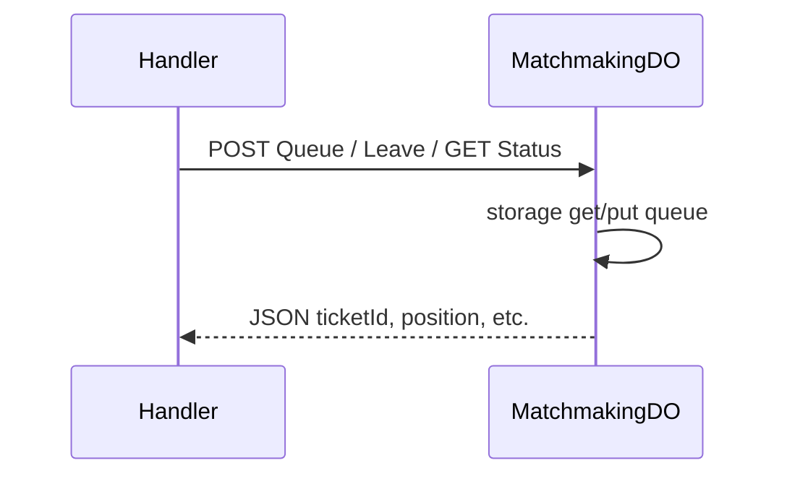

# MatchmakingDO

**Purpose:** Queue join/leave and status; ELO-based matching with expanding tolerance over time; ticket timeout 300s. Writes matchmaking analytics to ANALYTICS when bound.

**Shard key:** `default` (single region in code).

**HTTP surface:** POST path ending `/${MatchmakingDOSegment.Queue}` (join); POST or DELETE `/${MatchmakingDOSegment.Leave}`; DELETE Queue (leave); GET `/${MatchmakingDOSegment.Status}`. Query params forwarded.

**Message types:** N/A (HTTP only).

**Storage:** MatchmakingDOStoragePrefix (boundary-domain): queue entries (ticketId, userId, displayName, elo, gameType, queuedAt, queueExpiresAt).

**Handlers:** [handleMatchmakingRequest](../features/matchmaking.md) (feature-handlers.ts).

**Domain constants:** endpoint-domain: MatchmakingDOSegment, Http*; boundary-domain: MatchmakingDOStoragePrefix; endpoint-domain game: DefaultGameType.

