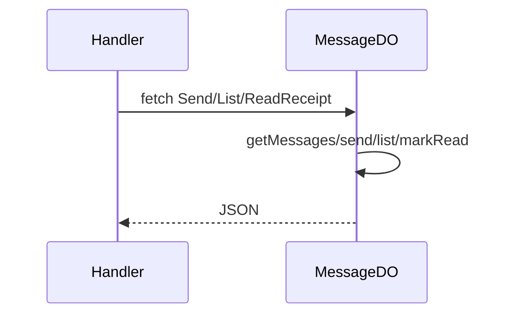

# MessageDO

**Purpose:** Per-conversation messages: send (senderId, content), list with limit/before cursor, read receipt. Max 1000 messages; FIFO trim.

**Shard key:** conversationId (convId from path; handler: `ns.idFromName(convId)`).

**HTTP surface:** POST path ending `/${MessageDOSegment.Send}` (body senderId, content); GET `/${MessageDOSegment.List}` (query limit, before); POST `/${MessageDOSegment.ReadReceipt}` (body messageIds).

**Message types:** N/A (HTTP only).

**Storage:** MessageDOStoragePrefix.Messages (array of StoredMessage). Optional archive to R2 (BucketPath from boundary-domain) when MESSAGE_ARCHIVE_BUCKET set.

**Handlers:** [handleMessageRequest](../features/messages.md) (feature-handlers.ts).

**Domain constants:** endpoint-domain: MessageDOSegment, Http*; boundary-domain: MessageDOStoragePrefix, BucketPath.

