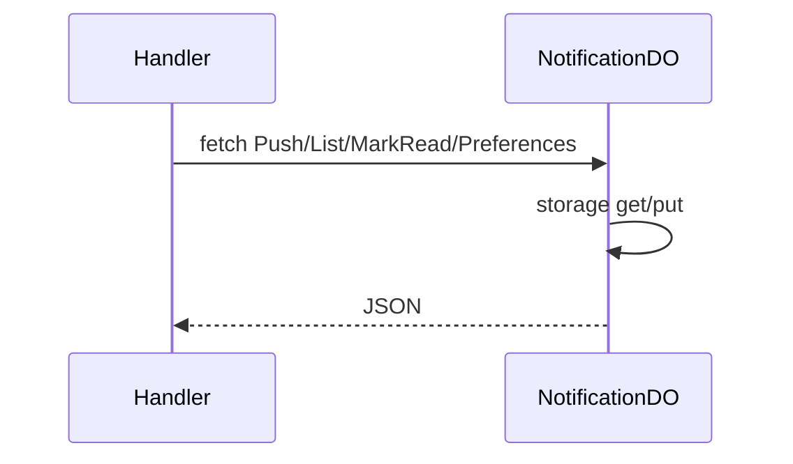

# NotificationDO

**Purpose:** Per-user notifications: push (type, title, body), list (limit, unreadOnly), mark-read (ids), preferences (GET/POST). NotificationType from endpoint-domain game constants. Max 200 notifications.

**Shard key:** userId.

**HTTP surface:** POST `/${NotificationDOSegment.Push}`; GET `/${NotificationDOSegment.List}`; POST `/${NotificationDOSegment.MarkRead}`; GET/POST `/${NotificationDOSegment.Preferences}`.

**Message types:** N/A (HTTP only).

**Storage:** NotificationDOStoragePrefix (boundary-domain): notifications list, preferences.

**Handlers:** [handleNotificationRequest](../features/notifications.md) (feature-handlers.ts).

**Domain constants:** endpoint-domain: NotificationDOSegment, Http*; endpoint-domain game: NotificationType; boundary-domain: NotificationDOStoragePrefix.

