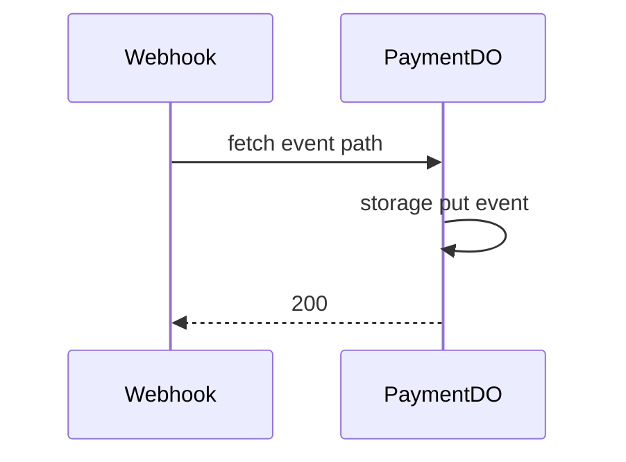

# PaymentDO

**Purpose:** Payment event storage and status; receives Stripe webhook payloads (signature verified by handler). Query param for status. PaymentDOStoragePrefix for events.

**Shard key:** userId (webhooks-stripe: `ns.idFromName(userId)`); payments handler uses extractIdFromPath for payment/session id.

**HTTP surface:** PaymentDOSegment paths (endpoint-domain); POST for event ingestion; GET for status (query params from endpoint-domain QueryParam).

**Message types:** N/A (HTTP only).

**Storage:** PaymentDOStoragePrefix (boundary-domain); PaymentEventSchema/ PaymentEvent types from endpoint-domain schemas.

**Handlers:** [handlePaymentRequest](../features/payments-and-stripe.md) (payments.ts), [handleStripeWebhookRequest](../features/payments-and-stripe.md) (webhooks-stripe.ts); reconciliation logic (reconciliation.ts) reads PaymentDO by userId.

**Domain constants:** endpoint-domain: PaymentDOSegment, QueryParam, PaymentEventSchema, PaymentEvent; boundary-domain: PaymentDOStoragePrefix.

