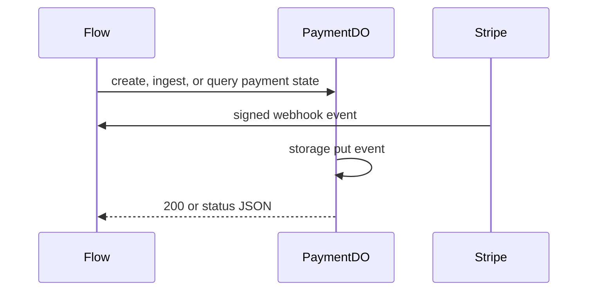

# PaymentDO

**Purpose:** Payment event storage and payment status tracking. The DO stores webhook events, transition markers, and payment metadata keyed by user or payment identifier.

**Shard key:** `userId` for webhook-backed state and the payment/session identifier for status lookup.

**HTTP surface:** `PaymentDOSegment` paths from endpoint-domain for event ingestion and status lookup.

**Storage:** `PaymentDOStoragePrefix` from boundary-domain; local state for payment events and status.

**Flows that use it:** `PaymentCheckoutFlow` creates payment state before Stripe checkout, and `StripeWebhookFlow` dedupes events, advances payment state, and triggers credit purchase on success.

**Handlers:** `payments.ts` and `webhooks-stripe.ts`, plus reconciliation logic. The handler layer dispatches into payment flows for the multi-step path.

**Domain constants:** endpoint-domain: `PaymentDOSegment`, `QueryParam`, `PaymentEventSchema`, `PaymentEvent`; boundary-domain: `PaymentDOStoragePrefix`.

