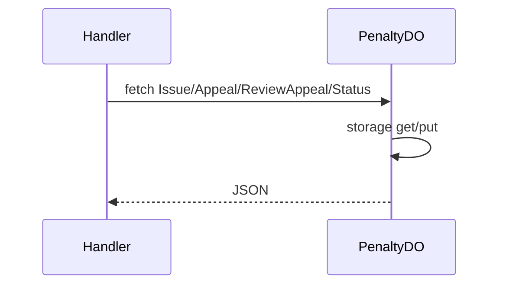

# PenaltyDO

**Purpose:** Per-user penalties: issue (type, reason, duration, issuedBy), appeal (penaltyId, reason), review-appeal (admin: appealId, action, moderatorId), status. PenaltyRecord: penaltyId, type (warning/mute/suspension/ban), status (active/expired/appealed/overturned). Max 500 retained.

**Shard key:** userId.

**HTTP surface:** PenaltyDOPaths (endpoint-domain): Issue, Appeal, ReviewAppeal, Status. Path includes 'issue' → Issue; 'appeal' (not 'review') → Appeal; 'review' → ReviewAppeal; else Status.

**Message types:** N/A (HTTP only).

**Storage:** PenaltyDOStoragePrefix (boundary-domain): penalties, appeals.

**Handlers:** handleSecurityRequest (feature-handlers.ts) for appeal/review and penalty status; handlePenaltyRequest if wired.

**Domain constants:** endpoint-domain: PenaltyDOSegment, PenaltyDOPaths, Http*; boundary-domain: PenaltyDOStoragePrefix.

