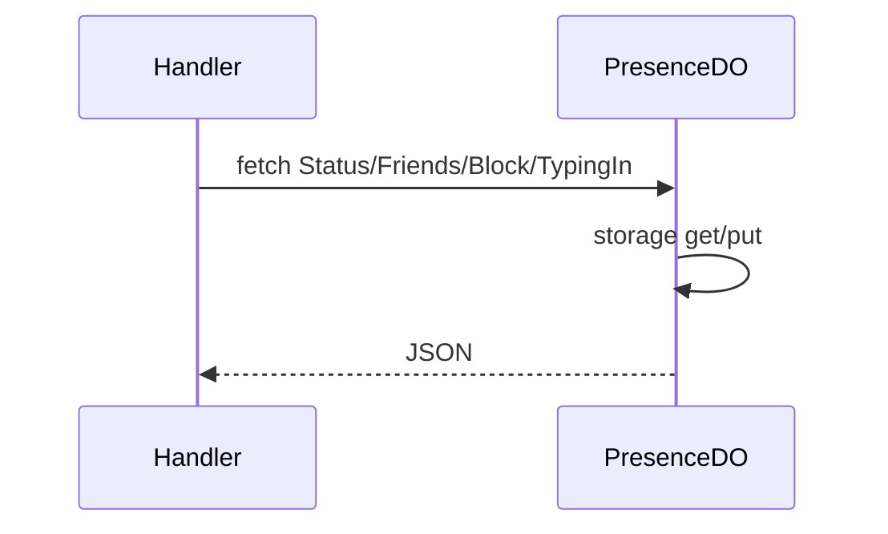

# PresenceDO

**Purpose:** Per-shard presence: status (GET/POST), friends list (GET/POST/DELETE), block list (POST, GET block-check), typing indicator (POST). Shard key = presence-${fnv1a(userId) % 256}.

**Shard key:** `getPresenceShardKey(userId)` = `presence-${fnv1a(userId) % 256}`.

**HTTP surface:** Paths: PresenceDOPaths.Status(shardKey, userId), Friends(shardKey), Block(shardKey), TypingIn(shardKey), BlockCheck(shardKey) with query userId, targetId.

**Message types:** N/A (HTTP only).

**Storage:** PresenceDOStoragePrefix (boundary-domain): status, friends, block list, typing state.

**Handlers:** [handlePresenceRequest](../features/presence-and-friends.md), [handleFriendsRequest](../features/presence-and-friends.md) (feature-handlers.ts); ws.ts for Presence DO upgrade by shardKey.

**Domain constants:** endpoint-domain: PresenceDOSegment, PresenceDOPaths; boundary-domain: PresenceDOStoragePrefix.

