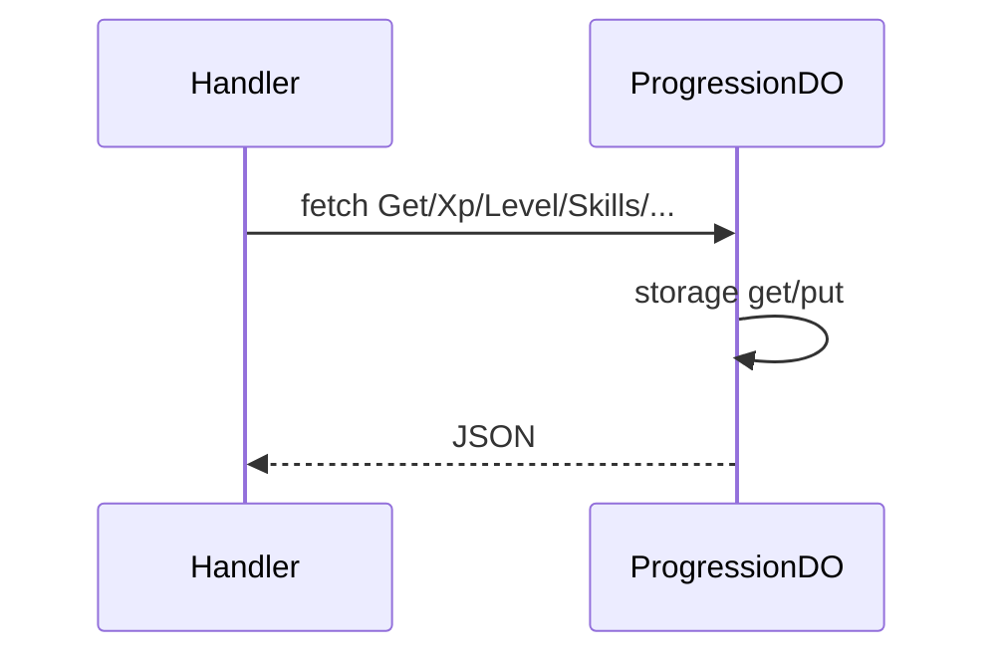

# ProgressionDO

**Purpose:** Per-user progression: XP, level, skills, achievements, collections. Paths: Xp, Level, UnlockSkill, UpdateAchievement, Skills, Achievements, Collections, Get. Used by personalization and analytics handlers.

**Shard key:** userId.

**HTTP surface:** ProgressionDOPaths (endpoint-domain): Get, Xp, Level, UnlockSkill, UpdateAchievement, Skills, Achievements, Collections.

**Message types:** N/A (HTTP only).

**Storage:** ProgressionDO storage prefix (boundary-domain); structure from DO implementation.

**Handlers:** handleProgressionRequest, handlePersonalizationRequest, handleAnalyticsRequest (feature-handlers.ts).

**Domain constants:** endpoint-domain: ProgressionDOPaths, Http*; boundary-domain: do-storage-prefixes.

