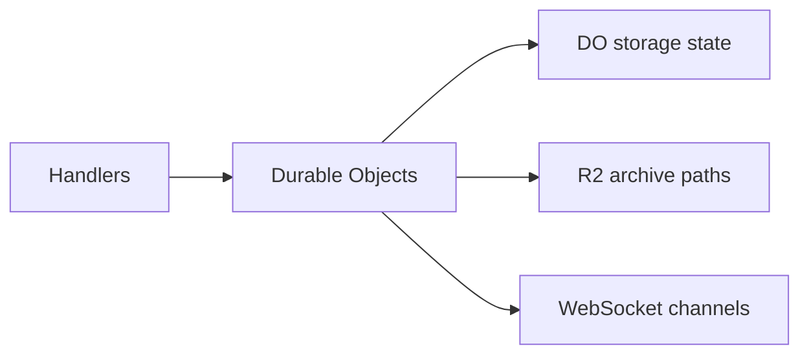

# Durable Objects

One doc per Durable Object. Content is derived from the DO class and its callers only.

| DO | Doc |
| -- | --- |
| ActivityFeedDO | [ActivityFeedDO.md](ActivityFeedDO.md) |
| AntiCheatDO | [AntiCheatDO.md](AntiCheatDO.md) |
| AuditLogDO | [AuditLogDO.md](AuditLogDO.md) |
| CreditsDO | [CreditsDO.md](CreditsDO.md) |
| FraudDetectionDO | [FraudDetectionDO.md](FraudDetectionDO.md) |
| InventoryDO | [InventoryDO.md](InventoryDO.md) |
| LeaderboardDO | [LeaderboardDO.md](LeaderboardDO.md) |
| LobbyDO | [LobbyDO.md](LobbyDO.md) |
| MarketplaceDO | [MarketplaceDO.md](MarketplaceDO.md) |
| MatchCoordinatorDO | [MatchCoordinatorDO.md](MatchCoordinatorDO.md) |
| MatchmakingDO | [MatchmakingDO.md](MatchmakingDO.md) |
| MatchShardDO | [MatchShardDO.md](MatchShardDO.md) |
| MessageDO | [MessageDO.md](MessageDO.md) |
| NotificationDO | [NotificationDO.md](NotificationDO.md) |
| PartyDO | [PartyDO.md](PartyDO.md) |
| PaymentDO | [PaymentDO.md](PaymentDO.md) |
| PenaltyDO | [PenaltyDO.md](PenaltyDO.md) |
| PlayerShardDO | [PlayerShardDO.md](PlayerShardDO.md) |
| PresenceDO | [PresenceDO.md](PresenceDO.md) |
| ProfileDO | [ProfileDO.md](ProfileDO.md) |
| ProgressionDO | [ProgressionDO.md](ProgressionDO.md) |
| RewardDO | [RewardDO.md](RewardDO.md) |
| SettingsDO | [SettingsDO.md](SettingsDO.md) |
| SignalingDO | [SignalingDO.md](SignalingDO.md) |
| StateSyncCoordinatorDO | [StateSyncCoordinatorDO.md](StateSyncCoordinatorDO.md) |
| TournamentDO | [TournamentDO.md](TournamentDO.md) |
| UserKeysDO | [UserKeysDO.md](UserKeysDO.md) |

See [ARCHITECTURE.md](../ARCHITECTURE.md#do-summary-and-detail-links) for the DO summary table with one-line purpose and links back here.
