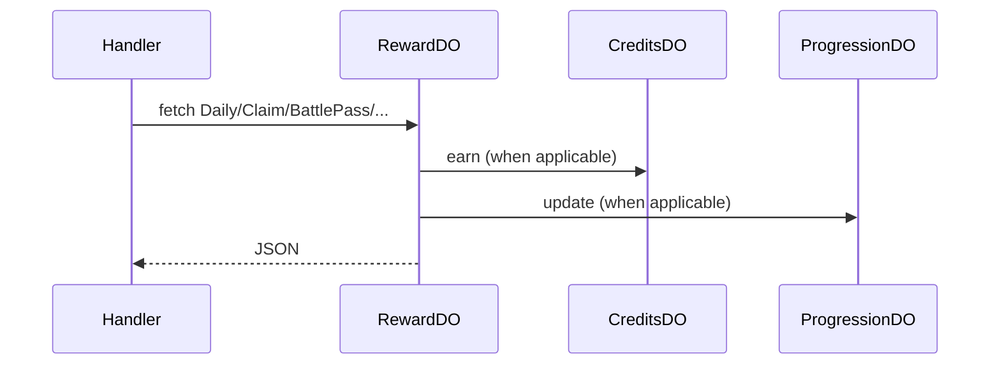

# RewardDO

**Purpose:** Per-user rewards: daily (claim), streak freeze, battle-pass (claim, xp), missions (list, progress, claim). Can call CreditsDO and ProgressionDO for grant/XP. RewardDOPaths: Daily, DailyClaim, StreakFreeze, BattlePass, BattlePassClaim, BattlePassXp, MissionsList, MissionProgress, MissionClaim.

**Shard key:** userId.

**HTTP surface:** POST/GET paths per RewardDOPaths (endpoint-domain).

**Message types:** N/A (HTTP only).

**Storage:** RewardDO storage prefix (boundary-domain). Internal calls to CreditsDO.idFromName(userId), ProgressionDO.idFromName(userId) when bound.

**Handlers:** handleRewardRequest (feature-handlers.ts); handlePersonalizationRequest, handleAnalyticsRequest read RewardDO for daily/streak.

**Domain constants:** endpoint-domain: RewardDOPaths, Http*; boundary-domain: do-storage-prefixes.

