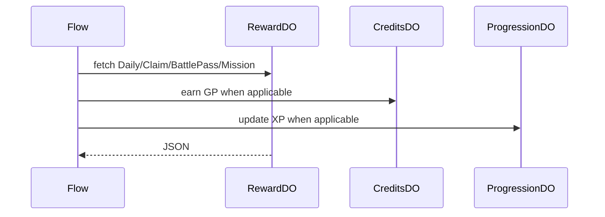

# RewardDO

**Purpose:** Per-user rewards for daily claims, streak freeze, battle-pass claims and XP, and mission progress. RewardDO owns the local reward state and idempotency ledger.

**Shard key:** `userId`.

**HTTP surface:** POST and GET paths per `RewardDOPaths` in endpoint-domain.

**Storage:** Reward DO storage prefix from boundary-domain; local state for reward history and progress markers.

**Flows that use it:** `RewardClaimFlow` coordinates reward mutation and forwards GP or XP to `CreditsDO` and `ProgressionDO` when needed.

**Handlers:** `handleRewardRequest` in the reward handler path, plus personalization and analytics reads. The handler layer dispatches into the reward flow for reward mutations.

**Domain constants:** endpoint-domain: `RewardDOPaths`, `Http*`; boundary-domain: reward storage prefix.

