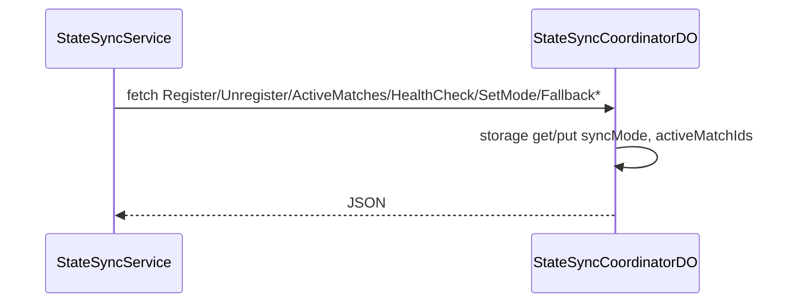

# StateSyncCoordinatorDO

**Purpose:** Coordinates state sync across match shards: register/unregister matchId, list active matches, health check, set sync mode (realtime/degraded/fallback/recovery), fallback enter/queue/recover. Single coordinator instance; stores syncMode and activeMatchIds. Can use SolanaRPC for health/recovery.

**Shard key:** `'coordinator'` (StateSyncService: `env.STATE_SYNC_COORDINATOR.idFromName('coordinator')`).

**HTTP surface:** POST `/${StateSyncCoordinatorDOSegment.Register}` (query matchId); POST `/${StateSyncCoordinatorDOSegment.Unregister}` (query matchId); GET `/${StateSyncCoordinatorDOSegment.ActiveMatches}`; GET `/${StateSyncCoordinatorDOSegment.HealthCheck}`; POST `/${StateSyncCoordinatorDOSegment.SetMode}` (body); POST paths for FallbackEnter, FallbackQueue, FallbackRecover.

**Message types:** N/A (HTTP only).

**Storage:** Keys `'syncMode'` (SyncModeValue), `'activeMatchIds'` (string[]). No boundary-domain prefix in DO source.

**Handlers:** StateSyncService (services/StateSyncService.ts) uses coordinator stub for register/unregister and match listing; MatchShardDO for per-match sync.

**Domain constants:** endpoint-domain: StateSyncCoordinatorDOSegment, Http*.

