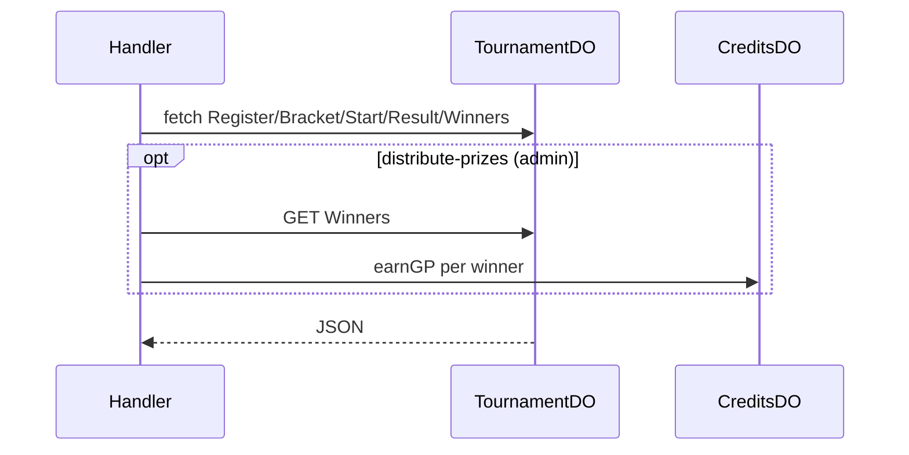

# TournamentDO

**Purpose:** Per-tournament state: register (userId, displayName, elo), bracket (GET), start (POST), result (POST), winners (GET). TournamentState: status (registration/running/ended), participants, bracket (BracketSlot[]). Handler calls earnGP for prize distribution (admin distribute-prizes).

**Shard key:** tournamentId (handler: extractIdFromPath(path, ApiEndpoint.Tournament.Base)).

**HTTP surface:** POST `/${TournamentDOSegment.Register}`; GET `/${TournamentDOSegment.Bracket}`; POST TournamentDOPaths.Start, TournamentDOPaths.Result; GET TournamentDOPaths.Winners.

**Message types:** N/A (HTTP only).

**Storage:** TournamentDOStoragePrefix.Tournament (boundary-domain): TournamentState.

**Handlers:** handleTournamentRequest (feature-handlers.ts); distribute-prizes uses Winners then earnGP per winner.

**Domain constants:** endpoint-domain: TournamentDOSegment, TournamentDOPaths, Http*; boundary-domain: TournamentDOStoragePrefix.

