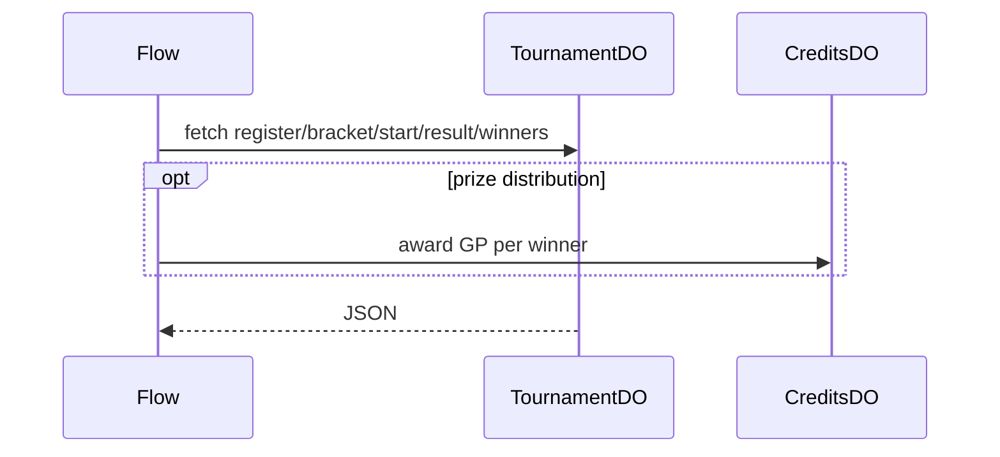

# TournamentDO

**Purpose:** Per-tournament state for registration, bracket, start, result, and winners. The DO owns tournament lifecycle state and the canonical winner list.

**Shard key:** `tournamentId`.

**HTTP surface:** `TournamentDOSegment` and `TournamentDOPaths` from endpoint-domain for register, bracket, start, result, and winners.

**Storage:** `TournamentDOStoragePrefix` from boundary-domain; local tournament state and bracket data.

**Flows that use it:** `TournamentPrizeDistributionFlow` reads winners from `TournamentDO` and awards prizes through `CreditsDO`.

**Handlers:** `handleTournamentRequest` in the feature handler path. The handler layer dispatches into the tournament flow for prize distribution.

**Domain constants:** endpoint-domain: `TournamentDOSegment`, `TournamentDOPaths`, `Http*`; boundary-domain: `TournamentDOStoragePrefix`.

