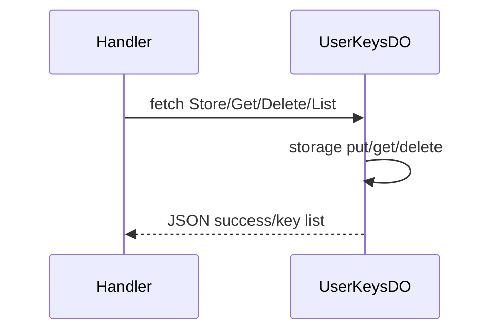

# UserKeysDO

**Purpose:** Encrypted API keys per user: store (providerId, ciphertext, iv, baseUrl), get, delete, list. Used for AI provider keys.

**Shard key:** userId (handlers: ai-keys.ts, ai-oauth.ts use `env.USER_KEYS_DO.idFromName(userId)`).

**HTTP surface:** UserKeysDOEndpoints (endpoint-domain): POST Store (body providerId, ciphertext, iv, baseUrl); POST Get (body providerId); POST Delete (body providerId); GET List.

**Message types:** N/A (HTTP only).

**Storage:** UserKeysDOStoragePrefix.Provider + providerId (boundary-domain): StoredKey { ciphertext, iv, updatedAt, baseUrl }.

**Handlers:** [handleAIKeysRequest](../features/ai-integration.md) (ai-keys.ts), [handleAIOAuthRequest](../features/ai-integration.md) (ai-oauth.ts).

**Domain constants:** endpoint-domain: UserKeysDO (path constants), Http*; boundary-domain: UserKeysDOStoragePrefix.

