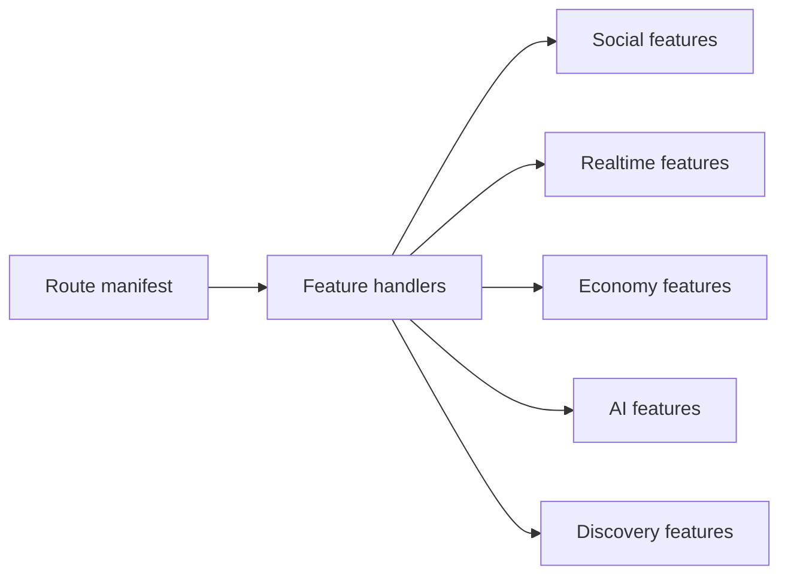

# Feature docs

One doc per feature area. Content and flows are derived from handler and DO code only.

| Feature | Doc |
| ------- | --- |
| Lobby | [lobby.md](lobby.md) |
| Matchmaking | [matchmaking.md](matchmaking.md) |
| Presence and friends | [presence-and-friends.md](presence-and-friends.md) |
| Signaling | [signaling.md](signaling.md) |
| Profile | [profile.md](profile.md) |
| Messages | [messages.md](messages.md) |
| Activity feed | [activity-feed.md](activity-feed.md) |
| Party | [party.md](party.md) |
| Leaderboard | [leaderboard.md](leaderboard.md) |
| Notifications | [notifications.md](notifications.md) |
| Discovery | [discovery.md](discovery.md) |
| Credits and economy | [credits-and-economy.md](credits-and-economy.md) |
| Payments and Stripe | [payments-and-stripe.md](payments-and-stripe.md) |
| Match coordination | [match-coordination.md](match-coordination.md) |
| AI integration | [ai-integration.md](ai-integration.md) |

See [ARCHITECTURE.md](../ARCHITECTURE.md#handlers-and-feature--do-links) for the handler-to-feature table.
