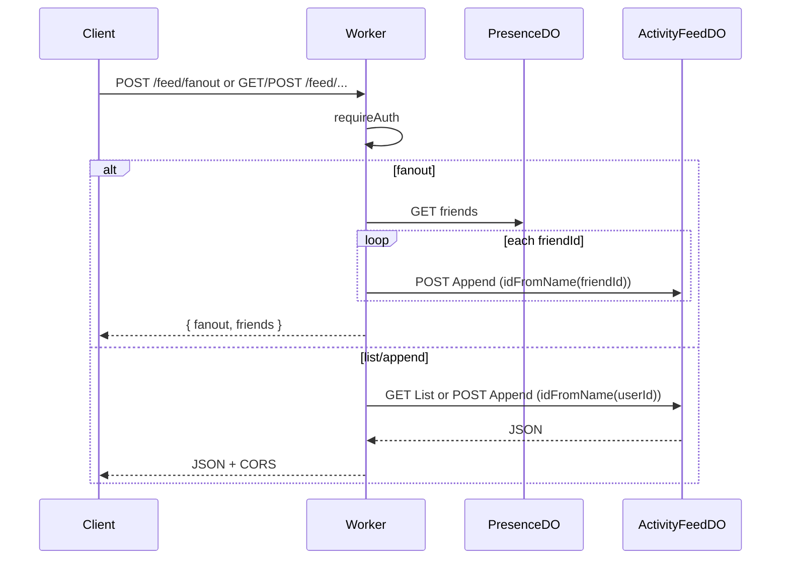

# Activity Feed

**Purpose:** Per-user activity feed: append items, list with cursor. Fan-out: POST /fanout writes one item to each friend's ActivityFeedDO after resolving the friends list from PresenceDO.

**Handlers:** `handleFeedRequest` (feature-handlers.ts). Route: Feed prefix. Auth required (except fanout uses auth for actorId).

**Durable Object:** [ActivityFeedDO](../durable-objects/ActivityFeedDO.md). Shard key: userId (feed owner). Fan-out: actor's friends from PresenceDO; for each friendId, ACTIVITY_FEED_DO.idFromName(friendId), POST Append.

**API surface (from code):**
- POST /fanout: body type, payload; the fan-out path resolves friends from PresenceDO, then appends to each friend's feed with { type, payload: { ...payload, actorId } }; returns { fanout: appended, friends: friendIds.length }.
- GET list: path ends with 'list'; DO list with limit, before cursor.
- POST append (direct): single user's feed; path ends with ActivityFeedDOSegment.Append; body type, payload.
- DO paths: ActivityFeedDOPaths.Append, ActivityFeedDOPaths.List (segment from endpoint-domain).

**Flow**

