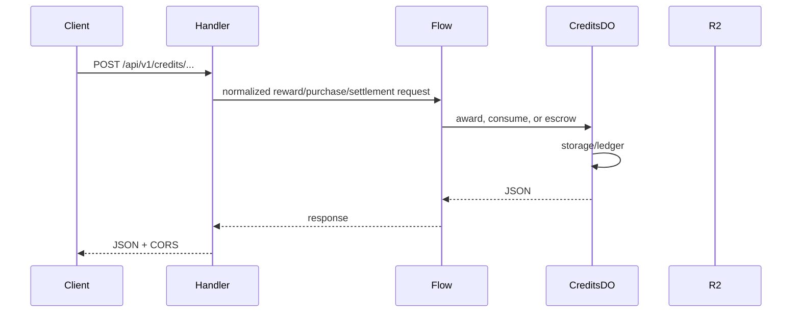

# Credits and Economy

**Purpose:** GP/AC balance and ledger for earn, consume, purchase, promo redeem, and escrow. The worker keeps the contract centralized in `endpoint-domain`, while the flow layer handles multi-step award and settlement paths.

**Handlers:** `handleCreditsRequest` (`handlers/credits.ts`), `handleStripeWebhookRequest` (`handlers/webhooks-stripe.ts`), and `handleAIEscrowRequest` (`handlers/ai-escrow.ts`).

**Durable Object:** [CreditsDO](../durable-objects/CreditsDO.md). Shard key: `userId`. Local state stores balance, ledger, and idempotency markers.

**Flows:** `MatchFinalizationFlow`, `RewardClaimFlow`, `StripeWebhookFlow`, and `TournamentPrizeDistributionFlow` all use CreditsDO for the GP or AC side of the operation.

**API surface (from code):**
- Credits handler: balance, earn GP, consume AC, purchase, and batch award paths.
- Stripe webhook: signature verification, event ingestion, and credit settlement on successful payment.
- AI escrow: reserve and consume paths that route through CreditsDO when the AI plan requires balance checks.

**Flow**

