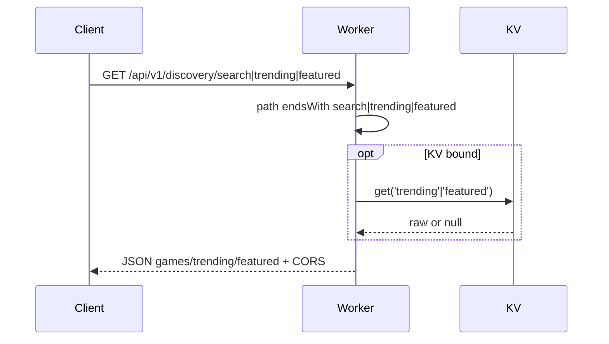

# Discovery

**Purpose:** Game discovery: search (filter by q), trending, featured. No DO; handler uses DISCOVERY_KV when bound and static game list (GameTypeId.Claim, Poker, WordSearch from endpoint-domain).

**Handlers:** `handleDiscoveryRequest` (feature-handlers.ts). Route: Discovery prefix.

**Storage:** DISCOVERY_KV: keys `trending`, `featured` (optional). Handler returns stub JSON when KV not configured.

**API surface (from code):**
- GET .../search?q=: query toLowerCase; filter DISCOVERY_GAMES by name or id; return { games }.
- GET .../trending: DISCOVERY_KV.get('trending'); if raw, return parsed; else stub { topGameModes, peakOnline, activeGames, featuredTournaments, lastUpdated }.
- GET .../featured: DISCOVERY_KV.get('featured'); else stub { games: first 2, banner: null }.
- Default: { games: DISCOVERY_GAMES, trending: [] }.

**Flow**

