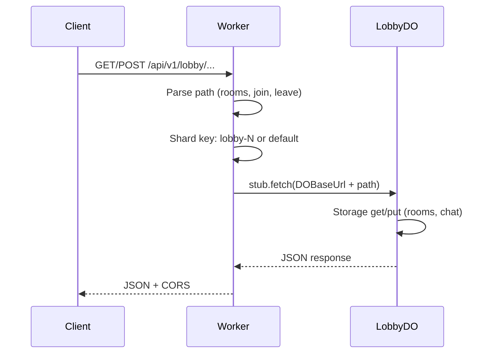

# Lobby (Gathering Hall)

**Purpose:** Rooms, join/leave, and optional WebSocket for chat and countdown. Sharded by room (64 shards); handler aggregates rooms across shards for GET.

**Handlers:** `handleLobbyRequest` (feature-handlers.ts). Route: Lobby prefix from endpoint-domain.

**Durable Object:** [LobbyDO](../durable-objects/LobbyDO.md). Shard key: `lobby-${fnv1a(roomId) % 64}` for room operations; `default` for non-join/leave. Default instance name from endpoint-domain for WS.

**API surface (from code):**
- GET rooms (optional auth): handler fans out to all 64 shard stubs, GET rooms on each, merges into single `{ rooms }`.
- POST create room: path includes `rooms`, body `roomId` (optional, else UUID), `hostId`; shard by `getLobbyShardKey(roomId)`; POST to DO rooms path.
- POST join / leave: path includes `join` or `leave`, roomId from path segment; shard by roomId; POST to DO Join/Leave path.
- WebSocket: Upgrade accepted by DO; messages handled inside DO (chat, system, countdown).

**Flow**

