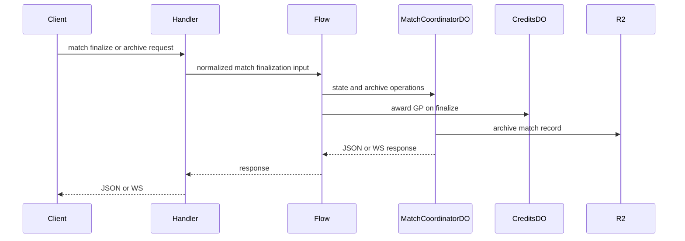

# Match Coordination

**Purpose:** Match storage, retrieval, finalization, and live WebSocket coordination. Match state lives in `MatchCoordinatorDO`; final archive and reward settlement are handled by the flow layer.

**Handlers:** `handleMatchRequest` (`handlers/matches.ts`) and `handleWsRequest` (`handlers/ws.ts`).

**Durable Objects:** [MatchCoordinatorDO](../durable-objects/MatchCoordinatorDO.md), [MatchShardDO](../durable-objects/MatchShardDO.md), [PlayerShardDO](../durable-objects/PlayerShardDO.md), [StateSyncCoordinatorDO](../durable-objects/StateSyncCoordinatorDO.md).

**Flows:** `MatchFinalizationFlow` persists the final match archive and coordinates GP award when a match ends.

**API surface (from code):**
- Matches: validate, upload, get, delete, anonymize, and transparency paths.
- WS: upgrade to the match coordinator for live play, chat, sync, AI dump, and checkpoint traffic.
- Match coordinator storage: R2 archive paths and local checkpoint state.

**Flow**

