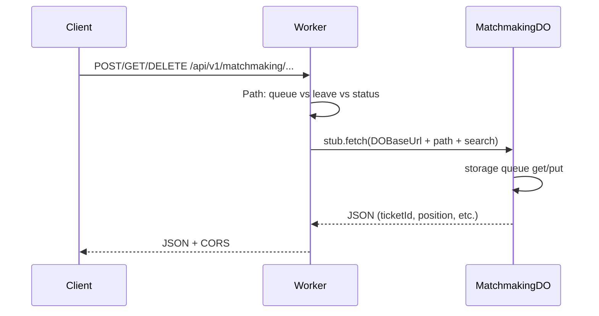

# Matchmaking

**Purpose:** Queue join/leave and status (ticket, position). Single region shard `default`; DO stores queue in SQLite and matches by ELO tolerance over time.

**Handlers:** `handleMatchmakingRequest` (feature-handlers.ts). Route: Matchmaking prefix.

**Durable Object:** [MatchmakingDO](../durable-objects/MatchmakingDO.md). Shard key: `default`.

**API surface (from code):**
- POST queue: join queue; body forwarded to DO; returns ticketId, position.
- POST/DELETE leave: leave queue; query params forwarded.
- GET status: ticket status; query params (e.g. ticketId) forwarded.
- DO paths: Queue(region), Leave(region), Status(region) from endpoint-domain.

**Flow**

