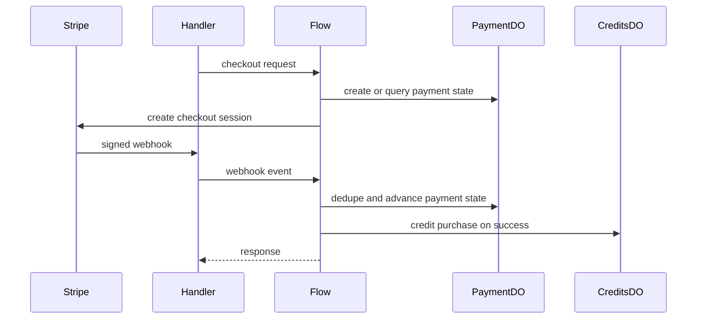

# Payments and Stripe

**Purpose:** Payment creation and status, Stripe webhook ingestion, and scheduled reconciliation. The flow layer owns the checkout and settlement orchestration.

**Handlers:** `handlePaymentRequest` (`handlers/payments.ts`) and `handleStripeWebhookRequest` (`handlers/webhooks-stripe.ts`).

**Durable Object:** [PaymentDO](../durable-objects/PaymentDO.md). Shard key: from path or user/session identifier. Local state stores payment events and status.

**Flows:** `PaymentCheckoutFlow` initializes payment state before Stripe checkout, and `StripeWebhookFlow` dedupes events, advances payment state, and triggers credit purchase on success.

**API surface (from code):**
- Payments handler: create payment, query payment status, and test-init setup.
- Webhook: signature verification, event parsing, payment dedupe, and downstream settlement.
- Cron: reconciliation when `PAYMENT_DO` and `STRIPE_SECRET_KEY` are set.

**Flow**

