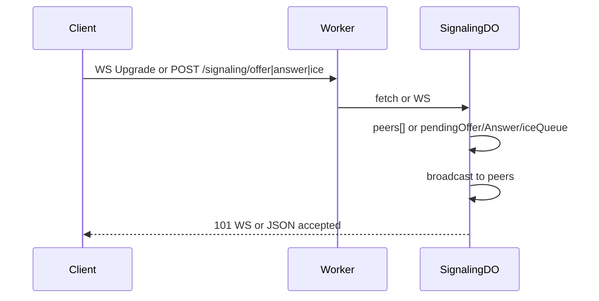

# Signaling

**Purpose:** WebRTC signaling: offer, answer, ICE candidates. SignalingDO holds up to two WebSocket peers and in-memory offer/answer/ICE queue; HTTP POST for offer/answer/ice when not using WS.

**Handlers:** Routed via feature or WS entry that forwards to SignalingDO (path includes signaling segment). DO is addressed by shard/session (path from endpoint-domain).

**Durable Object:** [SignalingDO](../durable-objects/SignalingDO.md). Shard key: from path (session or region); single DO instance per session.

**API surface (from code):**
- WebSocket Upgrade: DO accepts; pushes pending offer/answer/ICE to new peer; WS messages broadcast to peers.
- POST offer: body sdp; DO sets pendingOffer, broadcasts { type: 'offer', payload }.
- POST answer: body sdp; DO sets pendingAnswer, broadcasts.
- POST ice: body candidate; DO enqueues and broadcasts { type: 'ice', payload }.
- Path segments: SignalingDOSegment (Offer, Answer, Ice) from endpoint-domain.

**Flow**

