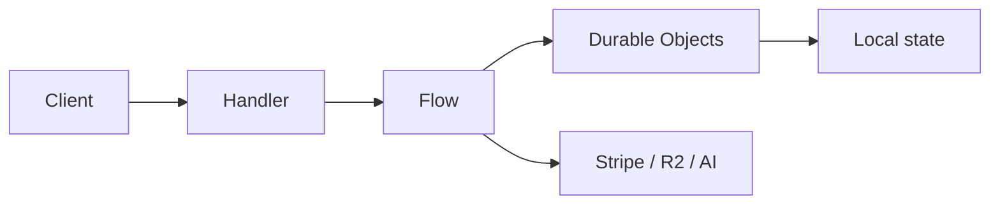

# Flows

Flows are the cross-domain orchestration layer for the Cloudflare Worker.

- Handlers validate, authorize, and dispatch.
- Flows coordinate one or more Durable Objects and external services.
- Durable Objects own local state, journaling, and invariants.
- No handler or Durable Object should orchestrate sibling DOs directly.

## Flow index

| Flow | Doc | What it coordinates |
| -- | -- | -- |
| MatchFinalizationFlow | [match-finalization-flow.md](match-finalization-flow.md) | Final match archive, chat and AI dump persistence, GP award |
| PaymentCheckoutFlow | [payment-checkout-flow.md](payment-checkout-flow.md) | PaymentDO setup and Stripe checkout session creation |
| StripeWebhookFlow | [stripe-webhook-flow.md](stripe-webhook-flow.md) | Stripe event settlement, payment transitions, credit purchase |
| RewardClaimFlow | [reward-claim-flow.md](reward-claim-flow.md) | Reward claims, mission progress, GP and XP forwarding |
| InventoryTransferFlow | [inventory-transfer-flow.md](inventory-transfer-flow.md) | Gifts and trades across inventory DOs |
| TournamentPrizeDistributionFlow | [tournament-prize-distribution-flow.md](tournament-prize-distribution-flow.md) | Winner payout distribution through CreditsDO |

## Core abstractions

See [../../src/flows/core/README.md](../../src/flows/core/README.md) for `BaseFlow`, `FlowContext`, `FlowResult`, and `FlowRunner`.
