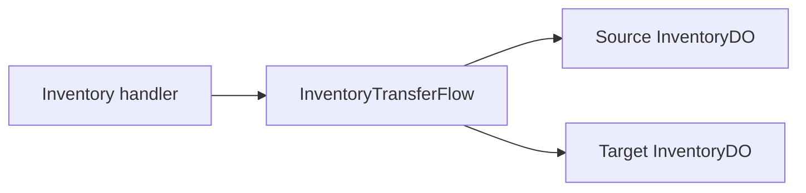

# Inventory Transfer Flow

**Purpose:** Moves items between inventory owners for gifts and trades.

**Triggered by:** inventory transfer request handling.

**Touches:** source and target `InventoryDO` instances.

**Does not:** leave a partial transfer behind. When a later step fails, the flow rolls back the earlier step.

## How it works

1. Require an authenticated source user.
2. Derive a stable transfer operation ID.
3. Remove the item from the source inventory.
4. Add the item to the target inventory.
5. Roll back the source or target side if a later step fails.

## Related docs

- [InventoryDO](../durable-objects/InventoryDO.md)
- [MarketplaceDO](../durable-objects/MarketplaceDO.md)
